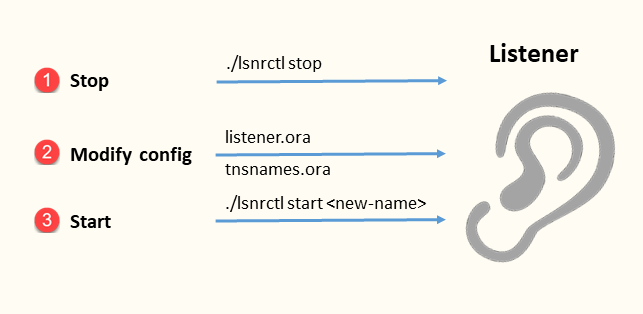
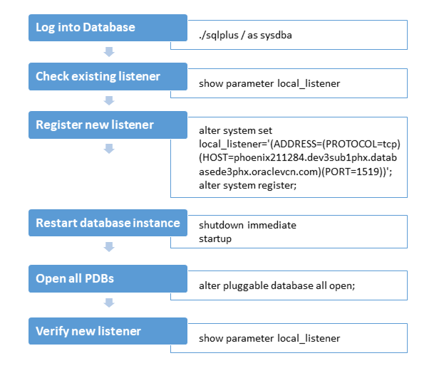
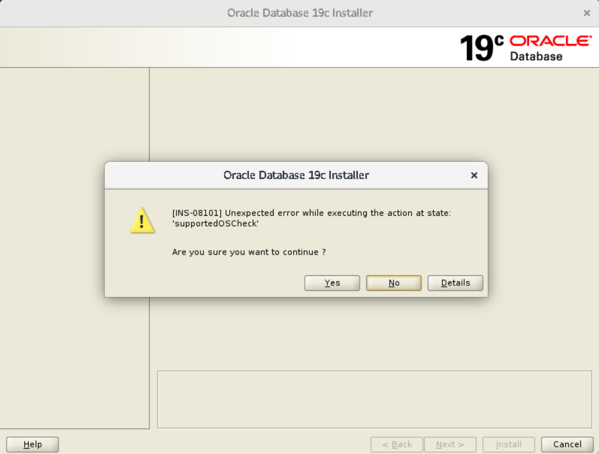

# Oracle Database Gold Image

## Introduction

This lab covers the pre-installation setup and post installation tasks for Oracle Database gold image. It also discusses the steps to deinstall Oracle Database and some troubleshooting scenarios and tips.

## Database concepts

The error *`ORA-12505`* indicates that the listener is up and you could connect to it, but the listener could not connect with the database. The listener is aware of the database, but does not know whether the database is up because the listener has not received any notification from the database that the database is up.

It may be due to the following reasons:
 - the database is not started, that is, the instance is idle
 - the database is not registered with the listener because it started before the listener

When a database starts, it registers itself with the listener if it is already running. If the listener is not running, the database does not register itself.    
When a listener starts, it does not go looking for databases that might register with it.

 > **Note:** If you try to connect to a wrong database using a wrong SID, then you get   
 `ORA-12154 error "TNS: could not resolve the connect identifier specified"`.

### Listener concepts

The default listener configuration is:

 - **name** - *LISTENER*
 - **port** - *1521*

**Scenario**   
You have multiple database versions (18c, 19c, 21c, 23c,...) on the same host. Each database has a listener associated with it. When you start a listener from any `$ORACLE_HOME/bin`, unless you specify the listener name Oracle Net Manager generally starts the default listener mentioned above. All databases may use the same (default) listener.

But if you want to use specific listener for each database version, then edit the listener configuration as explained in this lab. 

## Task 1: Pre-installation setup

Production versions are available to download from [OTN](https://www.oracle.com/database/technologies/oracle-database-software-downloads.html).   
Oracle Database installers are available internally as gold images.

1. Visit [DB shiphome gold image annoucements](https://confluence.oraclecorp.com/confluence/pages/viewpage.action?spaceKey=DBTEST&title=Database+Shiphome+Announcement+Home) and look for the required version.

	For example,
	 - [23c Linux64](https://confluence.oraclecorp.com/confluence/pages/viewpage.action?pageId=1755087062)
	 - [21c Linux64](https://confluence.oraclecorp.com/confluence/pages/viewpage.action?pageId=2248170665)
	 - [19.3 Linux64](https://confluence.oraclecorp.com/confluence/pages/viewpage.action?pageId=4129469989)

1. Under **Shiphome Location**, check <ins>Database Goldimage</ins>.

	----
	## Database 23c gold image

	| Select <i>any</i> server      | Link      |
	|:------------------------------|-----------|
	| OCI - 230120              	| [/net/phxnas204.strgsvcdaiphx.peocorpphxappv1.oraclevcn.com/export/pd_shiphomes/shiphomes/rdbms/linux.x64/MAIN/LATEST/goldimage](/net/phxnas204.strgsvcdaiphx.peocorpphxappv1.oraclevcn.com/export/pd_shiphomes/shiphomes/rdbms/linux.x64/MAIN/LATEST/goldimage) <br>File - `db_home.zip`       	|
	| ADC - 230120              	| [/net/adcnas481.us.oracle.com/export/pd_shiphomes/shiphomes/rdbms/linux.x64/MAIN/LATEST/goldimage](/net/adcnas481.us.oracle.com/export/pd_shiphomes/shiphomes/rdbms/linux.x64/MAIN/LATEST/goldimage) <br>File - `db_home.zip`       	|
	| SaltLake - 230120           	| [/net/slcnas563.us.oracle.com/export/pd_shiphomes/shiphomes/rdbms/linux.x64/MAIN/LATEST/goldimage](/net/slcnas563.us.oracle.com/export/pd_shiphomes/shiphomes/rdbms/linux.x64/MAIN/LATEST/goldimage) <br>File - `db_home.zip`       	|
	| HQ - 230120 					| [/net/rwsnas436.us.oracle.com/export/pd_shiphomes/shiphomes/rdbms/linux.x64/MAIN/LATEST/goldimage](/net/rwsnas436.us.oracle.com/export/pd_shiphomes/shiphomes/rdbms/linux.x64/MAIN/LATEST/goldimage) <br>File - `db_home.zip`         |
	| *ADE - LATEST*      			| [/ade_autofs/shiphomes/rdbms/linux.x64/MAIN/LATEST/goldimage](/ade_autofs/shiphomes/rdbms/linux.x64/MAIN/LATEST/goldimage) <br>File - `db_home.zip`   |

	Get the 23c gold image -

	1. 	Create a local folder for Oracle home.

		```
		$ <copy>mkdir -p /scratch/u01/app/oracle/product/23.0.0/dbhome_unzip01</copy>
		```

	1.  Go to the image location.

		Option 1 - much faster

		```
		$ <copy> cd /ade_autofs/shiphomes/rdbms/linux.x64/MAIN/LATEST/goldimage/</copy>
		```

		Option 2 - takes time

		```
		$ <copy>cd /net/adcnas481.us.oracle.com/export/pd_shiphomes/shiphomes/rdbms/linux.x64/MAIN/221025/goldimage/</copy>
		```

	1.  Unzip the installer file to the local folder.

		```
		$ <copy>unzip -q db_home.zip -d /scratch/u01/app/oracle/product/23.0.0/dbhome_unzip01</copy>
		```

	----
	## Database 21c production

	| Production servers      		| Link      |
	|:------------------------------|-----------|
	| ADC                    		| [/net/adcnas481.us.oracle.com/export/pd_shiphomes/shiphomes/rdbms/linux.x64/21c/21.3.0.0.0/210727.PRODUCTION](/net/adcnas481.us.oracle.com/export/pd_shiphomes/shiphomes/rdbms/linux.x64/21c/21.3.0.0.0/210727.PRODUCTION) <br>File - `LINUX.X64_213000_db_home.zip`       |
	| SLC                    		| [/net/slcnas563.us.oracle.com/export/pd_shiphomes/shiphomes/rdbms/linux.x64/21c/21.3.0.0.0/210727.PRODUCTION](/net/slcnas563.us.oracle.com/export/pd_shiphomes/shiphomes/rdbms/linux.x64/21c/21.3.0.0.0/210727.PRODUCTION) <br>File - `LINUX.X64_213000_db_home.zip`       |
	| HQ                     		| [/net/rwsnas436.us.oracle.com/export/pd_shiphomes/shiphomes/rdbms/linux.x64/21c/21.3.0.0.0/210727.PRODUCTION](/net/rwsnas436.us.oracle.com/export/pd_shiphomes/shiphomes/rdbms/linux.x64/21c/21.3.0.0.0/210727.PRODUCTION) <br>File - `LINUX.X64_213000_db_home.zip`       |

	| Select <i>any</i> server      | Link      |
	|:------------------------------|-----------|
	| <mark>ADC</mark> - **latest** |[/net/adcnas481.us.oracle.com/export/pd_shiphomes/shiphomes/rdbms/linux.x64/21c/21.3.0.0.0/LATEST/goldimage](/net/adcnas481.us.oracle.com/export/pd_shiphomes/shiphomes/rdbms/linux.x64/21c/21.3.0.0.0/LATEST/goldimage) <br>File - `db_home.zip`                        |
	| ADC - 210608                  |[/net/adcnas481.us.oracle.com/export/pd_shiphomes/shiphomes/rdbms/linux.x64/21c/21.3.0.0.0/RC1-210608/goldimage](/net/adcnas481.us.oracle.com/export/pd_shiphomes/shiphomes/rdbms/linux.x64/21c/21.3.0.0.0/RC1-210608/goldimage) <br>File - `db_home.zip`                     |
	| SaltLake - **latest**         | [/net/slcnas563.us.oracle.com/export/pd_shiphomes/shiphomes/rdbms/linux.x64/21c/21.3.0.0.0/LATEST/goldimage](/net/slcnas563.us.oracle.com/export/pd_shiphomes/shiphomes/rdbms/linux.x64/21c/21.3.0.0.0/LATEST/goldimage) <br>File - `db_home.zip`                        |
	| SaltLake - 210608             | [/net/slcnas563.us.oracle.com/export/pd_shiphomes/shiphomes/rdbms/linux.x64/21c/21.3.0.0.0/RC1-210608/goldimage](/net/slcnas563.us.oracle.com/export/pd_shiphomes/shiphomes/rdbms/linux.x64/21c/21.3.0.0.0/RC1-210608/goldimage) <br>File - `db_home.zip`                     |
	| HQ - **latest**               | [/net/rwsnas436.us.oracle.com/export/pd_shiphomes/shiphomes/rdbms/linux.x64/21c/21.3.0.0.0//LATEST/goldimage](/net/rwsnas436.us.oracle.com/export/pd_shiphomes/shiphomes/rdbms/linux.x64/21c/21.3.0.0.0//LATEST/goldimage) <br>File - `db_home.zip`                        |
	| HQ - 210608                   | [/net/rwsnas436.us.oracle.com/export/pd_shiphomes/shiphomes/rdbms/linux.x64/21c/21.3.0.0.0/RC1-210608/goldimage](/net/rwsnas436.us.oracle.com/export/pd_shiphomes/shiphomes/rdbms/linux.x64/21c/21.3.0.0.0/RC1-210608/goldimage) <br>File - `db_home.zip`                     |
	| <mark>ade_autofs</mark> - **new**<br><i>from Prakash J </i> | [/ade\_autofs/dd223\_db/RDBMS/21.3.0.0.0/LINUX.X64/210727.XE/install/shiphome/goldimage](/ade_autofs/dd223_db/RDBMS/21.3.0.0.0/LINUX.X64/210727.XE/install/shiphome/goldimage) <br>File - `db_home.zip`                                            |
	| ade_autofs - old              | [/ade\_autofs/dd77\_db/RDBMS/21.3.0.0.0/LINUX.X64/210727/install/shiphome/goldimage](/ade_autofs/dd77_db/RDBMS/21.3.0.0.0/LINUX.X64/210727/install/shiphome/goldimage) |

	----
	## Get Database 19c production

	1. Go to this location.

		```
		$ <copy> cd /net/adcnas481.us.oracle.com/export/pd_shiphomes/shiphomes/rdbms/linux.x64/19.3.0.0.0/190417.PRODUCTION</copy>
		```

	1. Unzip the file to the local system.

		```
		$ <copy>unzip -q LINUX.X64_193000_db_home.zip -d /scratch/u01/app/oracle/product/19.0.0/dbhome_02</copy>
		```

		If you get an error while creating directory

		```
		checkdir:  cannot create extraction directory: /scratch/u01/app/oracle/product/19.0.0/dbhome_unzip03
           No such file or directory
		```

		Then, create the directory first and try unzip again.

		```
		$ <copy>mkdir -p /scratch/u01/app/oracle/product/19.0.0/dbhome_unzip03</copy>
		```

	1. Go to the Oracle home folder.

		```
		$ <copy>cd /scratch/u01/app/oracle/product/19.0.0</copy>
		```
	1. Rename the folder.

		```
		$ <copy>mv dbhome_unzip03 dbhome_02</copy>
		```

	----
	## Start database installer

	1. Open a terminal window and create the folder structure for `$ORACLE_HOME`.

		```
		$ <copy>mkdir -p /scratch/u01/app/oracle/product/23.0.0/dbhome_1</copy>
		```

		> **Caution:** Do all installations only under */scratch*, never in `ade` or any other directory.

	1. Go to a location where the *gold image* exists.   
		This example uses <ins>the ADC server</ins>.

		```
		$ <copy>cd /net/adcnas481.us.oracle.com/export/pd_shiphomes/shiphomes/rdbms/linux.x64/MAIN/221025/goldimage</copy>
		```

	1. Unzip the installer into the Oracle home folder.   

		**Syntax**

		```
		$ unzip -q <file_name> -d <full_path>
		```
		> where,   
		*`-q`* for quiet operation (to run in the background)   
		*`-d`* to create the directory structure

		**Example 1** - for 23c ADC server gold image

		```
		$ <copy>unzip -q db_home.zip -d /scratch/u01/app/oracle/product/23.0.0/dbhome_1</copy>
		```

		**Example 2** - for 21c prod

		```
		$ <copy>unzip -q LINUX.X64_213000_db_home.zip -d /scratch/u01/app/oracle/product/21.0.0/dbhome_002</copy>
		```

		> **Tip**: Get an *extra copy of the installer* on your local system.

		```
		$ <copy>unzip -q /ade_autofs/dd223_db/RDBMS/21.3.0.0.0/LINUX.X64/210727.XE/install/shiphome/goldimage/db_home.zip -d /scratch/u01/app/oracle/product/21.0.0/dbhome_unzip02</copy>
		```

	1. Go to Oracle home.
		```
		$ <copy>cd /scratch/u01/app/oracle/product/23.0.0/dbhome_1</copy>
		```

	1. Run the Oracle Database Setup Wizard (Installer).

		```
		$ <copy>./runInstaller</copy>
		```

		<if type="hidden">
		`Oracle Database sys password` - *We!come1*
		<if>

## Task 2: Install Oracle Database

From the Oracle home location, start `./runInstaller` and select the following.    
Most fields are auto-filled.

1. Create and configure a single instance database.

1. Server Class

1. Enterprise Edition

1. Oracle Base location

	Example -

	```
	$ <copy>/scratch/u01/app/mgarodia</copy>
	```

1. Central inventory location

	Example -

	```
	$ <copy>/scratch/u01/app/oraInventory</copy>
	```

	**oraInventory group name**: *dba* (or `wheel`, your system primary group)

	> **Note:** This screen does not appear if you have another version of Oracle Database already installed.

1. General Purpose / Transaction Processing

1. Set database identifiers

	 - Global database name -

		```
		<copy>orcl.dev3sub1phx.databasede3phx.oraclevcn.com</copy>
		```

	 - Oracle System Identifier (SID) - *orcl*   
	 For typical installation, the option *Create as Container Database* is selected by default

	 - Pluggable database name -

		```
		<copy>orclpdb</copy>
		```

1. <i>Do not enable</i> **Automatic Memory Management**.   
Leave defaults for character set (and sample schemas).

1. Database storage options - *File system*  
	Database file location -

	```
	<copy>/scratch/u01/app/mgarodia/oradata</copy>
	```

1. <i>Do not register</i> with EMCC

1. Select **Enable Recovery** &gt; **File system**   
	Recovery area location -

	```
	<copy>/scratch/u01/app/mgarodia/recovery_area</copy>
	```

1. Use the same password for all accounts &gt; set the password<if type="hidden"> *Welcome_1*</if>.

1. For all OS groups - *dba* (or `wheel`, your system primary group)

1. You may `Automatically run configuration scripts`.   
Do not select this check box and run the scripts manually in the later steps.

1. Prerequisites check - *Ignore All*

1. Review the summary and **Install**

1. When prompted to run the script:

	- Open a terminal and go to root.

		```
		$ <copy>sudo -i</copy>
		```
	 Enter the LDAP/Kerberos password.

	- Run the `inventory` script.

		```
		$ <copy>source /scratch/u01/app/oraInventory/orainstRoot.sh</copy>
		```

		```
		Changing permissions of /scratch/u01/app/oraInventory.
		Adding read,write permissions for group.
		Removing read,write,execute permissions for world.

		Changing groupname of /scratch/u01/app/oraInventory to wheel.
		The execution of the script is complete.
		```

	- Run the `root` script.

		**For 23c**

		```
		$ <copy>source /scratch/u01/app/oracle/product/23.0.0/dbhome_1/root.sh</copy>
		```

		```
		Performing root user operation.

		The following environment variables are set as:
			ORACLE_OWNER= mgarodia
			ORACLE_HOME=  /scratch/u01/app/oracle/product/23.0.0/dbhome_1

		```

		Press **Enter** twice to complete the script.

		```
		Enter the full pathname of the local bin directory: [/usr/local/bin]: 

		/usr/local/bin is read only.  Continue without copy (y/n) or retry (r)? [y]: 

		Warning: /usr/local/bin is read only. No files will be copied.


		Creating /etc/oratab file...
		Entries will be added to the /etc/oratab file as needed by
		Database Configuration Assistant when a database is created
		Finished running generic part of root script.
		Now product-specific root actions will be performed.
		```

		## root scripts - other db versions

		**For 21c**

		```
		$ <copy>source /scratch/u01/app/oracle/product/21.0.0/dbhome_002/root.sh</copy>
		```

		**For 19c**

		```
		$ <copy>source /scratch/u01/app/oracle/product/19.0.0/dbhome_02/root.sh</copy>
		```

1. Go back to the installer and click **OK**.

On completion, the installer displays the finish window.

## Task 3: Database post installation checks

1. View Oracle SIDs and Oracle homes
1. View Oracle base locations
1. View system/config files
1. Set environment variables
1. Connect to SQL command line

	----
	## 1. View Oracle SIDs and Oracle homes

	Using *`/etc/oratab`*

	```
	$ <copy>cat /etc/oratab</copy>
	```

	Example -

	```
	# This file is used by ORACLE utilities.  It is created by root.sh
	# and updated by either Database Configuration Assistant while creating
	# a database or ASM Configuration Assistant while creating ASM instance.

	# A colon, ':', is used as the field terminator.  A new line terminates
	# the entry.  Lines beginning with a pound sign, '#', are comments.
	#
	# Entries are of the form:
	#   $ORACLE_SID:$ORACLE_HOME:<N|Y>:
	#
	# The first and second fields are the system identifier and home
	# directory of the database respectively.  The third field indicates
	# to the dbstart utility that the database should , "Y", or should not,
	# "N", be brought up at system boot time.
	#
	# Multiple entries with the same $ORACLE_SID are not allowed.
	#
	#
	orcl:/scratch/u01/app/mgarodia/product/23.0.0/dbhome_1:N
	orcl21:/scratch/u01/app/oracle/product/21.0.0/dbhome_002:N
	orcl19:/scratch/u01/app/oracle/product/19.0.0/dbhome_02:N
	orclmm:/scratch/u01/app/oracle/product/21.0.0/dbhome_manisha01:N

	```

	 > **Did you know..?**   
	 The file *`oratab`* is informational only.   
	 You can still connect to the sql prompt even if `/etc/oratab` is moved or deleted or does not contain entries of `ORACLE_SID` and `ORACLE_HOME`.

	Using *`oraInventory`*

	1. Go to this location.

		```
		$ <copy>cd /scratch/u01/app/oraInventory/ContentsXML</copy>
		```

	1. View the contents of `inventory.xml`.

		```
		$ <copy>cat inventory.xml</copy>
		```

	Using *`/opt`*

	1. Go to this location.

		```
		$ <copy>cd /opt/ORCLfmap/prot1_64/etc</copy>
		```

	1. View the contents of `filemap.ora`.

		```
		$ <copy>cat filemap.ora</copy>
		```

		```
		###############################################################################
		#                                                                             #
		# This is the configuration file that describes all the mapping libraries     #
		# available.                                                                  #
		#                                                                             #
		# The following row needs to be created for each library:                     #
		# lib={vendor name}: {mapping library path}                                   #
		#                                                                             #
		# Note that the ordering of the libraries in this file is extremely           #
		# important. The libraries are queried based on their order in the            #
		# configuration file.                                                         #
		#                                                                             #
		# Oracle provides a mapping library for EMC Symmetrix arrays. This library    #
		# (LIBMAPSYM.SO) uses the SYMAPI and SYMLVM EMC libraries.                    #
		#                                                                             #
		# UNCOMMENT THE ROW CORRESPONDING TO THAT LIBRARY ONLY IF THE SYM LIBRARIES   #
		# ARE AVAILABLE ON SOLARIS.                                                   #
		###############################################################################

		## The next row needs to be commented out only for Solaris on EMC storage
		#lib=Oracle: /scratch/u01/app/oracle/product/23.0.0/dbhome_1/lib/%s_mapsym%

		## The next row can be comented out on ALL UNIX PLATFORMS if no other
		## libraries exist
		#lib=Oracle: /scratch/u01/app/oracle/product/23.0.0/dbhome_1/lib/%s_mapdummy%
		```

	----
	## 2. View Oracle base locations

	1. Go to the `install` directory.

		```
		$ <copy>cd /scratch/u01/app/oracle/product/23.0.0/dbhome_1/install</copy>
		```

	1. View the contents of the `orabasetab` file.

		```
		$ <copy>cat orabasetab</copy>
		```
		```
		#orabasetab file is used to track Oracle Home associated with Oracle Base
		/scratch/u01/app/oracle/product/23.0.0/dbhome_1:/scratch/u01/app/mgarodia:OraDB23Home1:Y:
		```

		Base location for Oracle Database
		```
		$ /scratch/u01/app/mgarodia
		```
		Contents of Oracle base

		```
		$ ls

		$ admin  audit  cfgtoollogs  dbs  diag  fast_recovery_area  homes  oradata  recovery_area
		```
		De-install removes all these folders under the base location.

	----
	## 3. View system/config files

	Depending on the database version, the location of critical files may vary. For example, the location of central inventory, system config, network config, etc.

	 - To know the inventory location, check *`oraInst.loc`*

		```
		$ <copy>cat /etc/oraInst.loc</copy>

		inventory_loc=/scratch/u01/app/oraInventory
		```

	 - *`listener.ora`*, *`tnsnames.ora`*, *`sqlnet.ora`*

		| db <br>version | file location                 | full path        |
		|----------------|-------------------------------|------------------|
		| 23c | `$ORACLE_HOME/network/admin/`            |  `/scratch/u01/app/oracle/product/23.0.0/dbhome_1/network/admin/`    |
		| 21c | `$ORACLE_BASE/homes/OraDB21Home1/network/admin/`            | `/scratch/u01/app/mgarodia21/homes/OraDB21Home1/network/admin/`     |
		| 19c | `$ORACLE_HOME/network/admin/`            | `/scratch/u01/app/oracle/product/19.0.0/dbhome_02/network/admin/`   |

	 - **pfile** - *`init.ora.xxxxxxxxxxxxx`* is under `$ORACLE_BASE/admin/<ORACLE_SID>/pfile/`

		Full path

		```
		$ /scratch/u01/app/mgarodia/admin/orcl/pfile/
		$ /scratch/u01/app/mgarodia21/admin/orcl21/pfile/
		$ /scratch/u01/app/mgarodia19/admin/orcl19/pfile/
		```

	 - **spfile** - *`spfile<ORACLE_SID>.ora`*

		| db <br>version | file location                 | full path                           |
		|----------------|-------------------------------|-------------------------------------|
		| 23c | `$ORACLE_HOME/dbs/`  | `/scratch/u01/app/oracle/product/23.0.0/dbhome_1/dbs/`  |
		| 21c | `$ORACLE_BASE/dbs/`  | `/scratch/u01/app/mgarodia21/dbs/`                      |
		| 19c | `$ORACLE_HOME/dbs/`  | `/scratch/u01/app/oracle/product/19.0.0/dbhome_02/dbs/` |

	 - *`init.ora`* - `$ORACLE_HOME/dbs/`

		Full path

		```
		$ /scratch/u01/app/oracle/product/23.0.0/dbhome_1/dbs/
		$ /scratch/u01/app/oracle/product/21.0.0/dbhome_002/dbs/
		$ /scratch/u01/app/oracle/product/19.0.0/dbhome_02/dbs/
		```

	 - **oradata** - control files, redo log files, pdbs, seed, tablespaces are under *`$ORACLE_BASE/oradata/`*

		Full path

		```
		$ <copy>cd /scratch/u01/app/mgarodia/oradata/</copy>
		```

	----
	## 4. Set environment variables

	 - Set the environment variables to connect to the database and to run the listener.

		----
		## For 23c 

		Use any one of the following.

		**Shell - csh**

		```
		<copy>
		setenv ORACLE_SID orcl
		setenv ORACLE_HOME /scratch/u01/app/oracle/product/23.0.0/dbhome_1
		</copy>
		```

		----------- ------- --------------- -------------------------
			setenv ORACLE_SID orcl
			setenv ORACLE_HOME /scratch/u01/app/oracle/product/23.0.0/dbhome_1
		----------- ------- --------------- -------------------------

		**Shell - bash**

		```
		<copy>
		export ORACLE_SID=orcl
		export ORACLE_HOME=/scratch/u01/app/oracle/product/23.0.0/dbhome_1
		</copy>
		```

		----
		## For 21c 

		Use any one of the following.

		**Shell - csh**

		```
		<copy>
		setenv ORACLE_SID orcl21
		setenv ORACLE_HOME /scratch/u01/app/oracle/product/21.0.0/dbhome_002
		</copy>
		```

		----------- ------- --------------- -------------------------
			setenv ORACLE_SID orcl21
			setenv ORACLE_HOME /scratch/u01/app/oracle/product/21.0.0/dbhome_002
		----------- ------- --------------- -------------------------

		**Shell - bash**

		```
		<copy>
		export ORACLE_SID=orcl21
		export ORACLE_HOME=/scratch/u01/app/oracle/product/21.0.0/dbhome_002
		</copy>
		```

		----
		## For 19c 

		Use any one of the following.

		**Shell - csh**

		```
		<copy>
		setenv ORACLE_SID orcl19
		setenv ORACLE_HOME /scratch/u01/app/oracle/product/19.0.0/dbhome_02
		</copy>
		```

		----------- ------- --------------- -------------------------
			setenv ORACLE_SID orcl19
			setenv ORACLE_HOME /scratch/u01/app/oracle/product/19.0.0/dbhome_02
		----------- ------- --------------- -------------------------

		**Shell - bash**

		```
		<copy>
		export ORACLE_SID=orcl19
		export ORACLE_HOME=/scratch/u01/app/oracle/product/19.0.0/dbhome_02
		</copy>
		```

	**Option 1**   
	Works from any directory

	```
	$ <copy>. oraenv</copy>
	```

	**Option 2**   
	Works only from `$ORACLE_HOME/bin`

	```
	$ <copy>./oraenv</copy>
	```

	----
	## 5. Connect to SQL command line

	 - Using <i>SQL Plus</i>
	 - Using <i>SQL cl</i>

	**SQL Plus**   
	<ins>Option 1</ins> - Connect as `system` and enter the user name and password.

	```
	$ <copy>./sqlplus</copy>
	```

	 - Enter user-name: *system*
	 - Enter password: *Welcome_1*

	<ins>Option 2</ins> - Connect as `sysdba` (requires no password).

	```
	$ <copy>./sqlplus / as sysdba</copy>
	```
	```
	SQL*Plus: Release 23.0.0.0.0 - Development on Sat Dec 10 11:25:45 2022
	Version 23.1.0.0.0

	Copyright (c) 1982, 2022, Oracle.  All rights reserved.


	Connected to:
	Oracle Database 23c Standard Edition 2 Release 23.0.0.0.0 - Development
	Version 23.1.0.0.0
	```

	**SQL cl**   
	Connect as `sysdba` (requires no password).

	```
	$ <copy>./sql / as sysdba</copy>
	```
	```
	SQLcl: Release 21.4 Production on Sat Dec 10 11:31:55 2022

	Copyright (c) 1982, 2022, Oracle.  All rights reserved.

	Connected to:
	Oracle Database 23c Standard Edition 2 Release 23.0.0.0.0 - Development
	Version 23.1.0.0.0
	```

	### Exit from SQL prompt

	```
	$ &lt;SQL&gt;<copy>exit</copy>
	```
	```
	Disconnected from Oracle Database 23c Standard Edition 2 Release 23.0.0.0.0 - Development
	Version 23.1.0.0.0
	```


## Task 4: Edit listener config

To modify listener configuration, the high-level sequence is - 

 **Figure**: Edit Listener config

After stopping the listener - 

 1. Edit the files - *`listener.ora`*, *`tnsnames.ora`*
 1. Start the listener with the new name - *`./lsnrctl start <new-name>`*

### Register database with the modified listener

 **Figure**: Register Database with Listener

- The sections below explain how to modify listener configuration.

	## High-level steps to register database with listener

	 1. Log into the database 
		 - `./sqlplus / as sysdba`
	 1. Check the existing listener 
		 - `show parameter local_listener`
	 1. Register the new listener -    
		 - `alter system set local_listener='(ADDRESS=(PROTOCOL=tcp)(HOST=phoenix211284.dev3sub1phx.databasede3phx.oraclevcn.com)(PORT=1519))';`   
		 - `alter system register;`
	 1. Restart the database instance 
		 - `shutdown immediate` followed by `startup`
	 1. Open the PDBs 
		 - `alter pluggable database all open;`
	 1. Verify the new listener 
		 - `show parameter local_listener`

	Thus, you can set the listener according to database versions on your host. 

	For example, 
	 - for **19c** - *LISTENER19C* port *1519*
	 - for **21c** - *LISTENER21C* port *1521*
	 - for **23c** - *LISTENER* port *1523*

	> For detailed steps, check the corresponding database section below.

	<!--

	----
	## Configure the listener - for 19c

	Modify the listener for 19c as follows.

	 1. Go the listener config location under `$ORACLE_HOME/network/admin`.

		```
		$ <copy>cd /scratch/u01/app/oracle/product/19.0.0/dbhome_02/network/admin</copy>
		```

	 1. Open the file *`listener.ora`*. 

		```
		$ <copy>vi listener.ora</copy>
		```

		> Press ***i*** to go to the edit (insert) mode.

	 1. Edit listener details at all occurrences. 
	 
		 - name - *LISTENER19C* 
		 - port - *1519*

		```
		...
		LISTENER19C =
		  (DESCRIPTION_LIST =
			(DESCRIPTION =
			  (ADDRESS = (PROTOCOL = TCP)(HOST = phoenix211284.dev3sub1phx.databasede3phx.oraclevcn.com)(PORT = 1519))
			  (ADDRESS = (PROTOCOL = IPC)(KEY = EXTPROC1519))
			)
		  )
		...
		```

	 1. Save the file.

		 > **Esc** + **:wq** or **Esc** + **Shift** + **zz**

	 1. In the same location, open the file *`tnsnames.ora`*.

		```
		$ <copy>vi tnsnames.ora</copy>
		```

	 1. Edit the listener port to *1519*.

		```
		...
		ORCL19 =
		  (DESCRIPTION =
			(ADDRESS = (PROTOCOL = TCP)(HOST = phoenix211284.dev3sub1phx.databasede3phx.oraclevcn.com)(PORT = 1519))
			(CONNECT_DATA =
			  (SERVER = DEDICATED)
			  (SERVICE_NAME = orcl19.dev3sub1phx.databasede3phx.oraclevcn.com)
			)
		  )

		LISTENER_ORCL19 =
		  (ADDRESS = (PROTOCOL = TCP)(HOST = phoenix211284.dev3sub1phx.databasede3phx.oraclevcn.com)(PORT = 1519))
		...
		```

	 1. Save the file.

		 > **Esc** + **:wq** or **Esc** + **Shift** + **zz**


	 1. Go to `$ORACLE_HOME/bin`.

		```
		$ <copy>/scratch/u01/app/oracle/product/19.0.0/dbhome_02/bin</copy>
		```

	 1. Start the new listener.

		```
		$ <copy>./lsnrctl start listener19c</copy>
		```

	 1. Log into the database as *sysdba*.

		```
		$ <copy>./sqlplus / as sysdba</copy>
		```

	 1. Check the local listener.

		```
		SQL> <copy>show parameter local_listener</copy>
		```

		```
		NAME            TYPE        VALUE
		-----           --------    ------
		local_listener  string      LISTENER_ORCL
		```

	 1. Set the new listener and register the database with the listener.

		```
		SQL> <copy>alter system set local_listener='(ADDRESS=(PROTOCOL=tcp)(HOST=phoenix211284.dev3sub1phx.databasede3phx.oraclevcn.com)(PORT=1519))';</copy>
		```

		```
		SQL> <copy>alter system register;</copy>
		```

	 1. Restart the database and open all PDBs.

		```
		SQL> <copy>shutdown immediate</copy>
		```

		```
		Database closed.
		Database dismounted.
		ORACLE instance shut down.
		```

		```
		SQL> <copy>startup</copy>
		```

		```
		ORACLE instance started.

		Total System Global Area 9965664976 bytes
		Fixed Size		    9145040 bytes
		Variable Size		 1543503872 bytes
		Database Buffers	 8388608000 bytes
		Redo Buffers		   24408064 bytes
		Database mounted.
		Database opened.
		```

		```
		SQL> <copy>alter pluggable database all open;</copy>
		```

		```
		Pluggable database altered.
		```

	 1. Check the local listener again.

		```
		SQL> <copy>show parameter local_listener</copy>
		```

		```
		NAME			     TYPE	 	VALUE
		-------------------- ---------- ------------------------------
		local_listener		 string	 	(ADDRESS=(PROTOCOL=tcp)(HOST=p
										hoenix211284.dev3sub1phx.datab
										asede3phx.oraclevcn.com)(PORT=
										1519))
		```

	 1. Exit from SQL prompt.

		```
		SQL> <copy>exit</copy>
		```

		Your have configured the listener name and port for your database 19c. 

	-->

	----
	## Configure listener for 19c

	Modify listener name to *LISTENER19C* and port to *1519*. Register 19c with the new listener.

	 1. Go the listener config location under `$ORACLE_HOME/network/admin`.

		```
		$ <copy>cd /scratch/u01/app/oracle/product/19.0.0/dbhome_02/network/admin</copy>
		```

	 1. Open the file *`listener.ora`* and edit listener details at all occurrences. For example,	 
		 - name - *LISTENER19C* 
		 - port - *1519*

		```
		$ <copy>vi listener.ora</copy>
		```

		> Press ***i*** to go to the edit (insert) mode.

		```
		...
		LISTENER19C =
		  (DESCRIPTION_LIST =
			(DESCRIPTION =
			  (ADDRESS = (PROTOCOL = TCP)(HOST = phoenix211284.dev3sub1phx.databasede3phx.oraclevcn.com)(PORT = 1519))
			  (ADDRESS = (PROTOCOL = IPC)(KEY = EXTPROC1519))
			)
		  )
		...
		```

		Save the file. 
		 - **Esc** + **:wq** or **Esc** + **Shift** + **zz**

	 1. In the same location, open the file *`tnsnames.ora`* and change the port to *1519* at all occurrences.

		```
		$ <copy>vi tnsnames.ora</copy>
		```

		> Press ***i*** to go to the edit (insert) mode.

		```
		...
		ORCL19 =
		  (DESCRIPTION =
			(ADDRESS = (PROTOCOL = TCP)(HOST = phoenix211284.dev3sub1phx.databasede3phx.oraclevcn.com)(PORT = 1519))
			(CONNECT_DATA =
			  (SERVER = DEDICATED)
			  (SERVICE_NAME = orcl19.dev3sub1phx.databasede3phx.oraclevcn.com)
			)
		  )

		LISTENER_ORCL19 =
		  (ADDRESS = (PROTOCOL = TCP)(HOST = phoenix211284.dev3sub1phx.databasede3phx.oraclevcn.com)(PORT = 1519))
		...
		```

		Save the file. 
		 - **Esc** + **:wq** or **Esc** + **Shift** + **zz**

	 1. Go to `$ORACLE_HOME/bin` and start the new listener.

		```
		$ <copy>cd /scratch/u01/app/oracle/product/19.0.0/dbhome_02/bin</copy>
		```

		```
		$ <copy>./lsnrctl start listener19c</copy>
		```

	 1. Log into the database as *sysdba*.

		```
		$ <copy>./sqlplus / as sysdba</copy>
		```

	 1. Check the existing listener.

		```
		SQL> <copy>show parameter local_listener</copy>

		NAME            TYPE        VALUE
		-----           --------    ------
		local_listener  string      LISTENER_ORCL
		```

	 1. Set the listener details and register database with the new listener.

		```
		SQL> <copy>alter system set local_listener='(ADDRESS=(PROTOCOL=tcp)(HOST=phoenix211284.dev3sub1phx.databasede3phx.oraclevcn.com)(PORT=1519))';</copy>
		```

		```
		SQL> <copy>alter system register;</copy>
		```

	 1. Restart the database and open all PDBs.

		```
		SQL> <copy>shutdown immediate</copy>

		Database closed.
		Database dismounted.
		ORACLE instance shut down.
		```

		```
		SQL> <copy>startup</copy>

		ORACLE instance started.

		Total System Global Area 9965664976 bytes
		Fixed Size		    	9145040 bytes
		Variable Size		 1543503872 bytes
		Database Buffers	 8388608000 bytes
		Redo Buffers		   24408064 bytes
		Database mounted.
		Database opened.
		```

		```
		SQL> <copy>alter pluggable database all open;</copy>

		Pluggable database altered.
		```

	 1. Verify the new listener.

		```
		SQL> <copy>show parameter local_listener</copy>

		NAME			TYPE	 	VALUE
		--------------- ---------- 	-----------------------------
		local_listener	string	 	(ADDRESS=(PROTOCOL=tcp)(HOST=
									phoenix211284.dev3sub1phx.dat
									abasede3phx.oraclevcn.com)(PO
									RT=1519))
		```

		You can now exit from SQL prompt.

		```
		SQL> <copy>exit</copy>
		```

		You have modified the listener name and port and registered 19c with the new listener.

	----
	## Configure listener for 21c

	Modify listener name to *LISTENER21C* and port to *1521*. Register 21c with the new listener.

	 1. Go the listener config location under `$ORACLE_BASE/homes/OraDB21Home1/network/admin/`.

		```
		$ <copy>cd /scratch/u01/app/mgarodia21/homes/OraDB21Home1/network/admin/</copy>
		```

	 1. Open the file *`listener.ora`* and edit listener details at all occurrences. For example,	 
		 - name - *LISTENER21C* 
		 - port - *1521*

		```
		$ <copy>vi listener.ora</copy>
		```

		> Press ***i*** to go to the edit (insert) mode.

		```
		...
		LISTENER21C =
		  (DESCRIPTION_LIST =
			(DESCRIPTION =
			  (ADDRESS = (PROTOCOL = TCP)(HOST = phoenix211284.dev3sub1phx.databasede3phx.oraclevcn.com)(PORT = 1521))
			  (ADDRESS = (PROTOCOL = IPC)(KEY = EXTPROC1521))
			)
		  )
		...
		```

		Save the file. 
		 - **Esc** + **:wq** or **Esc** + **Shift** + **zz**

	 1. In the same location, open the file *`tnsnames.ora`* and change the port to *1521* at all occurrences.

		```
		$ <copy>vi tnsnames.ora</copy>
		```

		> Press ***i*** to go to the edit (insert) mode.

		```
		...
		ORCL21 =
		  (DESCRIPTION =
			(ADDRESS = (PROTOCOL = TCP)(HOST = phoenix211284.dev3sub1phx.databasede3phx.oraclevcn.com)(PORT = 1521))
			(CONNECT_DATA =
			  (SERVER = DEDICATED)
			  (SERVICE_NAME = orcl21.dev3sub1phx.databasede3phx.oraclevcn.com)
			)
		  )

		LISTENER_ORCL21 =
		  (ADDRESS = (PROTOCOL = TCP)(HOST = phoenix211284.dev3sub1phx.databasede3phx.oraclevcn.com)(PORT = 1521))
		...
		```

		Save the file. 
		 - **Esc** + **:wq** or **Esc** + **Shift** + **zz**

	 1. Go to `$ORACLE_HOME/bin` and start the new listener.

		```
		$ <copy>cd /scratch/u01/app/oracle/product/21.0.0/dbhome_002/bin</copy>
		```

		```
		$ <copy>./lsnrctl start listener21c</copy>
		```

	 1. Log into the database as *sysdba*.

		```
		$ <copy>./sqlplus / as sysdba</copy>
		```

	 1. Check the existing listener.

		```
		SQL> <copy>show parameter local_listener</copy>

		NAME            TYPE        VALUE
		-----           --------    ------
		local_listener  string      LISTENER_ORCL21
		```

	 1. Set the listener details and register database with the new listener.

		```
		SQL> <copy>alter system set local_listener='(ADDRESS=(PROTOCOL=tcp)(HOST=phoenix211284.dev3sub1phx.databasede3phx.oraclevcn.com)(PORT=1521))';</copy>
		```

		```
		SQL> <copy>alter system register;</copy>
		```

	 1. Restart the database and open all PDBs.

		```
		SQL> <copy>shutdown immediate</copy>

		Database closed.
		Database dismounted.
		ORACLE instance shut down.
		```

		```
		SQL> <copy>startup</copy>

		ORACLE instance started.

		Total System Global Area 9965663072 bytes
		Fixed Size		    	9696096 bytes
		Variable Size		 1509949440 bytes
		Database Buffers	 8422162432 bytes
		Redo Buffers		   23855104 bytes
		Database mounted.
		Database opened.
		```

		```
		SQL> <copy>alter pluggable database all open;</copy>

		Pluggable database altered.
		```

	 1. Verify the new listener.

		```
		SQL> <copy>show parameter local_listener</copy>

		NAME			TYPE	 	VALUE
		--------------- ---------- 	-----------------------------
		local_listener	string	 	(ADDRESS=(PROTOCOL=tcp)(HOST=
									phoenix211284.dev3sub1phx.dat
									abasede3phx.oraclevcn.com)(PO
									RT=1521))
		```

		You can now exit from SQL prompt.

		```
		SQL> <copy>exit</copy>
		```

		You have modified the listener name and port and registered 21c with the new listener.

	----
	## Configure listener for 23c

	Modify listener port to *1523*. Register 23c with the new listener.

	 1. Go the listener config location under `$ORACLE_HOME/network/admin`.

		```
		$ <copy>cd /scratch/u01/app/oracle/product/23.0.0/dbhome_1/network/admin</copy>
		```

	 1. Open the file *`listener.ora`* and edit listener details at all occurrences. For example,	 
		 - name - Leave the default, *LISTENER* 
		 - port - *1523*

		```
		$ <copy>vi listener.ora</copy>
		```

		> Press ***i*** to go to the edit (insert) mode.

		```
		...
		LISTENER =
		  (DESCRIPTION_LIST =
			(DESCRIPTION =
			  (ADDRESS = (PROTOCOL = TCP)(HOST = phoenix211284.dev3sub1phx.databasede3phx.oraclevcn.com)(PORT = 1523))
			  (ADDRESS = (PROTOCOL = IPC)(KEY = EXTPROC1523))
			)
		  )
		...
		```

		Save the file. 
		 - **Esc** + **:wq** or **Esc** + **Shift** + **zz**

	 1. In the same location, open the file *`tnsnames.ora`* and change the port to *1523* at all occurrences.

		```
		$ <copy>vi tnsnames.ora</copy>
		```

		> Press ***i*** to go to the edit (insert) mode.

		```
		...
		LISTENER_ORCL =
		  (ADDRESS = (PROTOCOL = TCP)(HOST = phoenix211284.dev3sub1phx.databasede3phx.oraclevcn.com)(PORT = 1523))


		ORCL =
		  (DESCRIPTION =
			(ADDRESS = (PROTOCOL = TCP)(HOST = phoenix211284.dev3sub1phx.databasede3phx.oraclevcn.com)(PORT = 1523))
			(CONNECT_DATA =
			  (SERVER = DEDICATED)
			  (SERVICE_NAME = orcl.dev3sub1phx.databasede3phx.oraclevcn.com)
			)
		  )
		...
		```

		Save the file. 
		 - **Esc** + **:wq** or **Esc** + **Shift** + **zz**

	 1. Go to `$ORACLE_HOME/bin` and start the new listener.

		```
		$ <copy>cd /scratch/u01/app/oracle/product/23.0.0/dbhome_1/bin</copy>
		```

		```
		$ <copy>./lsnrctl start</copy>
		```

		> **Note:** The listener name is optional in this command because it is the default name, *LISTENER*.

	 1. Log into the database as *sysdba*.

		```
		$ <copy>./sqlplus / as sysdba</copy>
		```

	 1. Check the existing listener.

		```
		SQL> <copy>show parameter local_listener</copy>

		NAME            TYPE        VALUE
		-----           --------    ------
		local_listener  string      LISTENER_ORCL
		```

	 1. Set the listener details and register database with the new listener.

		```
		SQL> <copy>alter system set local_listener='(ADDRESS=(PROTOCOL=tcp)(HOST=phoenix211284.dev3sub1phx.databasede3phx.oraclevcn.com)(PORT=1523))';</copy>
		```

		```
		SQL> <copy>alter system register;</copy>
		```

	 1. Restart the database and open all PDBs.

		```
		SQL> <copy>shutdown immediate</copy>

		Database closed.
		Database dismounted.
		ORACLE instance shut down.
		```

		```
		SQL> <copy>startup</copy>

		ORACLE instance started.

		Total System Global Area 9950893832 bytes
		Fixed Size		    	9926408 bytes
		Variable Size		 1543503872 bytes
		Database Buffers	 8388608000 bytes
		Redo Buffers		    8855552 bytes
		Database mounted.
		Database opened.
		```

		```
		SQL> <copy>alter pluggable database all open;</copy>

		Pluggable database altered.
		```

	 1. Verify the new listener.

		```
		SQL> <copy>show parameter local_listener</copy>

		NAME			TYPE	 	VALUE
		--------------- ---------- 	-----------------------------
		local_listener	string	 	(ADDRESS=(PROTOCOL=tcp)(HOST=
									phoenix211284.dev3sub1phx.dat
									abasede3phx.oraclevcn.com)(PO
									RT=1523))
		```

		You can now exit from SQL prompt.

		```
		SQL> <copy>exit</copy>
		```

		You have modified the listener port and registered 23c with the new listener.

	----
	## Verify modified listeners

	**Option 1** - Check Listener status from `ORACLE_HOME/bin`

	-	For 19c

		```
		$ <copy>./lsnrctl stat listener19c</copy>
		```

		## Output

		```
		LSNRCTL for Linux: Version 19.0.0.0.0 - Production on 25-JAN-2023 20:57:03

		Copyright (c) 1991, 2019, Oracle.  All rights reserved.

		Connecting to (DESCRIPTION=(ADDRESS=(PROTOCOL=TCP)(HOST=phoenix211284.dev3sub1phx.databasede3phx.oraclevcn.com)(PORT=1519)))
		STATUS of the LISTENER
		------------------------
		Alias                     listener19c
		Version                   TNSLSNR for Linux: Version 19.0.0.0.0 - Production
		Start Date                25-JAN-2023 05:20:40
		Uptime                    0 days 15 hr. 36 min. 22 sec
		Trace Level               off
		Security                  ON: Local OS Authentication
		SNMP                      OFF
		Listener Parameter File   /scratch/u01/app/oracle/product/19.0.0/dbhome_02/network/admin/listener.ora
		Listener Log File         /scratch/u01/app/mgarodia19/diag/tnslsnr/phoenix211284/listener19c/alert/log.xml
		Listening Endpoints Summary...
		  (DESCRIPTION=(ADDRESS=(PROTOCOL=tcp)(HOST=phoenix211284.dev3sub1phx.databasede3phx.oraclevcn.com)(PORT=1519)))
		  (DESCRIPTION=(ADDRESS=(PROTOCOL=ipc)(KEY=EXTPROC1519)))
		Services Summary...
		Service "86b637b62fdf7a65e053f706e80a27ca.dev3sub1phx.databasede3phx.oraclevcn.com" has 1 instance(s).
		  Instance "orcl19", status READY, has 1 handler(s) for this service...
		Service "f30feb5c998c60ebe0538e0846641b62.dev3sub1phx.databasede3phx.oraclevcn.com" has 1 instance(s).
		  Instance "orcl19", status READY, has 1 handler(s) for this service...
		Service "orcl19.dev3sub1phx.databasede3phx.oraclevcn.com" has 1 instance(s).
		  Instance "orcl19", status READY, has 1 handler(s) for this service...
		Service "orcl19XDB.dev3sub1phx.databasede3phx.oraclevcn.com" has 1 instance(s).
		  Instance "orcl19", status READY, has 1 handler(s) for this service...
		Service "orcl19pdb.dev3sub1phx.databasede3phx.oraclevcn.com" has 1 instance(s).
		  Instance "orcl19", status READY, has 1 handler(s) for this service...
		The command completed successfully
		```

	-	For 21c

		```
		$ <copy>./lsnrctl stat listener21c</copy>
		```

		## Output

		```
		LSNRCTL for Linux: Version 21.0.0.0.0 - Production on 31-JAN-2023 11:38:28

		Copyright (c) 1991, 2021, Oracle.  All rights reserved.

		Connecting to (ADDRESS=(PROTOCOL=tcp)(HOST=)(PORT=1521))
		STATUS of the LISTENER
		------------------------
		Alias                     listener21c
		Version                   TNSLSNR for Linux: Version 21.0.0.0.0 - Production
		Start Date                26-JAN-2023 20:16:49
		Uptime                    4 days 15 hr. 21 min. 38 sec
		Trace Level               off
		Security                  ON: Local OS Authentication
		SNMP                      OFF
		Listener Parameter File   /scratch/u01/app/mgarodia21/homes/OraDB21Home1/network/admin/listener.ora
		Listener Log File         /scratch/u01/app/mgarodia21/diag/tnslsnr/phoenix211284/listener21c/alert/log.xml
		Listening Endpoints Summary...
		  (DESCRIPTION=(ADDRESS=(PROTOCOL=tcp)(HOST=phoenix211284.dev3sub1phx.databasede3phx.oraclevcn.com)(PORT=1521)))
		  (DESCRIPTION=(ADDRESS=(PROTOCOL=ipc)(KEY=EXTPROC1521)))
		  (DESCRIPTION=(ADDRESS=(PROTOCOL=tcps)(HOST=phoenix211284.dev3sub1phx.databasede3phx.oraclevcn.com)(PORT=5500))(Security=(my_wallet_directory=/scratch/u01/app/mgarodia21/homes/OraDB21Home1/admin/orcl21/xdb_wallet))(Presentation=HTTP)(Session=RAW))
		Services Summary...
		Service "c8209f27c6b16005e053362ee80ae60e.dev3sub1phx.databasede3phx.oraclevcn.com" has 1 instance(s).
		  Instance "orcl21", status READY, has 1 handler(s) for this service...
		Service "f31b33958c07d8f8e0538e0846649415.dev3sub1phx.databasede3phx.oraclevcn.com" has 1 instance(s).
		  Instance "orcl21", status READY, has 1 handler(s) for this service...
		Service "orcl21.dev3sub1phx.databasede3phx.oraclevcn.com" has 1 instance(s).
		  Instance "orcl21", status READY, has 1 handler(s) for this service...
		Service "orcl21XDB.dev3sub1phx.databasede3phx.oraclevcn.com" has 1 instance(s).
		  Instance "orcl21", status READY, has 1 handler(s) for this service...
		Service "orcl21pdb.dev3sub1phx.databasede3phx.oraclevcn.com" has 1 instance(s).
		  Instance "orcl21", status READY, has 1 handler(s) for this service...
		The command completed successfully
		```

	-	For 23c

		```
		$ <copy>./lsnrctl stat</copy>
		```

		## Output

		```
		LSNRCTL for Linux: Version 23.0.0.0.0 - Beta on 26-JAN-2023 20:48:18

		Copyright (c) 1991, 2022, Oracle.  All rights reserved.

		Connecting to (DESCRIPTION=(ADDRESS=(PROTOCOL=TCP)(HOST=phoenix211284.dev3sub1phx.databasede3phx.oraclevcn.com)(PORT=1523)))
		STATUS of the LISTENER
		------------------------
		Alias                     LISTENER
		Version                   TNSLSNR for Linux: Version 23.0.0.0.0 - Beta
		Start Date                26-JAN-2023 20:44:54
		Uptime                    0 days 0 hr. 3 min. 23 sec
		Trace Level               off
		Security                  ON: Local OS Authentication
		SNMP                      OFF
		Listener Parameter File   /scratch/u01/app/oracle/product/23.0.0/dbhome_1/network/admin/listener.ora
		Listener Log File         /scratch/u01/app/mgarodia/diag/tnslsnr/phoenix211284/listener/alert/log.xml
		Listening Endpoints Summary...
		  (DESCRIPTION=(ADDRESS=(PROTOCOL=tcp)(HOST=phoenix211284.dev3sub1phx.databasede3phx.oraclevcn.com)(PORT=1523)))
		  (DESCRIPTION=(ADDRESS=(PROTOCOL=ipc)(KEY=EXTPROC1523)))
		  (DESCRIPTION=(ADDRESS=(PROTOCOL=tcps)(HOST=phoenix211284.dev3sub1phx.databasede3phx.oraclevcn.com)(PORT=5501))(Security=(my_wallet_directory=/scratch/u01/app/oracle/product/23.0.0/dbhome_1/admin/orcl/xdb_wallet))(Presentation=HTTP)(Session=RAW))
		Services Summary...
		Service "ea6e70c8150b6cb3e053a1a82c0aa06a.dev3sub1phx.databasede3phx.oraclevcn.com" has 1 instance(s).
		  Instance "orcl", status READY, has 1 handler(s) for this service...
		Service "f331ca2ad7d69451e0538e084664f10c.dev3sub1phx.databasede3phx.oraclevcn.com" has 1 instance(s).
		  Instance "orcl", status READY, has 1 handler(s) for this service...
		Service "orcl.dev3sub1phx.databasede3phx.oraclevcn.com" has 1 instance(s).
		  Instance "orcl", status READY, has 1 handler(s) for this service...
		Service "orclXDB.dev3sub1phx.databasede3phx.oraclevcn.com" has 1 instance(s).
		  Instance "orcl", status READY, has 1 handler(s) for this service...
		Service "orclpdb.dev3sub1phx.databasede3phx.oraclevcn.com" has 1 instance(s).
		  Instance "orcl", status READY, has 1 handler(s) for this service...
		The command completed successfully
		```

	**Option 2** - Check the listener service for each database

	-	For 19c
	 
		```
		$ <copy>ps -ef | grep listener19c</copy>
		```
		```
		mgarodia   27785       1  0 05:20 ?        00:00:02 /scratch/u01/app/oracle/product/19.0.0/dbhome_02/bin/tnslsnr listener19c -inherit
		mgarodia  302476   35076  0 20:56 pts/0    00:00:00 grep --color=auto listener19c
		```

	-	For 21c
	 
		```
		$ <copy>ps -ef | grep listener21c</copy>
		```
		```
		mgarodia  675596       1  0 Jan26 ?        00:00:06 /scratch/u01/app/oracle/product/21.0.0/dbhome_002/bin/tnslsnr listener21c -inherit
		mgarodia 2538381  672005  0 11:58 pts/3    00:00:00 grep --color=auto listener21c
		```

	-	For 23c 
	
		> Note the listener name in upper case.
	 
		```
		$ <copy>ps -ef | grep LISTENER</copy>
		```
		```
		mgarodia  694002       1  0 Jan26 ?        00:00:09 /scratch/u01/app/oracle/product/23.0.0/dbhome_1/bin/tnslsnr LISTENER -inherit
		mgarodia 2539150  680000  0 12:01 pts/4    00:00:00 grep --color=auto LISTENER
		```

	**Option 3** - Check all listener services

	- For all databases

		```
		$ <copy>ps -ef|grep lsn</copy>
		```
		```
		mgarodia   27785       1  0 Jan25 ?        00:00:07 /scratch/u01/app/oracle/product/19.0.0/dbhome_02/bin/tnslsnr listener19c -inherit
		mgarodia  675596       1  0 20:16 ?        00:00:00 /scratch/u01/app/oracle/product/21.0.0/dbhome_002/bin/tnslsnr listener21c -inherit
		mgarodia  694002       1  0 20:44 ?        00:00:00 /scratch/u01/app/oracle/product/23.0.0/dbhome_1/bin/tnslsnr LISTENER -inherit
		mgarodia  696062  680000  0 20:51 pts/4    00:00:00 grep --color=auto lsn
		```

## Task 5: Deinstall Oracle Database

1. Go to the `deinstall` folder.

	```
	$ <copy>cd /u01/app/oracle/product/23.0.0/dbhome_1/deinstall</copy>
	```

1. Run the `deinstall` command.

	```
	$ <copy>./deinstall</copy>
	```

## Troubleshooting

- Troubleshooting tips and scenarios

	----
	## Create directory under root

	**Problem:** In the VM, you can create the folder `/u01` under `/scratch` but not root `/`.   
	**Workaround:** Create `/u01` as root, change ownership to oracle, and mode to executable.

	1. Change the user to `root`.

		Option 1
		```
		$ <copy>/usr/local/packages/aime/install/run_as_root "bash"</copy>
		```
		Or, use these:
		- `sudo su -`
		- `sudo -i`   
			<if type="hidden">Password: Enter the LDAP/Kerberos password - *Livelabs\*1*</if>

	1. Create the folder under root.

		```
		$ <copy>mkdir -p /u01/app/oracle/product/23.0.0/dbhome_1</copy>
		```
	1. Change ownership to *oracle* (user) for the folder `/u01`.

		```
		$ <copy>chown -R oracle:dba /u01</copy>
		```

	1. Allow full control to `/u01`.

		```
		$ <copy>chmod 777 /u01</copy>
		```

	----
	## Graphical display error

	**ERROR:** Unable to verify the graphical display setup. This application requires X display. Make sure that xdpyinfo exist under PATH variable.
	No protocol specified

	Can't connect to X11 window server using ':1' as the value of the DISPLAY variable.

	**Solution:** Copy ~/.Xauthority to the `oracle` folder under `/home`.

	```
	<copy>cp ~/.Xauthority /home/oracle</copy>
	```

	Error is reproducible thus:

	```
	$ export DISPLAY=:0.0
	$ ./runInstaller
	ERROR: Unable to verify the graphical display setup. This application requires X display. Make sure that xdpyinfo exist under PATH variable.

	Can't connect to X11 window server using ':0.0' as the value of the DISPLAY variable.
	OP's X server was Hummingbird Exceed. Xming will work as well.
	```

	The actual solution depends on:
	- whether you are su'd to oracle from a different login account.
	- whether you are using X11 forwarding.
	- the actual port used by X11 forwarding, which could be 6010 or a different port.
	- If you logged in and then su'd to oracle, then copy ~/.Xauthority to the oracle account.
	- If you are using X11 forwarding and the forwarding port is 6010, then DISPLAY=localhost:10.0 is correct.
	- If you are not using X11 forwarding, and if port 6000 on your PC is reachable from the oracle server, then export DISPLAY=your.pc.ip.address:0.0 is correct.

	1. Install xterm and use xterm to test X windows.
	1. Install xdpyinfo.

	----
	## xdpyinfo Errors

	The `xdpyinfo` program must be installed.

	1. Install `xdpyinfo`.

		```
		$ <copy>yum install xorg-x11-utils-<version-number></copy>
		```

	1. If already installed, check whether the `oracle` user has execute privileges.

		```
		<copy>
		cd /usr/bin
		ls -al | grep xdpyinfo
		</copy>
		```
		Result: The oracle user has execute privileges.
		```
		-rwxr-xr-x   1 root root      38112 Feb 23  2015 xdpyinfo
		```

	1. If the `oracle` user does not have executable privileges, log in as root and execute this command.

		```
		$ <copy>xhost +SI:localuser:oracle</copy>
		```
		Result:
		```
		localuser:oracle being added to access control list
		```

	Refer [Installation Guide - xdpyinfo Errors](https://docs.oracle.com/cd/E89497_01/html/rpm_80_installation/GUID-842C3883-9BC1-4D37-82C1-9E7F24628AA7.htm).

	----
	## DB 19c installation - [INS-08101] Unexpected error: 'supportedOSCheck'

	**Problem statement**  
	You run the database installer on your VM but the wizard does not start. The installer returns the following error.

	```
	[INS-08101] Unexpected error while executing the action at state: 'supportedOSCheck'. Are you sure you want to continue?
	```

	

	**What happened**   
	Oracle 19c supports up to Oracle Enterprise Linux (OEL) v8.1. Apparently, the operating system on your VM is OEL v8.2 or higher.

	The code `[INS-08101]` indicates that `CV_ASSUME_DISTID`, an environmental variable set by the verification program, is not set.

	**What to do**  

	To fix this error, choose from two workarounds - <i>temporary fix</i> or <i>permanent fix</i>.

	 - Temporary fix

		Export the variable or `setenv` at runtime.

		 - **bash**

			```
			$ <copy>export CV_ASSUME_DISTID=OEL8.1</copy>
			```

		 - **csh**

			```
			$ <copy>setenv CV_ASSUME_DISTID OEL8.1</copy>
			```

		Interestingly, any distribution id is acceptable as long as it's valid.

	 - Permanent fix

		1. Open the CVU configuration file, `$ORACLE_HOME/cv/admin/cvu_config`, in an editor.

			```
			$ <copy>vi $ORACLE_HOME/cv/admin/cvu_config</copy>
			```

		1. Uncomment the line (around line `#20`) containing the variable. That is, remove the leading pound sign (`#`). Else, add a new line if the variable is missing.

			```
			CV_ASSUME_DISTID=OEL5
			```

			The fallback value can also work.

		1. Save the file.

			> **Esc** + **:wq** or **Esc** + **Shift** + **zz**

		1. Run the installer again.

			```
			$ <copy>./runInstaller</copy>
			```

		----
		## Cite reference

		 - [Ed Chen Logic](https://logic.edchen.org/how-to-resolve-ins-08101-unexpected-error/)
		 - [dbsguru](https://dbsguru.com/solution-for-ins-08101-unexpected-error-supportedoscheck-while-oracle-19c-installation/)
		 - [martinberger.com](https://www.martinberger.com/2020/05/install-oracle-19c-rdbms-on-oracle-linux-8-avoid-warning-ins-08101-unexpected-error-while-executing-the-action-at-state-supportedoscheck/)

	----
	## Listener does not know about Oracle SID

	Try LSNRCTL status if you find the service missing try this.

	```
	sqlplus /nolog
	conn system
	alter system register;  
	exit 
	lsnrctl status
	```

	Now you can see the service. Even if don't see try this one out.

	```
	sqlplus /nolog  
	conn system  
	alter system set local_listener = '(ADDRESS=(PROTOCOL=TCP)(HOST=localhost)(PORT=1521))' scope = both;  
	alter system register;  
	exit  
	lsnrctl status
	```

	## Check dependent libraries/packages for database installation

	Verify that the shared libraries and the packages required for the installer are available on the system.

	```
	$ <copy>ldd /scratch/u01/app/oracle/product/23.0.0/dbhome_1/perl/bin/perl</copy>
	```

	Output

	```
	linux-vdso.so.1 (0x00007ffd99cd1000)
	libpthread.so.0 => /lib64/libpthread.so.0 (0x00007ff236322000)
	libnsl.so.2 => /lib64/libnsl.so.2 (0x00007ff236108000)
	libdl.so.2 => /lib64/libdl.so.2 (0x00007ff235f04000)
	libm.so.6 => /lib64/libm.so.6 (0x00007ff235b82000)
	libcrypt.so.1 => /lib64/libcrypt.so.1 (0x00007ff235959000)
	libutil.so.1 => /lib64/libutil.so.1 (0x00007ff235755000)
	libc.so.6 => /lib64/libc.so.6 (0x00007ff235390000)
	/lib64/ld-linux-x86-64.so.2 (0x00007ff236542000)
	libtirpc.so.3 => /lib64/libtirpc.so.3 (0x00007ff23515d000)
	libgssapi_krb5.so.2 => /lib64/libgssapi_krb5.so.2 (0x00007ff234f08000)
	libkrb5.so.3 => /lib64/libkrb5.so.3 (0x00007ff234c1e000)
	libk5crypto.so.3 => /lib64/libk5crypto.so.3 (0x00007ff234a07000)
	libcom_err.so.2 => /lib64/libcom_err.so.2 (0x00007ff234803000)
	libkrb5support.so.0 => /lib64/libkrb5support.so.0 (0x00007ff2345f2000)
	libkeyutils.so.1 => /lib64/libkeyutils.so.1 (0x00007ff2343ee000)
	libcrypto.so.1.1 => /lib64/libcrypto.so.1.1 (0x00007ff233f05000)
	libresolv.so.2 => /lib64/libresolv.so.2 (0x00007ff233cee000)
	libselinux.so.1 => /lib64/libselinux.so.1 (0x00007ff233ac4000)
	libz.so.1 => /lib64/libz.so.1 (0x00007ff2338ac000)
	libpcre2-8.so.0 => /lib64/libpcre2-8.so.0 (0x00007ff233628000)

	```

	If any required libraries are missing, the installer refuses to run.   
	Example -

	```
	/scratch/u01/app/oracle/product/23.0.0/dbhome_3/perl/bin/perl: /lib64/libcrypt.so.1: version `XCRYPT_2.0' not found (required by /scratch/u01/app/oracle/product/23.0.0/dbhome_3/perl/bin/perl)
	/scratch/u01/app/oracle/product/23.0.0/dbhome_3/perl/bin/perl: /lib64/libc.so.6: version `GLIBC_2.28' not found (required by /scratch/u01/app/oracle/product/23.0.0/dbhome_3/perl/bin/perl)
        linux-vdso.so.1 =>  (0x00007ffc023aa000)
        libpthread.so.0 => /lib64/libpthread.so.0 (0x00007f4e483d8000)
		libnsl.so.2 => not found
        libdl.so.2 => /lib64/libdl.so.2 (0x00007f4e47fba000)
        libm.so.6 => /lib64/libm.so.6 (0x00007f4e47cb8000)
        libcrypt.so.1 => /lib64/libcrypt.so.1 (0x00007f4e47a81000)
        libutil.so.1 => /lib64/libutil.so.1 (0x00007f4e4787e000)
        libc.so.6 => /lib64/libc.so.6 (0x00007f4e474b0000)
        /lib64/ld-linux-x86-64.so.2 (0x00007f4e485f4000)
        libfreebl3.so => /lib64/libfreebl3.so (0x00007f4e472ad000)
	```

## Acknowledgements

 - **Author** - ♏🅰️♑❗💲♓ Team Database UAD
 - **Last Updated on** - February 4, (Sat) 2023
 - **Questions/Feedback?** - Blame [manish.garodia@oracle.com](./../../../intro/files/email.md)
