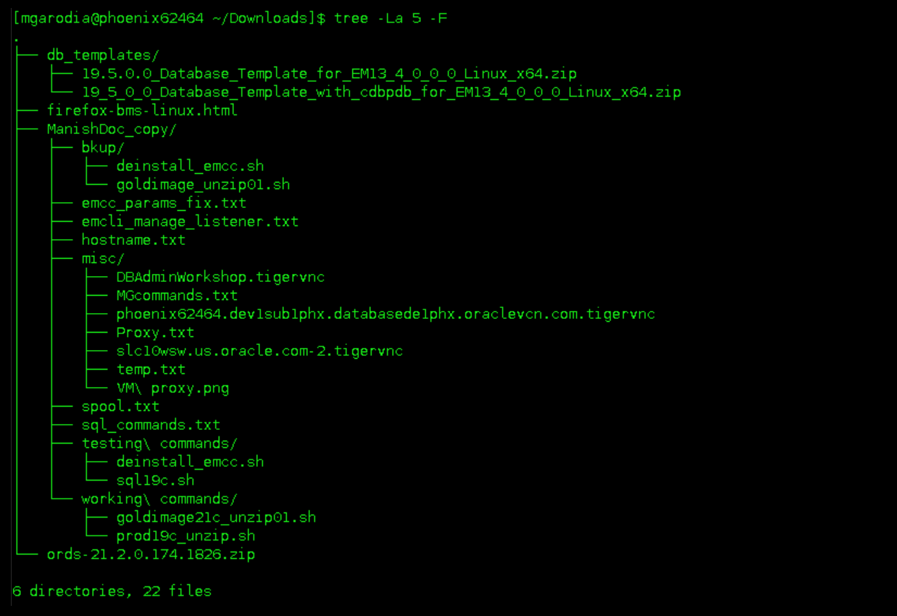
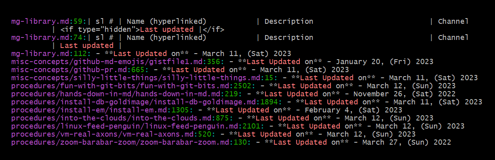
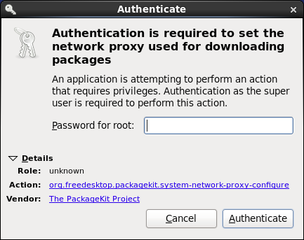

#  Linux -:- feed the penguin 

## Introduction
Get hands dirty with Linux commands, tips, and tricks.


**Figure:** Linux system layers


<!--
**Cite**: Source - [Guru99](https://www.guru99.com/introduction-to-shell-scripting.html)
-->

## Linux Terminal
 - Common

	----
	## Shell commands
	 - check the current (active running) shell

		```
		$ <copy>echo $0</copy>

		/bin/csh
		```
		```
		$ <copy>ps -p $$</copy>

		  PID TTY          TIME CMD
		22850 pts/4    00:00:00 csh
		```

	 - find out all available shells

		```
		$ <copy>cat /etc/shells</copy>
		```
		```
		/bin/sh
		/bin/bash
		/usr/bin/sh
		/usr/bin/bash
		/bin/ksh
		/bin/rksh
		/bin/zsh
		/bin/tcsh
		/bin/csh
		```

	 - Default Bash prompt

		```
		bash-4.4$
		```

	 - Set custom text for BASH prompt

		```
		$ <copy>PS1="MyText> "</copy>
		```

		> Take a backup of the `.bashrc` file before making changes to the Bash profile.

		```
		$ <copy>cp ~/.bashrc ~/.bashrc.bak</copy>
		```

		Custom CSH prompt -

		```
		$ <copy>set prompt='%w %D %Y %P %# '</copy>
		```

		```
		$ <copy>set prompt="\n%{\033[0;32m%}%n@%m:%{\033[0;33m%}%~%{\033[1;30m%}>%{\033\[1;37m%} "</copy>
		```

		<!--

		https://superuser.com/questions/399047/customizing-csh-prompt

		First of all, the ${cwd} part isn't giving the full path to the directory I'm in, only the full path to the directory I'm in when .cshrc was sourced. How do I display the current directory?

		Secondly, if I don't include the space at the end of the string the color of the text I type is changed to the color of the directory from the previous part. Is there anyway to do this without adding the space?
		-->

	 - Add date to Bash prompt

		```
		$ <copy>export PS1="$(date +\k:\M:\S) $ "</copy>
		```

		```
		11:17:24 $
		```

		```
		$ <copy>PS1="\u \D{\%d-\%m-\%y - }\t $ "</copy>
		```

		```
		your-account 24-07-24 - 10:03:49 $ 
		```

	 - Add user/host information to Bash prompt

		```
		$ <copy>PS1="[\mgarodia@\phoenix123546 \D{\Y\m\d-\H:\M:\S}]\$ "</copy>
		```
		```
		[\mgarodia@\phoenix123546 20221123-11:15:17]$
		```

		Remove the slashes before every percentage symbol.

		> **Note:** This is a temporary variable.   
		New terminal opens with the default Bash prompt, *`bash-4.4$`*.

	 To return to the previous mode or go back to the previous shell -
		 - type *`exit`*   
		   or
		 - Press **Ctrl** + **D**

	----
	## Switch shell

	```
	$ <copy>exec /bin/sh</copy>

	sh-4.2$
	```

	- **Temporary** - Applicable to the current terminal session only.

		From *Bash* to *c*

		```
		$ <copy>exec csh</copy>
		or
		$ csh
		```

		From *c* to *Bash*

		```
		$ <copy>exec bash</copy>
		or
		$ bash
		```

	- **Permanent**

		```
		$ <copy>chsh -s /bin/csh</copy>
		$ Password:
		```

	----
	## Run command as root

	Syntax

	```
	$ su -c [command] [user-name]
	```

	Example

	```
	$ <copy>su -c /scratch/u01/app/oracle/product/21.0.0/dbhome_01/root.sh mgarodia</copy>
	```

	----
	## Keyboard shortcuts

	Shortcuts for Linux terminal shell prompt.

	 | shortcut       | action                                                          |
	 |----------------|-----------------------------------------------------------------|
	 | **Ctrl** + *L* | clear screen or type *`clear`*                                  |
	 | **Ctrl** + *D* | log out from sudo user back to the original user                |
	 | **Ctrl** + *U* | erases from the current cursor position to the begining of line |
	 | **Ctrl** + *A* | moves cursor position to the beginning of line                  |
	 | **Ctrl** + *E* | moves cursor position to the end of line                        |

## Users & Groups

- User and group administration

	----
	## User commands

	 1. Show current user
	 1. User login shells
	 1. Switch to a different user
	 1. Switch to root
	 1. Exit from root/shell
	 1. Check sudo password

	----
	1. **Show current user**

		```
		$ <copy>whoami</copy>
		[user-name]
		```
		or
		```
		$ <copy>echo $USER</copy>
		[user-name]
		```

	1. **User login shells**

		```
		$ <copy>who</copy>
		```
		```
		mgarodia pts/0        2022-11-09 18:13 (:1)
		mgarodia pts/1        2022-11-09 18:14 (:1)
		mgarodia pts/2        2022-11-10 04:45 (:1)
		mgarodia pts/3        2022-11-09 18:24 (:1)
		mgarodia pts/4        2022-11-09 18:36 (:1)
		mgarodia pts/5        2022-11-10 14:18 (:1)
		```
		or
		```
		$ <copy>w</copy>
		```
		```
		 14:40:07 up 1 day, 40 min,  6 users,  load average: 0.00, 0.00, 0.00
		USER     TTY      FROM             LOGIN@   IDLE   JCPU   PCPU WHAT
		mgarodia pts/0    :1               Wed18   20:26m  0.00s 13.60s kdeinit4: kded4 [kdeinit]
		mgarodia pts/1    :1               Wed18   30:53   0.11s  0.11s -bin/csh
		mgarodia pts/2    :1               04:45    9:53m  0.38s  0.06s -bin/csh
		mgarodia pts/3    :1               Wed18   19:41m  1.28s  1.22s ./sqlplus   as sysdba
		mgarodia pts/4    :1               Wed18   21:50   0.18s  0.05s -sh
		mgarodia pts/5    :1               14:18    4.00s  0.04s  0.04s -bin/csh
		```

	1. **Switch to a different user**

		Syntax

		```
		$ sudo su - [user-name] -s <shell>
		```

		Example, switch to *oracle* with `c` shell.

		```
		$ sudo su - oracle /usr/bin/csh
		```

		> **Did you know..?**   
		The user *oracle* requires no password. Use this user to install the database and perform project-related activities.

	1. **Switch to root**

		```
		$ <copy>sudo -i</copy>
		$ Password:
		```
		```
		$ <copy>sudo su -</copy>
		$ Password:
		```

		The following requires no password.

		```
		$ <copy>/usr/local/packages/aime/install/run_as_root "bash"</copy>
		```

		```
		$ <copy>/usr/local/packages/aime/em/run_as_root bash</copy>
		```

		```
		$ <copy>sudo su - || (sudo sed -i -e 's|root:x:0:0:root:/root:.*$|root:x:0:0:root:/root:/bin/bash|g' /etc/passwd && sudo su -)</copy>
		```

	1. **Exit from root**

		To log out from root (or any current user) and to go back to the previous user:

		 - type *`exit`*

			```
			$ <copy>exit</copy>
			```
			or
		 - Press **Ctrl** + **D**

	1. **Check sudo password**

		```
		$ <copy>sudo ls</copy>
		$ Password:
		```

	----
	## Group commands

	 *`g`* - Primary group
	 *`G`* - Secondary group

	 1. Show all groups the user belongs to
	 1. Complete user/group details
	 1. Get entries from database

	----

	1. **Show all groups the user belongs to**

		Syntax
		```
		$ groups [user-name]
		```

		Examples

		```
		$ <copy>groups</copy>

		wheel dba oinstall
		```
		```
		$ <copy>groups mgarodia</copy>

		mgarodia : wheel dba oinstall
		```

	1. **Complete user/group details**

		Syntax

		```
		$ id [user-name]
		```

		for only the current user

		```
		$ id
		```

		Example

		```
		$ <copy>id mgarodia</copy>

		uid=1477205(mgarodia) gid=10(wheel) groups=10(wheel),8500(dba),59968(oinstall)
		```

	1. **Get entries from database**

		Syntax

		```
		$ getent group <group>
		```

		Example

		```
		$ <copy>getent group dba</copy>

		dba:x:8500:mgarodia,oracle
		```

	----
	## Manage users and groups

	 1. Create a new group
	 1. Delete a group
	 1. Create a new user
	 1. Add user to groups
	 1. Change user password
	 1. Modify the primary group of user
	 1. Modify secondary groups of user
	 1. Remove user from group
	 1. Modify user default shell

	----

	1. **Create a new group**

		```
		$ <copy>sudo groupadd </copy><group>
		```

	1. **Delete a group**

		```
		$ <copy>sudo groupdel </copy><group>
		```

	1. **Create a new user**

		```
		$ <copy>sudo useradd </copy>[user-name]
		```

	1. **Add user to groups**

		Syntax

		```
		$ sudo useradd -g (primary group) users -G wheel,developers (secondary groups) [user-name]
		```

		Example

		```
		$ <copy>sudo useradd -g wheel -G dba,oinstall mgarodia</copy>
		```

	1. **Change user password**

		```
		$ sudo -u [user-name] passwd
		```

	1. **Modify the primary group of user**

		Syntax

		```
		$ sudo usermod -g <group> [user-name]
		```

		Example

		```
		$ <copy>sudo usermod -g developers mgarodia</copy>
		```

	1. **Modify secondary groups of user**

		Use `sudo` or go to `root` and modify.

		Syntax

		```
		$ sudo usermod -a -G <group1,group2,group3 use comma with no spaces> [user-name]
		```

		Example

		```
		$ <copy>usermod -a -G dba,oinstall,db_code_access,db_if_access,db_test_access,db_code_access_ro,db_nls_access,em_test_access mgarodia</copy>
		```

		> **Caution:** Ensure to use the option *-a* to append while modifying the user groups. If you do not use *-a*, the command removes the user from the groups not mentioned after *-G*.

	1. **Remove user from group**

		Syntax

		```
		$ sudo gpasswd -d [user-name] <group>
		```

		The option *-d* deletes the user.

		```
		$ sudo deluser [user-name] <group>
		```

		Example

		```
		$ sudo gpasswd -d mgarodia oinstall
		```

	1. **Modify user default shell**

		Syntax

		```
		$ sudo usermod -s <shell> [user-name]
		```

		Example

		```
		$ <copy>sudo usermod -s /usr/bin/csh mgarodia</copy>
		```

## files-folders

 - directories basic
 - make directories
 - home folder
 - symbolic links
 - command alias
 - copy
 - move or rename
 - remove
 - find
 - file/folder permissions
 - other general

	----
	## directories basic

	 - Print working directory (absolute path)

		```
		$ <copy>pwd</copy>
		```

	 - Print working directory (only current directory without the full path)

		```
		$ <copy>basename "$PWD"</copy>
		```

	 - List files and directories, excluding hidden ones

		```
		$ <copy>ls</copy>
		```

		```
		$ <copy>ls -D</copy>
		```

	 - List directories to one-level only, vertically, non-recursive

		```
		$ <copy>ls -1</copy>
		```

	 - List files and directories including subdirectories to one-level only

		```
		$ <copy>ls -D *</copy>
		```

		```
		$ <copy>ls -1 *</copy>
		```

	 - List directories and classify, append indicators `/`, `=`, `*`, `@`, `|`, or `>` to items

		```
		$ <copy>ls -F</copy>
		```
		```
		[mgarodia@phoenix123546 ~/Downloads]$ ls -F
		db_templates/  firefox-bms-linux.html  ManishDoc_copy/  ords-21.2.0.174.1826.zip
		```

	 - List directories recursive *-R*

		```
		$ <copy>ls -R</copy>
		```
		```
		.:
		db_templates  firefox-bms-linux.html  ManishDoc_copy  ords-21.2.0.174.1826.zip

		./db_templates:
		19.5.0.0_Database_Template_for_EM13_4_0_0_0_Linux_x64.zip  19_5_0_0_Database_Template_with_cdbpdb_for_EM13_4_0_0_0_Linux_x64.zip

		./ManishDoc_copy:
		bkup  emcc_params_fix.txt  emcli_manage_listener.txt  hostname.txt  misc  spool.txt  sql_commands.txt  testing commands  working commands

		./ManishDoc_copy/bkup:
		deinstall_emcc.sh  goldimage_unzip01.sh

		./ManishDoc_copy/misc:
		DBAdminWorkshop.tigervnc  phoenix123546.dev3sub1phx.databasede3phx.oraclevcn.com.tigervnc  slc10wsw.us.oracle.com-2.tigervnc  VM proxy.png
		MGcommands.txt            Proxy.txt                                                       temp.txt

		./ManishDoc_copy/testing commands:
		deinstall_emcc.sh  sql19c.sh

		./ManishDoc_copy/working commands:
		goldimage21c_unzip01.sh  prod19c_unzip.sh
		```

	 - See files size in a directory in MBs.

		```
		$ <copy>ls -l --block-size=M</copy>
		```
		```
		total 4330M
		-r--r--r-- 1 90002 g527  818M Feb  8 04:24 client_home.zip
		-r--r--r-- 1 90002 g527 2382M Feb  8 04:24 db_home.zip
		-r--r--r-- 1 90002 g527 1130M Feb  8 04:25 grid_home.zip
		```

	 - Long listing of files and directories with complete details on date, time, size, permissions, etc.

		```
		$ <copy>ll</copy>
		```
		```
		total 34892
		-rw-r--r-- 1 mgarodia wheel      325 Jan 17 04:53 19cstart.sh
		-rw-r--r-- 1 mgarodia wheel      353 Jan 20 15:55 21cstart.sh
		-rw-r--r-- 1 mgarodia wheel      347 Jan 17 10:14 23cstart.sh
		lrwxrwxrwx 1 mgarodia wheel       49 Aug 12  2021 dbhome19c -> /scratch/u01/app/oracle/product/19.0.0/dbhome_02/
		lrwxrwxrwx 1 mgarodia wheel       49 Jan 20 16:36 dbhome21c -> /scratch/u01/app/oracle/product/21.0.0/dbhome_002
		lrwxrwxrwx 1 mgarodia wheel       47 Jan 16 16:24 dbhome23c -> /scratch/u01/app/oracle/product/23.0.0/dbhome_1
		drwxr-xr-x 3 mgarodia wheel        2 Jul 29 18:55 Desktop
		drwxr-xr-x 4 mgarodia wheel        4 Oct  1  2021 Documents
		drwxr-xr-x 4 mgarodia wheel        4 Oct 27 09:31 Downloads
		drwxrwxrwt 3 mgarodia wheel        1 May 19  2022 emdiag
		-rw-r--r-- 1 mgarodia wheel      131 May 21  2022 install_EM.sh
		lrwxrwxrwx 1 mgarodia wheel       58 Feb 14  2022 listener21c -> /scratch/u01/app/mgarodia/homes/OraDB21Home1/network/admin
		-rw-r--r-- 1 mgarodia wheel      362 Jun  3  2022 manisha.sh
		lrwxrwxrwx 1 mgarodia wheel       56 Oct 29  2021 mm_21c -> /scratch/u01/app/oracle/product/21.0.0/dbhome_manisha01/
		drwxr-xr-x 2 mgarodia wheel        0 Jun 10  2021 Music
		-rw-rw---- 1 mgarodia wheel 33562624 Jan 18 10:47 octs.dbf
		drwxr----- 3 mgarodia wheel        1 Jul  1  2021 oradiag_mgarodia
		drwxr----- 3 mgarodia wheel        1 Dec 25 00:20 oradiag_UNKNOWN
		drwxrwx--- 6 mgarodia wheel        6 Jun 12  2021 oraInventory
		drwxr-xr-x 2 mgarodia wheel        0 May 30  2022 ORDS
		drwxr-xr-x 3 mgarodia wheel        1 May 26  2022 ordsdata-old
		drwxr-xr-x 2 mgarodia wheel        9 Jul 13  2021 ords_log
		-rw-r--r-- 1 mgarodia wheel     6597 Jan 17 09:18 out.txt
		lrwxrwxrwx 1 mgarodia wheel       42 Feb 14  2022 pfile21c -> /scratch/u01/app/mgarodia/admin/orcl/pfile
		drwxr-xr-x 2 mgarodia wheel        0 Jun 10  2021 Pictures
		drwxr-xr-x 2 mgarodia wheel        0 Jun 10  2021 Public
		-rw-r--r-- 1 mgarodia wheel        0 Nov  7  2021 show
		-rw-r--r-- 1 mgarodia wheel       63 Jun 13  2022 snsuffix.properties
		drwxr-xr-x 2 mgarodia wheel        0 Aug 12  2021 symlinks
		drwxr-xr-x 2 mgarodia wheel        0 Jun 10  2021 Templates
		drwxr-xr-x 2 mgarodia wheel     3726 Jan 16 11:25 tmp-files
		-rw-r----- 1 mgarodia wheel      542 Jun  3  2022 tnsnames.ora
		drwxr-xr-x 2 mgarodia wheel        0 Jun 10  2021 Videos
		```

	 - View hidden files and folders

		in terminal

		```
		$ <copy>lah</copy>
		```

		in File Manager, use **Ctrl + H**

	 - go to a directory and view its tree structure

		Syntax

		```
		$ <copy>tree -La 5 -F</copy>
		```

		Sample

		```
		.
		|-- folder-a/
			|-- folder-a1/
			|   |-- folder-aa1/
			|   |   |-- file-aa1
			|   |   |-- file-aa2
			|   |-- file-a1
			|   |-- file-a2
			|-- folder-b1/
			|   |-- folder-bb1/
			|   |-- folder-bb2
			|   |   |-- file-bb1
					|-- file-bb2
					|-- file-bb3
		```

		Example

		```
		$ cd ~/Downloads/
		$ <copy>tree -La 5 -F</copy>
		```
		```
		.
		|-- db_templates/
		|   |-- 19.5.0.0_Database_Template_for_EM13_4_0_0_0_Linux_x64.zip
		|   `-- 19_5_0_0_Database_Template_with_cdbpdb_for_EM13_4_0_0_0_Linux_x64.zip
		|-- firefox-bms-linux.html
		|-- ManishDoc_copy/
		|   |-- bkup/
		|   |   |-- deinstall_emcc.sh
		|   |   `-- goldimage_unzip01.sh
		|   |-- emcc_params_fix.txt
		|   |-- emcli_manage_listener.txt
		|   |-- hostname.txt
		|   |-- misc/
		|   |   |-- DBAdminWorkshop.tigervnc
		|   |   |-- MGcommands.txt
		|   |   |-- phoenix123546.dev3sub1phx.databasede3phx.oraclevcn.com.tigervnc
		|   |   |-- Proxy.txt
		|   |   |-- slc10wsw.us.oracle.com-2.tigervnc
		|   |   |-- temp.txt
		|   |   `-- VM\ proxy.png
		|   |-- spool.txt
		|   |-- sql_commands.txt
		|   |-- testing\ commands/
		|   |   |-- deinstall_emcc.sh
		|   |   `-- sql19c.sh
		|   |-- working\ commands/
		|   |   |-- goldimage21c_unzip01.sh
		|   |   `-- prod19c_unzip.sh
		|-- ords-21.2.0.174.1826.zip

		6 directories, 22 files
		```

		----
		## Screenshot

		

	 - go back to the previous directory

		```
		$ <copy>cd -</copy>
		```

	- Check variables

		*`$home`*

		```
		 $ <copy>echo $home</copy>
		```

		*`$DISPLAY`*

		```
		 $ <copy>echo $DISPLAY</copy>
		```

		*`$ORACLE_SID`*

		```
		 $ <copy>echo $ORACLE_SID</copy>
		```

		*`$ORACLE_HOME`*

		```
		 $ <copy>echo $ORACLE_HOME</copy>
		```

	----
	## make directories

	 - Create a directory in home `/home/mgarodia`

		```
		$ <copy>mkdir ~/directory/</copy>
		```

	 - Create multiple directories and subdirectories together

		```
		$ <copy>mkdir -p /home/linuxize/music/rock/gothic</copy>
		```

		> **Did you know..?**   
		The *-p* flag creates a parent-child directories structure, if the directories does not exist. If you do not specify *-p*, then `mkdir` returns an error:
		`No such file or directory`.

	 - Create directories as a <i>tree structure</i>

		Ensure no spaces after the commas. If you have a blank space after a comma, `mkdir` fails with an error - *`Missing '}'`*.

		```
		$ <copy>mkdir -p food/{icecream/strawberry,fruits,salad,juice/{apple,orange,mixed},soup/chicken/spicy}</copy>
		```
		```
		food/
		|-- fruits
		|-- icecream
		|   `-- strawberry
		`-- juice
		|   |-- apple
		|   |-- mixed
		|   `-- orange
		|-- salad
		`-- soup
			`-- chicken
				`-- spicy
		```

		Example

		```
		$ <copy>mkdir -p htg/{articles/{new,rewrites},images,notes,done}</copy>
		```
		```
		htg/
		|-- articles
		|   |-- new
		|   `-- rewrites
		`-- done
		|-- images
		`-- notes
		```

		<if type="hidden">

		Example, Cite: [mkdir command](https://linuxize.com/post/how-to-create-directories-in-linux-with-the-mkdir-command/)

		```
		$ <copy>mkdir -p /music/{jazz/blues,folk,disco,rock/{gothic,punk,progressive},classical/baroque/early}</copy>
		```
		```
		music/
		|-- classical
		|   `-- baroque
		|       `-- early
		|-- disco
		|-- folk
		|-- jazz
		|   `-- blues
		`-- rock
			|-- gothic
			|-- progressive
			`-- punk
		```
		</if>

	----
	## home folder

	 - go to home directory

		```
		$ <copy>cd /home/[user-name]</copy>
		```
		```
		$ <copy>cd ~</copy>
		```

	 - change the default home folder

		**Option 1** - using *CLI*

		```
		$ <copy>usermod -d /new-home/directory-location [user-name]</copy>
		```

		**Option 2** - edit *.bash_profile*

		1. Open the config file for Bash profile.

			```
			$ <copy>vi ~/.bashrc</copy>
			```

		1. Enter the path to the new home location.

			```
			<copy>cd /home/mgarodia/Downloads</copy>
			```

		1. Save the file.

			 > **Esc** + **:wq** or **Esc** + **Shift** + **zz**

	----
	## symbolic links

	 - create and update symlinks

		----
		## Create a symlink

		Syntax

		```
		$ ln -s target linkname
		$ ln -s </path/to/file-folder/to-be-linked> </path/of/link/to-be-created>
		```

		Example

		```
		$ <copy>ln -s /scratch/mgarodia/23c-install-db 23c-ws1</copy>
		```

		After creating a symlink, you can update it, for example, rename the link or modify it to point to a new location.

		To update a symlink, you can do either of these -
		 - Delete the link and re-create a new one as indicated earlier
		 - Update the existing link with force

		----
		## Update a symlink

		To delete a symlink, use the command `rm <link-name>`.

		To replace an existing symlink completely with a new name or point to a new target folder -  

		```
		$ ln -sfn new-target new-linkname
		$ ln -sfn </path/to/new-file-folder> </fullpath-name/of/new-link>
		```

		Where,

		 - ***s*** - creates the symlink
		 - ***f*** - enforces changes to the link
		 - ***n*** - (optional) use this for linking to a folder

		The ***-n*** option is necessary to avoid creating a subfolder inside that symbolic link, instead of replacing the symbolic link.			

	----
	## command alias

	You can create and run you own short *aliases* for commands.

	Syntax

	```
	$ alias short-name="your-custom-command"
	```

	Example

	```
	$ <copy>alias wr=”cd /var/www/html”</copy>
	```

	Henceforth, run *`wr`* instead of the complete command.

	> It is worth mentioning that these alias are temporary. They are applicable to the current terminal session only. If you open a new terminal, then it does not recognize your alias anymore.

	**Permanent alias**

	You can create aliases that are persistent in the system.

	1. Create a file *`.bash_aliases`* in your home location.

		- Windows home (10 or later): `C:\Users\[your-user-name]`
		- Linux home: `/home/[your-user-name]`

	1. Add your aliases to this file.

		```
		<copy>
		alias w="wordlist.sh"
		alias 21c="cd /d/git/GitHub/database-livelabs/projects/dba-essentials-test/db21c-livelabs-workshops/"
		alias 23c="cd /d/git/GitHub/database-livelabs/projects/dba-essentials-test/db23c-livelabs-workshops/"
		alias cmn="cd /d/git/GitHub/oracle-livelabs/common/"
		alias db="cd /d/git/GitHub/oracle-livelabs/database/"
		alias em="cd /d/git/GitHub/oracle-livelabs/em-omc/"
		alias ll="cd /d/git/GitHub/database-livelabs/"
		alias mg="cd /d/git/GitHub/mg-playground/"
		alias new="cd /c/Programs/Git\ 2.37.1/ ; ./git-bash.exe" && cd /d/git
		</copy>
		```

	1. Add the following to *`.bashrc`* to run the aliases automatically.

		```
		<copy>
		if [ -f ~/.bash_aliases ]; then
		. ~/.bash_aliases
		fi
		</copy>
		```

	Your aliases are now stored permanently. Even if you close the terminal or open a new terminal, the aliases are still valid.

	> **Caution**: Even though it works, avoid adding aliases directly to the `.bashrc` file.

	To view the existing aliases in your system:

	```
	$ <copy>alias</copy>
	```

	```
	alias ls='ls -F --color=auto --show-control-chars'
	alias node='winpty node.exe'
	alias test='cmd'
	```

	**Cite**

	- [Linux permanent aliases - cyberciti](https://www.cyberciti.biz/faq/create-permanent-bash-alias-linux-unix/)

	----
	## copy

	 - Copy files locally

		```
		$ <copy>cp -a /<source>/. /<destination>/</copy>
		```

	 - Secure copy across remote systems

		```
		$ scp <option> <user@source-host:>filepath1 [user@destination-host:]filename2
		```

		Enter the password when prompted.
		You can copy files and folders with *SCP* in two scenarios, **push** or **pull**.

		----
		## Push file or folder

		1. Go to the filer or folder source location (local directory).

			```
			$ cd /path/to/where/the-file-resides
			```

		1. Push the file or folder to the destination.

			```
			$ scp source-file-name user-name@destination-host:destination-folder
			```
			```
			$ scp -r \home\mgarodia\Downloads\myfile.txt user@host:/path/to/where-you-want/the-file
			```

		----
		## Pull file or folder

		1. Go to the file or folder destination location.

			```
			$ cd /path/to/the-destination-folder
			```

		1. Pull files or folders from the source location.

			```
			$ scp remote-user-name@host:/remote/file.txt /local/directory
			```

		----
		## Examples

		 - Push file

			```
			$ <copy>scp password.txt mgarodia@phoenix123546.dev3sub1phx.databasede3phx.oraclevcn.com:/scratch/mgarodia</copy>
			Password:
			```

		 - Pull file

			```
			$ <copy>scp -rp mgarodia@phoenix123546.dev3sub1phx.databasede3phx.oraclevcn.com:/scratch/u01/mgarodia/installers/emcc135/ /scratch/u01/software/emcc_new/</copy>
			Password:
			```
			```
			$ <copy>scp -rp mgarodia@phoenix62465.dev1sub1phx.databasede1phx.oraclevcn.com:/scratch/u01/app/oracle/product/21.0.0/dbhome_unzip02 /scratch/mgarodia</copy>
			Password:
			```
			<if type="hidden">
			```
			$ <copy>scp -rp mgarodia@phoenix123546.dev3sub1phx.databasede3phx.oraclevcn.com:/scratch/u01/mgarodia/installers/LINUX.X64_193000_db_home.zip mgarodia@den02asa.us.oracle.com:/scratch/preeshuk/</copy>
			Password:
			```
			</if>

	----
	## move or rename

	### <ins>**move**</ins>

	Use the `mv` command for both *moving* and for *renaming* files and folders.

	 - Move files and folders (recursive)

		```
		$ <copy>mv -r /files/source/location /files/destination/location</copy>
		```

	 - Run the move command as another user

		```
		$ <copy>sudo mv /directory/source/location /directory/destination/location</copy>
		```

	 - Move multiple files to a destination

		```
		$ <copy>mv file1 file2 file3 -t /destination/location</copy>
		```

		or

		```
		$ <copy>mv -t /destination/location [source-file1] [source-file2] .... [source-fileN]</copy>
		```

	 - move files and directories as another user, requires password

		Syntax

		```
		$ sudo mv source-folder/* target-folder/
		```

		Example

		```
		$ <copy>sudo mv launcher2022-11-09_06-21-46PM.log tmp1/OraInstall2022-11-09_06-21-46PM/</copy>
		Password:
		```

	### <ins>**rename**</ins>

	 - Rename a file

		```
		$ mv [file-old-name] [file-new-name]
		```

		Similarly, rename a folder

		```
		$ mv [folder-old-name] [folder-new-name]
		```

	----
	## remove

	 - Delete a file

		```
		$ <copy>rm [file-name]</copy>
		```

	 - Delete all files

		```
		$ <copy>rm *.*</copy>
		```

		or

		```
		$ rm .
		```

	 - Remove an <i>empty</i> directory

		```
		$ <copy>rm -d [directory]</copy>
		```

	 - Remove nonempty directories, <i>recursive</i>

		```
		$ <copy>rm -rd [directory]</copy>
		```

		- *r* - recursive
		- *d* - directories

		> **Note:** If the directory you want to delete contains no subdirectories, use *`rm -d`*.

	 - <i>Force delete</i> one or more files (directly without prompt, overrides write-protection)

		```
		$ <copy>rm -f <files or files></copy>
		```

		> **Caution:** Force delete removes the file or files instantly without asking for any confirmation. ***Be absolutely sure while running this command***.

	 - <i>Force delete</i> nonempty directories (directly without prompt, overrides write-protection)

		```
		$ <copy>rm -rf <directory></copy>
		```

		> **Caution:** Force delete removes the directory and its underlying files and subdirectories instantly without asking for any confirmation. ***Be absolutely sure while running this command***.

	----
	## Searching for something?? go *find*

	<i>Who's stopping you</i> :)

	 - Syntax

		```
		$ <copy>find . -print | grep [file-name]</copy>
		```

	 - find specific file type in all subdirectories

		```
		$ <copy>find . -name '*.json' -exec cat {} \;</copy>
		```

	 - find text within files

		```
		$ <copy>grep -rinw --color=always [path-to-file] -e 'pattern'</copy>
		```

		where,
		- ***r*** &nbsp;&nbsp;&nbsp; - recursive
		- ***i*** &nbsp;&nbsp;&nbsp; - ignore case
		- ***n*** &nbsp;&nbsp;&nbsp; - line number
		- ***w*** &nbsp;&nbsp; - match whole word
		- ***l*** &nbsp;&nbsp;&nbsp; - show file name
		- ***e*** &nbsp;&nbsp;&nbsp; - pattern to find

		Example,

		```
		$ grep -rinw --color=always -e 'Last Updated'
		```

		Result

		

		Alternatively, search in a file

		Syntax
		```
		$ grep 'text' file
		```
		Example
		```
		$ <copy>grep 'temporary password' /var/log/mysqld.log</copy>
		```

	 - include specific file types

		```
		$ <copy>grep --include=\*.{c,h} -rnw '/path/to/somewhere/' -e "pattern"</copy>
		```

	 - exclude specific file types

		```
		$ <copy>grep --exclude=\*.o -rnw '/path/to/somewhere/' -e "pattern"</copy>
		```

		```
		$ <copy>grep --exclude-dir={dir1,dir2,*.dst} -rnw '/path/to/somewhere/' -e "pattern"</copy>
		```

	 - Other find options

		```
		$ <copy>grep -Ril "text-to-find-here" /</copy>
		```

		where, ***/*** is for root

		```
		$ <copy>grep -r "string to be searched"  /path/to/dir</copy>
		```
		```
		$ <copy>ack 'text-to-find-here'</copy>
		```

		----
		## Wordlist Check sample

		Glance a piece of code inside the tool, *wordlist-check.sh* -

		```
		$ <copy>grep -wrEniTaH -B 0 --color=always 'above|accessable|ad.hoc|ada.compliant|adaptor|adhoc|admin|advisor|afterwards|aggre-gator|air.bill|alive|allow|allow.list|allowed|allows|alphabetical|alphanumerical|alright|amongst|analogue|and/or|anti|as.per|as-of date|associate to|associate. to|auto|back.plane|back.slash|back.space|backend|back-order|backwardly|backwards|band.width|be escaped|be sure|being that|below|bi|bitvector|bit-vector|black.hat|bogus|boiler-plate|bold.face|boot|bottom up|bottom.most|bottomup|break.point|built in|builtin|bulletted|busy.bar|busy.box|byte.code|can not|cancell|cancellable|cancelled|cancelling|cancells|case-insensitive|cashe|cautionlist|caution-list|centigrade|change-able|check.list|check.lists|checkin|checkins|children elements|c-language|classpath|class-path|cleans-up|clean-up|click on|click.jack|clicked on|clicks on|client-server|clientside|clip.board|cloud-native|clusterwide|cluster-wide|co|code-base|commandline|comment out|commented out|comments out|context sensitive|copy protected|copyprotected|crash|c-shell|cut-off|cuts-off|data.base|dataguide|data-guide|datamart|data-mart|datasource|data-source|datawarehouse|data-warehouse|datum|de|dead|demo|dependant|depress|descripter|dezoom|dial into|dials into|dialsup|dialup|disabled|done|double.click on|double.clicked on|double.clicks on|doublesided|down.time|drilldown|dropdown|dumb|dynamic link library|easier|easy|else|end.line|end.user|end.users|enterprise-wide|equi-join|failed-over|fat|fatal|fault tolerant|feed-back|fingerprint-reader|firm.ware|flow.chart|flow.charts|foo|formatable|formated|forwards|freeform|frontend|geo-code|geo-fence|geo-location|geo-spatial|gray.list|gray.scale|grayed-out|graylist|gray-out|grey|hand-held|hard.code|hard.coded|hard.copy|hard.copies|hard-ware|he|her|hex|hexa-decimal|high level|high-availability|higher|him|hit|homepage|home-page|hot.fix|hot.keys|hyper.text|illegal|in.line|indicative|indices|info|information on|instal|inter|intra|irrecoverable|issue|italicise|joy.stick|judgement|just|keep in mind|key.store|key.stores|key.word|key.words|lady|landscape-mode|left.hand|legal|licence|life-cycle|like|linearise|list.box|live|log into|logged into|logging into|logoff|logout|logs into|loop.back|lowcost|lower|lower.case|lowlevel|machine-learning|mail.box|mailstop|mail-stop|main.frame|main.frames|make-file|man|man-in-the-middle|mash-up|master|mathematic|matrices|men|menu.option|meta.data|mice|mono.space|moveable|multi|name.space|name.spaces|navigation-tree|need.to|needs.to|new-line|newsfeed|news-feed|non|numerical|object oriented|obsolete |off site|off.line|off.load|off.premises|offsite|okay|on.board|on.premise|once|one time|on-line|on-screen|on-site|onwards|openended|opensource|open-source|oracle corporation|oracle data.server|oracle database.server|outdent|out-of-the-box|outwards|over.all|over.estimate|over.ride|page-able|pageout|per.cent|pick-up|picks-up|please|portrait-mode|possesses|post.installation|post.processor|postal.code|postman|poweroff|power-off|poweron|power-on|pre|prepend|preventative|private-cloud|progress-indicator|pseudo|public-private|pull.down|punch-out|punched-out|push.button|push.buttons|queriable|queueing|quickstart|quote.marks|quotes|random-access|readonly|readout|read-write|realtime|rearchive|record oriented|record-length|record-mark|record-size|remote.host|removeable|replace-mode|re-rout|re-run|re-usable|right.hand|right.most|roll-up|run.time|run-out|s/he|salable|salesman|saleswoman|scaleable|screen-reader|scroll.arrow|scroll.bar|scroll.box|scrolling.list|section.508|selfchecking|selfdefining|selfinitializing|selfloading|selfrelocating|semi.annual|semi.monthly|semi.weekly|server side|serverside|setid|set-id|shareable|she|short term|shortcut.keys|shortcut.menu|should|shut-down|shut-off|shuts-off|sign.on|sign-in|signout|silent.installation|simple|simply|singlesided|sizeable|slider|smart.card|smart.phone|soft.copy|soft.copies|space-bar|stand.alone|start-up|statusbar|status-bar|sub|super.set|super.user|supply-chain|surviving|survivor|swapin|swapout|synch|system-wide|table.space|table.spaces|tap on|taps on|tape-mark|tar|task.bar|task.flow|thinclient|thin-client|tick.mark|tick.marks|time share|time.line|time.lines|timeframe|time-frame|time-out|time-series|timeslice|time-slice|timestamp|to-do|tool.bar|tool.bars|tool.set|tool.sets|tool.tip|tool.tips|top.most|topdown|touch sensitive|touchscreen|touchsensitive|towards|track.ball|trouble.free|trust-keystore|turn.around|type.bar|type.case|type.face|typeahead|ultra|un|under-estimate|unzoom|upper.case|up-time|upwards|useable|userdefined|userID|user-ID|username|useroriented|userspecified|usersupplied|userwritten|vendee|via|victim|voice frequency|voice grade|warmup|web.site|web.sites|webagent|web-agent|webform|web-form|webmaster|web-master|webpage|webpages|web-page|web-pages|webportal|web-portal|webserver|webservers|web-server|web-servers|webservice|webservices|web-service|web-services|whitehat|white.hat|whitelist|whitelists|white.list|white.lists|whitepaper|whitepapers|white.paper|white.papers|wild.card|wild.cards|wish|woman|women|word-length|world-wide|wrap-around|writeback|writeenable|writeup|[cw]ould|zero suppression|zoom-in|zoom-out|zip|zipped|zips|zipping' --exclude={\*index\*,\*initialize-environment\*,\*ISHCONDITION\*,\*manifest\*,\*ocw-livelabs-rat-overview\*,\*prepare-setup\*,\*.gitignore\*,\*git-filter-repo\*,\*wordlist-check\*,\*.css,\*.dsnb,\*.dva,\*.gif,\*.\*ish\*,\*.jpg,\*.JPG,\*.jpeg,\*.js,\*.json,\*.log,\*.map,\*.old,\*.png,\*.PNG,\*.py,\*.rsp,\*.sql,\*.tmpl,\*.tiff,\*.yaml,\*.yml} --exclude-dir={\*.git\*,\*lintchecker\*,\*learning-library\*,\*sample-tutorial\*,\*tutorial_creator\*,\*vale\*}</copy>
		```

		### Qualifiers

		*grep* (Global Regular Expression Print)

		- **`'text1|text2|textn'`** - separate different words with pipes to search for multiple patterns (or words) together
		- **`w`**, *`--word-regexp`* - match only whole words
		- **`r`**, *`--recursive`* - include subdirectories
		- **`E`**, *`--extended-regexp`* - extended regular expression
		- **`n`**, *`--line-number`* - prints line number
		- **`i`**, *`--ignore-case`* - for case independent
		- **`T`**, *`--initial-tab`* - shows tab spacing
		- **`a`**, *`--text`* - equivalent to --binary-files=text
		- **`H`**, *`--with-filename`* - prints file name
		- **`B 0`**, *`--before-context=x`* - prints `x` lines before the context; keep `0` to exclude extra lines
		- **`color=always`**, *`--colour[=WHEN]`* - use color markers to highlight;	other options are  `never` and `auto`
		- **`--exclude=FILE_PATTERN`** - skips the file or directory matching this pattern
		- **`--exclude={\*.png,\*.jpg}`** - skips multiple files together; use backslash  `\` to escape characters
		- **`--exclude-dir=PATTERN`** - skip the directory matching this pattern
		- **`--exclude-dir={\*PATTERN1\*,\*PATTERN2\*}`** - skips multiple directories together; use backslash  `\` to escape characters

		More qualifiers -

		- `c`, `--count` - shows count of words
		- `h`, `--no-filename` - hides the file names
		- `l`, `--files-with-matches` - displays only file names containing matches
		- `L`, `--files-without-matches` - displays only file names without matches
		- `o`, `--only-matching` - shows only matching part
		- `R`, `--dereference-recursive` - recursive and also follow symbolic links
		- `v`, `--invert-match` - invert match; displays all but matched words
		- `z`, `--null-data` - displays entire contents of matching files

		Other search options -

		```
		$ grep -e pattern1 -e pattern2 filename-or-filepath
		$ awk '/error|critical/failed/' /var/log/httpd/error_log
		$ sed -e '/error/b' -e '/critcial/b' -e d /var/log/apache/nixcraft.com_error_log
		```

		**Cite**

		- [linuxize - using grep](https://linuxize.com/post/how-to-use-grep-command-to-search-files-in-linux/)

		- [cyberciti - search mutliple words](https://www.cyberciti.biz/faq/searching-multiple-words-string-using-grep/)

		- [phoenixnap - mutliple patterns](https://phoenixnap.com/kb/grep-multiple-strings)

		- [linuxhint - prompt for input](https://linuxhint.com/prompt-for-input-bash/)

	----
	## The Triplets of Linuxville

	Every file has an **owner user** and an **owner group**. A file is associated with three classes of users -
	 - user or file owner
	 - group members
	 - others (everyone else)

	Each of these users have specific file permissions. You can control which user can -
	 - <i>**r**ead</i> access to your file
	 - <i>**w**rite</i> to your file
	 - <i>e**x**ecute</i> your file as a program

		----
		## file permissions

		To view the file permissions, use the *`ls`* command.

		```
		$ <copy>ls -l [file-name]</copy>
		```
		```
		-rw-r--r-- 12 mgarodia wheel 12.0K Nov  27 10:10 [file-name]
		|[-][-][-]-   [------] [---]
		| |  |  | |      |       |
		| |  |  | |      |       +-----------> Group
		| |  |  | |      +-------------------> Owner
		| |  |  | +--------------------------> Alternate Access Method
		| |  |  +----------------------------> Others Permissions
		| |  +-------------------------------> Group Permissions
		| +----------------------------------> Owner Permissions
		+------------------------------------> File Type
		```

		Each of these permissions are associated with a number.

		----
		## the number game

		Let us consider a use case where you want to modify a file's permissions (*r=4*, *w=2*, *x=1*).

		You want to grant -
		 - full permission (read, write, execute) to the file owner
		 - read and execute permissions to the file’s group
		 - only read permissions to all other users

		<ins>Triplets</ins>

		 - for u   
		 *rwx* &gt; **4** + **2** + **1** = **7**

		 - for g    
		 *r-x* &gt; **4** + **0** + **1** = **5**

		 - for o   
		 *r--* &gt; **4** + **0** + **0** = **4**

		 Which comes up to *754*.

			 > A *777* means <i>everyone has full access to the file</i>.

		You administer the ownership of your files and folders with
		 - *`chown`*
		 - *`chgrp`*

			----
			## cite source

			 - [Linuxize - File Permissions](https://linuxize.com/post/understanding-linux-file-permissions/)
			 - [UNIX Permissions](https://www.ccn.ucla.edu/wiki/index.php/UNIX_Permissions)

	----
	## Others

	 - Create an empty file

		```
		$ <copy>touch text.txt</copy>
		```

	 - Open a new file in the editor.

		```
		$ <copy>vi file1.txt</copy>
		```
		```
		$ <copy>view file2.txt</copy>
		```

	 - combine multiple files into a single file (not compress or zip)

		```
		$ <copy>cat source-file1.txt source-file2.txt > target-file3.txt</copy>
		```

		> **Note**: This command will copy contents from the source files and replace the contents of the target file *`target-file3.txt`*.

		However, you can retain the contents of the target file and insert further.    
		To merge files without removing the contents of the target file, use two greater than symbols.

		```
		$ <copy>cat source-file1.txt source-file2.txt >> target-file3.txt</copy>
		```

		This will append contents from the source files at the bottom of the target file. This command is not to create a compressed (`*.zip`) file.

	 - Extract file and folders from a `*.zip` file.

		```
		$ unzip [file-name] -d /folder/location
		```

		> **Tip**: If the destination folder does not exit, you may create the folder first.

	 - While extracting files and folders, use `-d` to specify the target directory

		Syntax

		```
		$ unzip -d
		```

		Sample

		```
		$ unzip -o archive.zip -d /Users/current/Dev/tools/
		```

## Scripting

A script begins with -

```
#!/bin/sh
```

### 1. Run a script from **csh**

 - If the script contains *export* commands -

	```
	$ sh <script-file>.sh
	```

 - If the script contains *setenv* commands -

	```
	$ source <script-file>.sh
	```

### 2. Run a script from **Bash**

 - All of these work in Bash

	```
	$ sh <script-file>.sh
	$ source <script-file>.sh
	$ . <script-file>.sh
	```

**Cite**: [Run a script from anywhere](https://askubuntu.com/questions/153251/launch-shell-scripts-from-anywhere)

## File system, disk space, OS, packages

 - File system, packages, and OS related

	----
	## Disk space

	Check the file system types with the complete hard disk information, *used* and *available*.

	```
	$ <copy>df -Th</copy>
	```
	```
	Filesystem           Type      Size  Used Avail Use Mounted on
	devtmpfs             devtmpfs  7.2G     0  7.2G   0 /dev
	tmpfs                tmpfs      15G     0   15G   0 /dev/shm
	tmpfs                tmpfs     7.3G   26M  7.2G   1 /run
	tmpfs                tmpfs     7.3G     0  7.3G   0 /sys/fs/cgroup
	/dev/sda2            ext4       42G   29G   11G  74 /
	/dev/sdb             ext4      296G   28G  253G  10 /scratch
	/dev/loop0           btrfs     2.0G   17M  1.8G   1 /var/lib/docker
	tmpfs                tmpfs     1.5G   44K  1.5G   1 /run/user/1477205
	tmpfs                tmpfs     1.5G     0  1.5G   0 /run/user/0
	```

	 > **Tip:** To exclude *Type*, use *`df -h`*.

	 - Check directory size

		Syntax

		```
		$ du -sh /directory/full/path
		```

		Example

		```
		$ <copy>du -sh /home/mgarodia</copy>
		```
		```
		1.7G    /home/mgarodia
		```

	 - Check the complete disk usage of a directory

		```
		$ <copy>df -h /scratch</copy>
		```
		```
		Filesystem      Size  Used Avail Use Mounted on
		/dev/sdb        296G   28G  253G  10 /scratch
		```

	 - Check size folder-wise

		Syntax

		```
		$ du -shx <directory> | sort -h
		```

		Example

		```
		$ <copy>du -shx ~/* | sort -h</copy>
		```

		----
		## Output

		```
		0       /home/mgarodia/Music
		0       /home/mgarodia/ORDS
		0       /home/mgarodia/Pictures
		0       /home/mgarodia/Public
		0       /home/mgarodia/show
		0       /home/mgarodia/symlinks
		0       /home/mgarodia/Templates
		0       /home/mgarodia/Videos
		512     /home/mgarodia/dbhome19c
		512     /home/mgarodia/dbhome21c
		512     /home/mgarodia/listener21c
		512     /home/mgarodia/mm_21c
		512     /home/mgarodia/pfile21c
		8.0K    /home/mgarodia/19cstart.sh
		8.0K    /home/mgarodia/21cstart.sh
		8.0K    /home/mgarodia/install_EM.sh
		8.0K    /home/mgarodia/manisha.sh
		8.0K    /home/mgarodia/ords_cdb_install_apex_ORCLPDB_2022-06-03_093912_00533.log
		8.0K    /home/mgarodia/ords_cdb_install_apex_PDB_SEED_2022-06-03_093849_00859.log
		8.0K    /home/mgarodia/ords_cdb_install_core_CDB_ROOT_2022-06-03_093816_00241.log
		8.0K    /home/mgarodia/ords_cdb_install_datamodel_ORCLPDB_2022-06-03_093910_00825.log
		8.0K    /home/mgarodia/ords_cdb_install_datamodel_PDB_SEED_2022-06-03_093847_00653.log
		8.0K    /home/mgarodia/ords_cdb_uninstall_core_CDB_ROOT_2022-06-03_084433_00185.log
		8.0K    /home/mgarodia/ords_cdb_uninstall_core_ORCLPDB_2022-06-03_084455_00019.log
		8.0K    /home/mgarodia/ords_cdb_uninstall_core_PDB3_2022-06-03_084504_00536.log
		8.0K    /home/mgarodia/ords_cdb_uninstall_core_PDB_SEED_2022-06-03_084444_00266.log
		8.0K    /home/mgarodia/snsuffix.properties
		8.0K    /home/mgarodia/tnsnames.ora
		16K     /home/mgarodia/ords_cdb_install_core_ORCLPDB_2022-06-03_093853_00120.log
		16K     /home/mgarodia/ords_cdb_install_core_PDB_SEED_2022-06-03_093822_00953.log
		17K     /home/mgarodia/Documents
		42K     /home/mgarodia/ordsdata-old
		89K     /home/mgarodia/ords_log
		195K    /home/mgarodia/emdiag
		6.2M    /home/mgarodia/oraInventory
		127M    /home/mgarodia/oradiag_mgarodia
		174M    /home/mgarodia/Desktop
		985M    /home/mgarodia/Downloads
		```

	 - Check RAM on the system

		```
		$ <copy>cat /proc/meminfo</copy>
		```
		```
		MemTotal:       15119300 kB
		MemFree:         1438948 kB
		MemAvailable:    7780692 kB
		Buffers:          854092 kB
		Cached:          9906216 kB
		SwapCached:        10796 kB
		Active:          9207284 kB
		Inactive:        3735700 kB
		Active(anon):    6002344 kB
		Inactive(anon):   665700 kB
		Active(file):    3204940 kB
		Inactive(file):  3070000 kB
		Unevictable:           0 kB
		Mlocked:               0 kB
		SwapTotal:      18628584 kB
		SwapFree:       18160104 kB
		Dirty:                32 kB
		Writeback:             0 kB
		AnonPages:       2176512 kB
		Mapped:          3504612 kB
		Shmem:           4486184 kB
		Slab:             432092 kB
		SReclaimable:     371856 kB
		SUnreclaim:        60236 kB
		KernelStack:        7312 kB
		PageTables:       214244 kB
		NFS_Unstable:          0 kB
		Bounce:                0 kB
		WritebackTmp:          0 kB
		CommitLimit:    26188232 kB
		Committed_AS:    9682356 kB
		VmallocTotal:   34359738367 kB
		VmallocUsed:           0 kB
		VmallocChunk:          0 kB
		HardwareCorrupted:     0 kB
		AnonHugePages:         0 kB
		ShmemHugePages:        0 kB
		ShmemPmdMapped:        0 kB
		CmaTotal:              0 kB
		CmaFree:               0 kB
		HugePages_Total:       0
		HugePages_Free:        0
		HugePages_Rsvd:        0
		HugePages_Surp:        0
		Hugepagesize:       2048 kB
		DirectMap4k:      153456 kB
		DirectMap2M:     7186432 kB
		DirectMap1G:    10485760 kB
		```

	----
	## Operating system

	 Check OS version

	 -	*`lsb_release`*  - view compact information

		```
		$ <copy>lsb_release -d</copy>
		```

		Output

		```
		Description:	Oracle Linux Server release 8.6
		```

	 -	*`lsb_release`* - view detailed information. Use any one of the following -

		```
		$ <copy>lsb_release -a</copy>
		```
		```
		$ <copy>lsb_release --all</copy>
		```

		Output

		```
		LSB Version:	:core-4.1-amd64:core-4.1-noarch:cxx-4.1-amd64:cxx-4.1-noarch:desktop-4.1-amd64:desktop-4.1-noarch:languages-4.1-amd64:languages-4.1-noarch:printing-4.1-amd64:printing-4.1-noarch
		Distributor ID:	OracleServer
		Description:	Oracle Linux Server release 8.6
		Release:	8.6
		Codename:	n/a
		```

	 -	*`uname --all`*

		```
		$ <copy>uname --all</copy>
		```

		Output

		```
		Linux phoenix211284 5.4.17-2136.312.3.4.el8uek.x86_64 #2 SMP Wed Oct 19 17:42:16 PDT 2022 x86_64 x86_64 x86_64 GNU/Linux
		```

	 -	*`os-release`*

		```
		$ <copy>cat /etc/os-release</copy>
		```

		Output

		```
		NAME="Oracle Linux Server"
		VERSION="8.6"
		ID="ol"
		ID_LIKE="fedora"
		VARIANT="Server"
		VARIANT_ID="server"
		VERSION_ID="8.6"
		PLATFORM_ID="platform:el8"
		PRETTY_NAME="Oracle Linux Server 8.6"
		ANSI_COLOR="0;31"
		CPE_NAME="cpe:/o:oracle:linux:8:6:server"
		HOME_URL="https://linux.oracle.com/"
		BUG_REPORT_URL="https://bugzilla.oracle.com/"

		ORACLE_BUGZILLA_PRODUCT="Oracle Linux 8"
		ORACLE_BUGZILLA_PRODUCT_VERSION=8.6
		ORACLE_SUPPORT_PRODUCT="Oracle Linux"
		ORACLE_SUPPORT_PRODUCT_VERSION=8.6
		```

	 -	*`host name`*

		```
		$ <copy>hostname</copy>
		```

		Output

		```
		phoenix211284
		```

	 -	*`lsb-release`* - Linux Standard Base

		```
		$ <copy>cat /etc/lsb-release</copy>
		```

		> **Note:** Some Linux distributions, but not all, use this file for older programs.

		----
		## Cite source

		[stack overflow](https://stackoverflow.com/questions/47838800/etc-lsb-release-vs-etc-os-release#:~:text=The202Fetc2Flsb2Drelease,including20things20like20filesystem20layout.)

	 - The following commands may also give OS-related information.

		Both *`issue`* and *`issue.net`* are used to display a banner (e.g. welcome line/ warning..) to SSH users before the login prompt.

		<ins>For local users</ins> -

		```
		$ <copy>cat /etc/issue</copy>
		```

		<ins>For network users</ins> -

		```
		$ <copy>cat /etc/issue.net</copy>
		```

		Though primarily for local users, the *`/etc/issue`* information is shown to both local and network users unless *`/etc/issue.net`* is present and configured. The *`/etc/issue.net`* information is shown only to users who connect from a network.

		To configure them to be displayed when you login using SSH, uncomment *`#Banner`* and specify the desired file name at `/etc/ssh/sshd_config`, like:

		```
		...
		Banner /etc/issue.net
		...
		```

		----
		## Cite source

		[difference between issue and issue.net](https://serverfault.com/questions/922235/what-is-the-difference-between-etc-issue-net-and-etc-issue)

	 - view processor type, cpu architecture information with *`lscpu`*

		**Option 1**

		```
		$ <copy>lscpu | grep Architecture</copy>
		```

		Output

		```
		Architecture:          x86_64
		```

		**Option 2**

		```
		$ <copy>lscpu | awk '/Architecture:/{print $2}'</copy>
		```

		Output

		```
		x86_64
		```

	 - view CPU information, such as processor type, number of CPUs, and so on.

		 - CPU information in short

			```
			$ <copy>lscpu</copy>
			```

			----
			## Output

			```
			Architecture:        x86_64
			CPU op-mode(s):      32-bit, 64-bit
			Byte Order:          Little Endian
			CPU(s):              4
			On-line CPU(s) list: 0-3
			Thread(s) per core:  2
			Core(s) per socket:  2
			Socket(s):           1
			NUMA node(s):        1
			Vendor ID:           AuthenticAMD
			CPU family:          23
			Model:               49
			Model name:          AMD EPYC 7742 64-Core Processor
			Stepping:            0
			CPU MHz:             2245.780
			BogoMIPS:            4491.56
			Hypervisor vendor:   KVM
			Virtualization type: full
			L1d cache:           64K
			L1i cache:           64K
			L2 cache:            512K
			L3 cache:            16384K
			NUMA node0 CPU(s):   0-3
			Flags:               fpu vme de pse tsc msr pae mce cx8 apic sep mtrr pge mca cmov pat pse36 clflush mmx fxsr sse sse2 ht syscall nx mmxext fxsr_opt pdpe1gb rdtscp lm rep_good nopl cpuid extd_apicid tsc_known_freq pni pclmulqdq ssse3 fma cx16 sse4_1 sse4_2 x2apic movbe popcnt tsc_deadline_timer aes xsave avx f16c rdrand hypervisor lahf_lm cmp_legacy cr8_legacy abm sse4a misalignsse 3dnowprefetch osvw topoext perfctr_core ssbd ibrs ibpb stibp vmmcall fsgsbase tsc_adjust bmi1 avx2 smep bmi2 rdseed adx smap clflushopt clwb sha_ni xsaveopt xsavec xgetbv1 nt_good arat umip
			```

		 - CPU information in details

			```
			$ <copy>cat /proc/cpuinfo</copy>
			```

			----
			## Output

			```
			processor	: 0
			vendor_id	: AuthenticAMD
			cpu family	: 23
			model		: 49
			model name	: AMD EPYC 7742 64-Core Processor
			stepping	: 0
			microcode	: 0x1000065
			cpu MHz		: 2245.780
			cache size	: 512 KB
			physical id	: 0
			siblings	: 4
			core id		: 0
			cpu cores	: 2
			apicid		: 0
			initial apicid	: 0
			fpu		: yes
			fpu_exception	: yes
			cpuid level	: 13
			wp		: yes
			flags		: fpu vme de pse tsc msr pae mce cx8 apic sep mtrr pge mca cmov pat pse36 clflush mmx fxsr sse sse2 ht syscall nx mmxext fxsr_opt pdpe1gb rdtscp lm rep_good nopl cpuid extd_apicid tsc_known_freq pni pclmulqdq ssse3 fma cx16 sse4_1 sse4_2 x2apic movbe popcnt tsc_deadline_timer aes xsave avx f16c rdrand hypervisor lahf_lm cmp_legacy cr8_legacy abm sse4a misalignsse 3dnowprefetch osvw topoext perfctr_core ssbd ibrs ibpb stibp vmmcall fsgsbase tsc_adjust bmi1 avx2 smep bmi2 rdseed adx smap clflushopt clwb sha_ni xsaveopt xsavec xgetbv1 nt_good arat umip
			bugs		: fxsave_leak sysret_ss_attrs null_seg spectre_v1 spectre_v2 spec_store_bypass retbleed
			bogomips	: 4491.56
			TLB size	: 1024 4K pages
			clflush size	: 64
			cache_alignment	: 64
			address sizes	: 40 bits physical, 48 bits virtual
			power management:

			processor	: 1
			vendor_id	: AuthenticAMD
			cpu family	: 23
			model		: 49
			model name	: AMD EPYC 7742 64-Core Processor
			stepping	: 0
			microcode	: 0x1000065
			cpu MHz		: 2245.780
			cache size	: 512 KB
			physical id	: 0
			siblings	: 4
			core id		: 0
			cpu cores	: 2
			apicid		: 1
			initial apicid	: 1
			fpu		: yes
			fpu_exception	: yes
			cpuid level	: 13
			wp		: yes
			flags		: fpu vme de pse tsc msr pae mce cx8 apic sep mtrr pge mca cmov pat pse36 clflush mmx fxsr sse sse2 ht syscall nx mmxext fxsr_opt pdpe1gb rdtscp lm rep_good nopl cpuid extd_apicid tsc_known_freq pni pclmulqdq ssse3 fma cx16 sse4_1 sse4_2 x2apic movbe popcnt tsc_deadline_timer aes xsave avx f16c rdrand hypervisor lahf_lm cmp_legacy cr8_legacy abm sse4a misalignsse 3dnowprefetch osvw topoext perfctr_core ssbd ibrs ibpb stibp vmmcall fsgsbase tsc_adjust bmi1 avx2 smep bmi2 rdseed adx smap clflushopt clwb sha_ni xsaveopt xsavec xgetbv1 nt_good arat umip
			bugs		: fxsave_leak sysret_ss_attrs null_seg spectre_v1 spectre_v2 spec_store_bypass retbleed
			bogomips	: 4491.56
			TLB size	: 1024 4K pages
			clflush size	: 64
			cache_alignment	: 64
			address sizes	: 40 bits physical, 48 bits virtual
			power management:

			processor	: 2
			vendor_id	: AuthenticAMD
			cpu family	: 23
			model		: 49
			model name	: AMD EPYC 7742 64-Core Processor
			stepping	: 0
			microcode	: 0x1000065
			cpu MHz		: 2245.780
			cache size	: 512 KB
			physical id	: 0
			siblings	: 4
			core id		: 1
			cpu cores	: 2
			apicid		: 2
			initial apicid	: 2
			fpu		: yes
			fpu_exception	: yes
			cpuid level	: 13
			wp		: yes
			flags		: fpu vme de pse tsc msr pae mce cx8 apic sep mtrr pge mca cmov pat pse36 clflush mmx fxsr sse sse2 ht syscall nx mmxext fxsr_opt pdpe1gb rdtscp lm rep_good nopl cpuid extd_apicid tsc_known_freq pni pclmulqdq ssse3 fma cx16 sse4_1 sse4_2 x2apic movbe popcnt tsc_deadline_timer aes xsave avx f16c rdrand hypervisor lahf_lm cmp_legacy cr8_legacy abm sse4a misalignsse 3dnowprefetch osvw topoext perfctr_core ssbd ibrs ibpb stibp vmmcall fsgsbase tsc_adjust bmi1 avx2 smep bmi2 rdseed adx smap clflushopt clwb sha_ni xsaveopt xsavec xgetbv1 nt_good arat umip
			bugs		: fxsave_leak sysret_ss_attrs null_seg spectre_v1 spectre_v2 spec_store_bypass retbleed
			bogomips	: 4491.56
			TLB size	: 1024 4K pages
			clflush size	: 64
			cache_alignment	: 64
			address sizes	: 40 bits physical, 48 bits virtual
			power management:

			processor	: 3
			vendor_id	: AuthenticAMD
			cpu family	: 23
			model		: 49
			model name	: AMD EPYC 7742 64-Core Processor
			stepping	: 0
			microcode	: 0x1000065
			cpu MHz		: 2245.780
			cache size	: 512 KB
			physical id	: 0
			siblings	: 4
			core id		: 1
			cpu cores	: 2
			apicid		: 3
			initial apicid	: 3
			fpu		: yes
			fpu_exception	: yes
			cpuid level	: 13
			wp		: yes
			flags		: fpu vme de pse tsc msr pae mce cx8 apic sep mtrr pge mca cmov pat pse36 clflush mmx fxsr sse sse2 ht syscall nx mmxext fxsr_opt pdpe1gb rdtscp lm rep_good nopl cpuid extd_apicid tsc_known_freq pni pclmulqdq ssse3 fma cx16 sse4_1 sse4_2 x2apic movbe popcnt tsc_deadline_timer aes xsave avx f16c rdrand hypervisor lahf_lm cmp_legacy cr8_legacy abm sse4a misalignsse 3dnowprefetch osvw topoext perfctr_core ssbd ibrs ibpb stibp vmmcall fsgsbase tsc_adjust bmi1 avx2 smep bmi2 rdseed adx smap clflushopt clwb sha_ni xsaveopt xsavec xgetbv1 nt_good arat umip
			bugs		: fxsave_leak sysret_ss_attrs null_seg spectre_v1 spectre_v2 spec_store_bypass retbleed
			bogomips	: 4491.56
			TLB size	: 1024 4K pages
			clflush size	: 64
			cache_alignment	: 64
			address sizes	: 40 bits physical, 48 bits virtual
			power management:
			```

	----
	## Linux processes

	 - View the currently running processes and thread managed by Linux kernel.

		```
		$ <copy>top</copy>
		```

		----
		## Output

		```
		top - 14:34:25 up 10 days, 19:37,  0 users,  load average: 0.29, 0.24, 0.22
		Tasks: 591 total,   1 running, 590 sleeping,   0 stopped,   0 zombie
		%Cpu(s):  4.4 us,  0.8 sy,  0.0 ni, 94.3 id,  0.1 wa,  0.0 hi,  0.1 si,  0.3 st
		MiB Mem :  31668.2 total,   1058.2 free,  13464.3 used,  17145.6 buff/cache
		MiB Swap:  18096.0 total,  17726.2 free,    369.8 used.   4181.6 avail Mem

		   PID  USER      PR  NI    VIRT    RES    SHR S  %CPU  %MEM     TIME+ COMMAND     
		  14243 mgarodia  20   0 4963800 531048  71772 S  10.0   1.6  14:36.40 gnome-shell
		  14108 mgarodia  20   0 1259060  94668  37784 S   2.0   0.3   2:57.08 Xvnc        
		  25941 mgarodia  -2   0 9962.8m  50736  47136 S   1.0   0.2 133:21.77 ora_vktm_o+
		 138899 mgarodia  20   0 3861120 224280   9300 S   1.0   0.7  99:15.16 java        
		 143364 mgarodia  20   0 6895244   3.2g  12644 S   1.0  10.3 346:32.17 java        
		3031531 mgarodia  -2   0 6862940  76148  72052 S   1.0   0.2  38:01.30 ora_vktm_o+
		3031726 mgarodia  20   0 6873908 807568 794296 S   1.0   2.5  27:15.36 ora_cjq0_o+
		  15327 mgarodia  20   0  945072  41376  19896 S   0.7   0.1   0:54.28 gnome-term+
		 674374 mgarodia  -2   0    9.8g  12612   8656 S   0.7   0.0 115:21.77 ora_vktm_o+
		3977329 clamscan  39  19 2479648   1.3g   6592 S   0.7   4.1  29:16.40 clamd       
		   4826 mgarodia  20   0 9975.2m 152936 141364 S   0.3   0.5   0:01.05 oracle_482+
		   9284 mgarodia  20   0  277052   5224   3924 R   0.3   0.0   0:00.11 top         
		  25969 mgarodia  20   0    9.8g   4.3g   4.3g S   0.3  13.9   2:14.83 ora_dbw0_o+
		  26043 mgarodia  20   0 9984.0m 435736 425812 S   0.3   1.3  26:50.39 ora_cjq0_o+
		 140687 mgarodia  20   0 6220024   1.4g   9240 S   0.3   4.7 165:37.62 java        
		 674405 mgarodia  20   0    9.8g 287660 280584 S   0.3   0.9   8:15.49 ora_dbrm_o+
		 674407 mgarodia  20   0    9.8g  17444  13388 S   0.3   0.1   8:55.13 ora_vkrm_o+
		 674414 mgarodia  20   0    9.8g  14864  10896 S   0.3   0.0   2:02.43 ora_pman_o+
		 674442 mgarodia  20   0    9.9g 370252 256452 S   0.3   1.1   3:02.64 ora_mmon_o+
		3031527 mgarodia  20   0 6863072  79788  75524 S   0.3   0.2   0:39.57 ora_psp0_o+
		3031554 mgarodia  20   0 6862428  76860  72780 S   0.3   0.2   0:10.92 ora_diag_o+
 		```

	- Find the process id of, for example, Java.

		**Option 1**

		```
		$ <copy>pgrep java</copy>
		```
		```
		138899
		140687
		143364
		3037157
		```

		**Option 2**

		```
		$ <copy>pidof java</copy>
		```

		```
		3037157 143364 140687 138899
		```

	----
	## Java

	- check Java, install or upgrade, set env variables

		----
		## Check Java version

		 - print Java version to <i>error stream</i>

			```
			$ <copy>java -version</copy>
			```
			```
			java version "16.0.1" 2021-04-20
			Java(TM) SE Runtime Environment (build 16.0.1+9-24)
			Java HotSpot(TM) 64-Bit Server VM (build 16.0.1+9-24, mixed mode, sharing)
			```

		 - print Java version to <i>output stream</i>

			```
			$ <copy>java --version</copy>
			```
			```
			java 16.0.1 2021-04-20
			Java(TM) SE Runtime Environment (build 16.0.1+9-24)
			Java HotSpot(TM) 64-Bit Server VM (build 16.0.1+9-24, mixed mode, sharing)
			```

		 - Check whether Java is installed on the system

			```
			$ <copy>where is java</copy>
			```
			```
			/usr/lib/jvm/java-1.8.0/bin/java
			/usr/dev_infra/platform/bin/java
			/bin/java
			/usr/bin/java
			```

		 - Java installer puts several files into different directories. Check the Java SDK location.

			```
			$ <copy>which java</copy>
			```
			```
			/usr/lib/jvm/java-1.8.0/bin/java
			```

		 - Check version

			```
			$ <copy>rpm -q --whatprovides java</copy>
			```
			```
			java-1.8.0-openjdk-1.8.0.332.b09-2.el8_6.x86_64
			jdk-17-17.0.6-9.x86_64
			```

		----
		## Java install/upgrade

		To install a new version

		```
		$ <copy>rpm -ivh jdk-16.interim.update.patch_linux-x64_bin.rpm</copy>
		```


		To upgrade the existing Java version

		1. Download Java from web - [Link to Java 17](https://www.oracle.com/in/java/technologies/downloads/#java17)

		1. Check the Java copy.

			```
			$ <copy>find /usr/lib/jvm/java-1.8.0-openjdk-1.8.0.332.b09-2.el8_6.x86_64/</copy>
			```

		1. Run the upgrade command.

			```
			$ <copy>rpm -Uvh jdk-16.interim.update.patch_linux-x64_bin.rpm</copy>
			```
			```
			warning: jdk-17_linux-x64_bin.rpm: Header V3 RSA/SHA256 Signature, key ID ec551f03: NOKEY
			Verifying...                          ################################# [100%]
			Preparing...                          ################################# [100%]
			Updating / installing...
			   1:jdk-17-2000:17.0.6-9             ################################# [100%]
			```

		## Set env variable $JAVA_HOME

		To set the environment variable *$JAVA_HOME* for all users -

		1. Open `.base_profile` in vi editor.

			```
			$ <copy>vi ~/.bash_profile</copy>
			```

		1. Insert these into `.bash_profile`.

			```
			<copy>
			export JAVA_HOME="/usr/lib/jvm/java-1.8.0-openjdk-1.8.0.332.b09-2.el8_6.x86_64/"
			export PATH=$JAVA_HOME/bin:$PATH
			</copy>
			```

		1. Reload `.bash_profile` to bring the previous commands into effect.

			```
			$ <copy>source ~/.bash_profile</copy>
			```

		----
		## Remove Java

		1. Find the Java package

			```
			$ <copy>rpm -qa | grep jdk</copy>
			```

		1. Remove the Java package (returned from previous output). 

			```
			$ <copy>yum remove jdk-11-11.0.18-9.x86_64</copy>
			```

		1. Remove symbolic links.

			```
			$ update-alternatives --remove "java" "/usr/lib/jvm/jdk[version]/bin/java"
			```

			Examples

			```
			$ update-alternatives --remove "java" "/usr/lib/jvm/jdk-11-oracle-x64/bin/java"
			$ update-alternatives --remove "javac" "/usr/lib/jvm/jdk-11-oracle-x64/bin/javac"
			$ update-alternatives --remove "javaws" "/usr/lib/jvm/jdk-11-oracle-x64/bin/javaws"
			```

		1. Delete the JDK folder.

			```
			$ rm -r /usr/lib/jvm/jdk[version]
			```

			Example

			```
			$ <copy>rm -r /usr/lib/jvm/jdk-11-oracle-x64</copy>
			```

		Verify if any Java residue is still remaining.

		```
		$ <copy>java --version</copy>
		```

	----
	## Upgrade apache-commons-text

	1. Download the [latest apache rpm](https://rpmfind.net/linux/rpm2html/search.php?query=apache-commons-text).

	1. Install the package using yum.

		```
		$ <copy>yum install apache-commons-text-1.10.0-2.4.noarch.rpm</copy>
		```

		Package installation proceeds.

		----
		## View detailed steps

			```
			Repository ol8_addons is listed more than once in the configuration
			Repository ol8_appstream is listed more than once in the configuration
			Repository ol8_baseos_latest is listed more than once in the configuration
			Repository ol8_u6_baseos_base is listed more than once in the configuration
			Repository ol8_codeready_builder is listed more than once in the configuration
			Repository ol8_developer is listed more than once in the configuration
			Repository ol8_distro_builder is listed more than once in the configuration
			Repository ol8_leapp is listed more than once in the configuration
			Repository ol8_kvm_appstream is listed more than once in the configuration
			Last metadata expiration check: 4:03:58 ago on Mon 20 Mar 2023 11:20:15 AM UTC.
			Dependencies resolved.
			===========================================================================================================================================================================================
			 Package                                    Architecture                 Version                                                Repository                                            Size
			===========================================================================================================================================================================================
			Installing:
			 apache-commons-text                        noarch                       1.10.0-2.4                                             @commandline                                         226 k
			Installing dependencies:
			 apache-commons-lang3                       noarch                       3.7-3.module+el8+5206+de031079                         snapshot_ol8_codeready_builder                       483 k

			Transaction Summary
			===========================================================================================================================================================================================
			Install  2 Packages

			Total size: 709 k
			Total download size: 483 k
			Installed size: 842 k
			Is this ok [y/N]: y
			Downloading Packages:
			apache-commons-lang3-3.7-3.module+el8+5206+de031079.noarch.rpm                                                                                              15 MB/s | 483 kB     00:00
			-------------------------------------------------------------------------------------------------------------------------------------------------------------------------------------------
			Total                                                                                                                                                       14 MB/s | 483 kB     00:00
			Running transaction check
			Transaction check succeeded.
			Running transaction test
			Transaction test succeeded.
			Running transaction
			  Preparing        :                                                                                                                                                                   1/1
			  Installing       : apache-commons-lang3-3.7-3.module+el8+5206+de031079.noarch                                                                                                        1/2
			  Installing       : apache-commons-text-1.10.0-2.4.noarch                                                                                                                             2/2
			  Verifying        : apache-commons-lang3-3.7-3.module+el8+5206+de031079.noarch                                                                                                        1/2
			  Verifying        : apache-commons-text-1.10.0-2.4.noarch                                                                                                                             2/2

			Installed:
			  apache-commons-lang3-3.7-3.module+el8+5206+de031079.noarch                                             apache-commons-text-1.10.0-2.4.noarch

			Complete!
			```

	Verify `apache-commons-text` version

	```
	$ <copy>rpm -qa | grep -i apache-commons-text</copy>
	```

	```
	apache-commons-text-1.10.0-2.4.noarch
	```

	----
	## Public IP address

	```
	$ <copy>host myip.opendns.com resolver1.opendns.com</copy>
	```
	```
	$ <copy>host myip.opendns.com resolver1.opendns.com | grep "myip.opendns.com has" | awk '{print $4}'</copy>
	```
	```
	$ <copy>curl ifconfig.me</copy>
	```
	```
	$ <copy>curl ident.me</copy>
	```
	```
	$ <copy>curl ipinfo.io/ip</copy>
	```
	```
	$ <copy>curl api.ipify.org</copy>
	```

## Troubleshooting

 - Fix errors on Linux

	----
	## window loop: Authentication required for network proxy

	**Problem statement**   
	You are connected through the VNC viewer and this window keeps appearing every few minutes.

	

	The window contains the following message -
	```
	Authentication is required to set the network proxy used for downloading packages
	An application is attempting to perform an action that requires privleges. Authentication as the super user is required to perform this action
	Password for root:
	Details
	Role: unknown
	Action: org.freedesktop.packagekit.system-network-proxy-configure
	Vendor: The PackageKit Project
	[Cancel] [Authenticate]
	```

	**How to fix**

	Three possible solutions to this problem.
	 - Option 1 as normal user
	 - Option 2 and 3 requires root

	<u>Option 1 - as normal user</u>

	 1. Open a terminal console and type the following to open **Startup Programs**.

		```
		$ <copy>gnome-session-properties</copy>
		```

	 1. Uncheck the option *PackageKit Update Applet*.


	 <u>Option 2 - requires *root*</u>

	 1. In the terminal, change to root.

		```
		$ sudo -i
		Password:
		```

	 1. Disable `/etc/yum/pluginconf.d`.

		```
		$ <copy>vi /etc/yum/pluginconf.d/refresh-packagekit.conf</copy>
		```

	 1. Modify the value.

		```
		[main]
		enabled=0
		```

	 1. Save the file, **Esc** + **:wq**.

	 <u>Option 3 - requires *root*</u>

	 1. Edit the file `/etc/xdg/autostart/gpk-update-icon.desktop`.

		```
		$ <copy>vi /etc/xdg/autostart/gpk-update-icon.desktop</copy>
		```

	 1. Add the following line at the end.

		```
		<copy>X-GNOME-Autostart-enabled=false</copy>
		```

	 1. Restart the VNC server.

	----
	## Error while extracting files

	**Problem statement**   
	You try extracting all contents of a zip file into a folder using the asterisk (`*`) character.

	```
	unzip: caution: filename not matched:
	```

	**How to fix**

	To prevent this -

	- **Option 1**

		Escape the asterisk (`*`) character

		```
		$ unzip -o somearchive.zip somedir/\*
		```

	- **Option 2**

		Put the files to extract in double quotation marks.

		```
		$ unzip -o somearchive.zip "somedir/*"
		```

## References

 - [linuxhint - Setup WSL on Windows] (https://linuxhint.com/run-sh-file-windows/)

## Acknowledgments

 - **Author** - [](include:author)
 - **Created on** - November 28, (Mon) 2022
 - **Last Updated on** - November 3, (Sun) 2024
 - **Questions/Feedback?** - Blame [](include:profile)


<!--

basic

advanced

Bash profile

add details about chown, chmod, chgrp


-->
