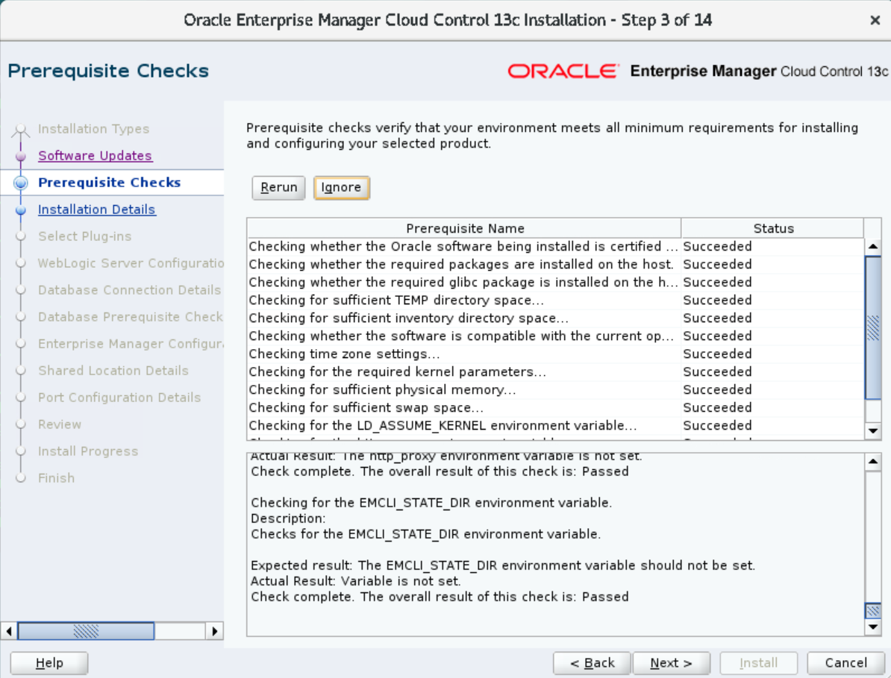
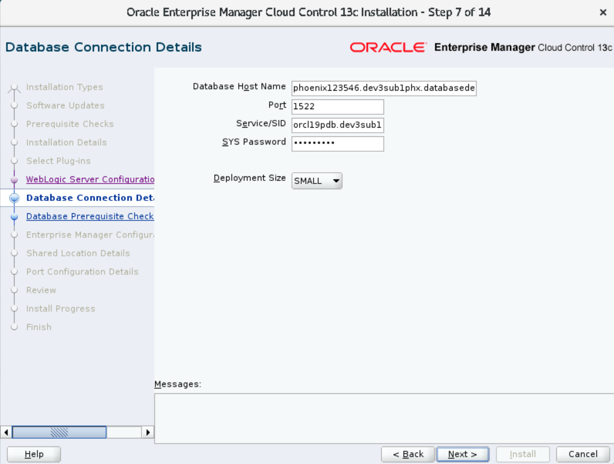
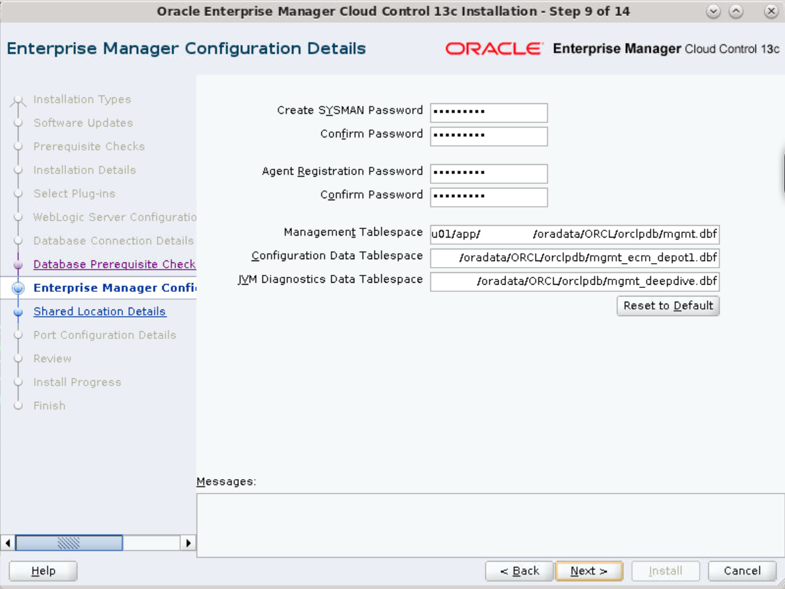
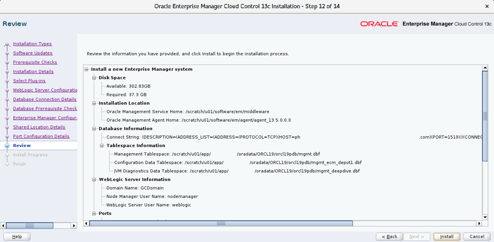
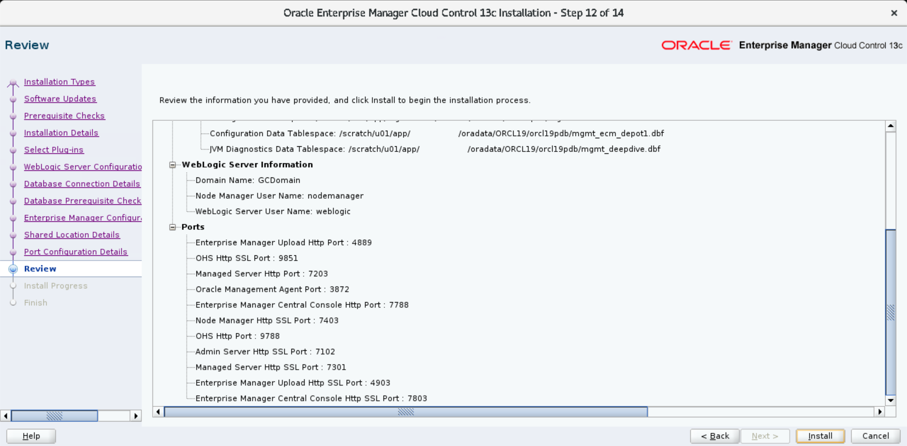
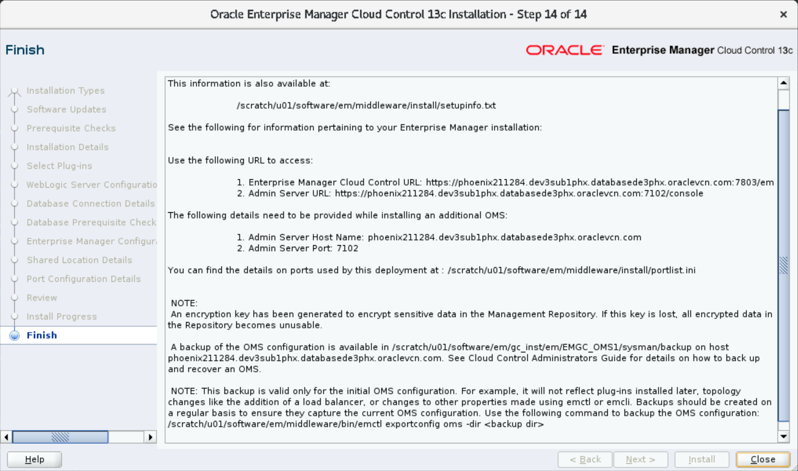

# Oracle Enterprise Manager (EM)

## Introduction

This lab explains how to install Oracle Enterprise Manager on a VM running Linux. It covers installation steps for EM 13.5 RU shiphome and for the 2021 image. It also contains postinstallation checks, steps to remove EM, and some troubleshooting scenarios and tips.

## EM installation

You can install Oracle Enterprise Manager:

 - from a shiphome setup, for example, RU 22 (latest)
 - using the binaries, that is, 2021 image (older)

	> Depending on your system configuration, both types of installation may fail a few times or may take a while (~3-4 hours) to complete, if successful. 

	----
	## Preinstallation checks

	- Basic checks before EM installation

		----
		## ADE access groups

		Along with a Kerberos account, you also require certain access privileges for installing EM. If your account does not belong to these groups, then the installation does not start due to missing permissions. 

		 - `fmw_code_access_ro` &nbsp;&nbsp; - for RU 22
		 - `em_test_access` &nbsp;&nbsp;&nbsp;&nbsp;&nbsp;&nbsp;&nbsp;&nbsp;&nbsp;&nbsp;&nbsp; - for RU 14/15

		 > **Tip**: The entitlement `em_code_access` requires second-level approval. You need this entitlement only if you want to change the source code in EMGC labels or develop a plug-in from a label.   
		 For creating an EMGC view for testing purpose, only `EM_TEST_ACCESS` is sufficient.

		Additional privileges you might require for other activities.

		 - `db_code_access`
		 - `db_code_access_ro`
		 - `db_if_access`
		 - `db_nls_access`
		 - `db_test_access`

		Check the access groups your user account belongs to.

		1. Run the *`id`* command to check the current groups of your user. 

			```
			$ id
			or
			$ groups [user-account]
			```

		1. Set `$ADE_HOME_DIR`.


			```
			$ <copy>ade exec $SHELL</copy>
			```

		1. List the groups of your user.

			```
			$ <copy>$ADE_HOME_DIR/util/list_groups_for_user.pl -u [user-account]</copy>
			```

			It displays the groups associated with the user. 

			```
			db_code_access
			db_code_access_ro
			db_if_access
			db_nls_access
			db_test_access
			em_test_access
			Can't locate JSON.pm in @INC (@INC contains: /ade_autofs/ade_infra/ADE_MAIN_LINUX.X64.rdd/LATEST/nde/ade/util /ade_autofs/ade_infra/ADE_MAIN_LINUX.X64.rdd/LATEST/nde/ade/util/../bin/perl/ADE/.. /ade_autofs/ade_infra/ADE_MAIN_LINUX.X64.rdd/LATEST/nde/ade/util/../bin/perl/ADE/../ /ade_autofs/ade_infra/ADE_MAIN_LINUX.X64.rdd/LATEST/nde/ade/util/../bin/perl /usr/local/packages/perl_remote/5.8.8/lib/5.8.8/i686-linux /usr/local/packages/perl_remote/5.8.8/lib/5.8.8 /usr/local/packages/perl_remote/5.8.8/lib/site_perl/5.8.8/i686-linux /usr/local/packages/perl_remote/5.8.8/lib/site_perl/5.8.8 /usr/local/packages/perl_remote/5.8.8/lib/site_perl .) at /ade_autofs/ade_infra/ADE_MAIN_LINUX.X64.rdd/LATEST/nde/ade/util/../bin/perl/ADE/Logging.pm line 93.
			END failed--call queue aborted.
			```

		1. Log in to identity & access management (OIM) and request for entitlements, if you do not already have.

		----
		## Log in to ADE

		To run ADE commands and use the functions:

		1. Obtain the initial ticket for Kerberos. 

			```
			$ <copy>ade okinit</copy>
			```

		1. Enter your Kerberos password to authenticate.

			```
			Kerberos Utilities for Linux: Version 19.0.0.0.0 - Production on 21-MAR-2023 17:01:23

			Copyright (c) 1996, 2020 Oracle.  All rights reserved.

			Password for [user-account]@DEV.ORACLE.COM:
			```

		----
		## Check product labels

		Select the label to install. You can check for a specific label or get the latest label from a series. 

		 - To check the label for, say, *EM 13.5 RU 22* - 

			```
			$ <copy>ade showlabels -series EMGC_PT.13.5.0.0.0-RU-22_LINUX.X64</copy>
			```

			```
			EMGC_PT.13.5.0.0.0-RU-22_LINUX.X64_240507.0650
			```

			The date stamp for this label is May 7, 2024.

		 - To view labels for `RU 15` - 

			```
			$ <copy>ade showlabels -series EMGC_13.5.0.0.0-RU-15_LINUX.X64</copy>
			```

			```
			EMGC_13.5.0.0.0-RU-15_LINUX.X64_230520.2230
			```

		 - To check the latest label from a series -

			```
			$ <copy>ade showlabels -series EMGC_MAIN_LINUX.X64 -latest</copy>
			```

			```
			Determining most recent label...
			EMGC_MAIN_LINUX.X64_240630.2300
			```

			The date stamp for this label is June 30, 2024.

		 - To view all available labels from the series, run the same command without the `-latest` attribute. 
		 
			```
			$ <copy>ade showlabels -series EMGC_MAIN_LINUX.X64 -latest</copy>
			```

			The latest label for EM resides here -

			```
			$ cd /ade_autofs/ud322_em/EMGC_MAIN_LINUX.X64.rdd/LATEST
			```

			You can use any available label to create a view. If a label for a specific date does not exist, then it shows related labels from the series.

			```
			$ <copy>ade showlabels -series EMGC_13.5.0.0.0-RU-14_LINUX.X64_230304.0102</copy>
			```

			```
			ade WARNING: No labels found for series: EMGC_13.5.0.0.0-RU-14_LINUX.X64_230304.0102.
			ade WARNING: Showing labels for 'EMGC_13.5.0.0.0-RU-14_LINUX.X64', instead.
						 For faster execution, you may type this command as:
						 [ade showlabels -series EMGC_13.5.0.0.0-RU-14_LINUX.X64]
			EMGC_13.5.0.0.0-RU-14_LINUX.X64_230329.0325
			```

			## Contents of an EM label

			```
			ade_info.lmd     emcld   encryption     jewt         panama
			ade_info.lmd.gz  emcore  eons           ldap         pcbpel
			ant              emcsm   ess            network      perl
			asclassic        emdb    exalogicoplan  network_src  plsql
			askernel         emdev   fmwtest        ngam         precomp
			assistants       emes    gdr            nginst       rdbms
			balipi           emfa    gradle         nlsrtl       rdbms_ho
			bam              emgc    has            nlsrtl3      rules
			bishiphome       emll    iam            nlstools     sdo
			bpm              emnsmp  idm            oai          security_src
			buildtools       emohc   if9i_src_1     ons          slax
			charts           emopc   if9i_src_2     opatch       soa
			ctx              emorhc  install        opatchauto   sqlplus
			dbdev            empa    intgtools      opmn         tfa
			dbjava           empl    ip             opsm         tk_backup_restore
			dc               empp    ipc            oracle       tk_common
			delta.emd        emrt    j2ee           oracore      ucp
			emacc            emsh    javavm         oracore3     utl
			emagent          emsi    JBO_src_1      oratst       wlm
			emam             emsmf   jdev           osp          workplace
			emas             emssta  jdevadf        oss          wptg
			embda            emutil  jdk6           oui          wwg
			emcat            emvi    jdk7           oui_2        xdk
			emcfw            emxa    jdk8           ovmemplgn    xdo
			```

	----
	## Install EM from shiphome setup (RU 22 - latest)

	1. Log in to ADE using Kerberos authentication, if not already connected.

		```
		$ <copy>ade okinit</copy>
		```

		If the previous login is still valid, then the terminal does not prompt for entering the password.

		```
		Note : ade okinit is not required as kerberos ticket is currently valid.
		```

	1. Create an ADE view with an RU 22 label and provide a view name.   
		Check the preinstallation section for details.

		Syntax
	
		```
		$ ade createview -label [label] [view-name]
		```

		Example -

		```
		$ <copy>ade createview -label EMGC_PT.13.5.0.0.0-RU-22_LINUX.X64_240507.0650 135ru22</copy>
		```

		```
		ade WARNING: View storage directory specified in ADE_DEFAULT_VIEW_STORAGE_LOC does not exist.
		Trying to create directory : /scratch/[user-account]/view_storage
		Connecting to Repository... Connected.
		View [user-account]_135ru22 in /scratch/[user-account]/view_storage/[user-account]_135ru22 will be refreshed to
		label EMGC_PT.13.5.0.0.0-RU-22_LINUX.X64_240507.0650 (the server /ade_autofs/ud322_em/EMGC_PT.13.5.0.0.0-RU-22_LINUX.X64.rdd/240507.0650).
		Using label default pop_dir_list: emdev/pub,emdev/test/triage/test/src,emdev/test/triage/bin,emagent/test/src/utl,emcore/test/src/eml/tvmlp/tvmlpdp,emcore/test/src/provision/utl,emcore/test/src/tvmg/tvmga,emcore/test/src/tvmg/tvmgp/tvmgpc/cmn
		The view [user-account]_135ru22 in /scratch/[user-account]/view_storage/[user-account]_135ru22 has been created.
		```

	1. Enter into the view. 

		```
		$ <copy>ade useview 135ru22</copy>
		```

		```
		Binding view to label server [server-name]
		VIEW_NAME     : [user-account]_135ru22
		HOST_NAME     : [example.localhost.com]
		VIEW_LOCATION : /scratch/[user-account]/view_storage/[user-account]_135ru22
		VIEW_LABEL    : [RU-label]
		VIEW_TXN_NAME : NONE
		VIEW_TXN_MERGE_STATE : NOT MERGING
		VIEW_REFRESH_STATE   : OK
		Processing /ade/[user-account]_135ru22/emgc/setup_env.pl
		Setting perl in view
		Processing /ade/[user-account]_135ru22/emgc/s_setup_env.pl
		[ user-account_135ru22 ] bash-4.4$
		```

		Before running the EM installation command, you can check details of the view. 

		```
		[ mgarodia_135ru21 ] bash-5.1$ ade pwv
		```

		```
		VIEW_NAME     : [user-account]_135ru21
		HOST_NAME     : [example.localhost.com]
		VIEW_LOCATION : /scratch/[user-account]/view_storage/[user-account]_135ru21
		VIEW_LABEL    : [RU-label]
		VIEW_TXN_NAME : NONE
		VIEW_TXN_MERGE_STATE : NOT MERGING
		VIEW_REFRESH_STATE   : OK
		```

	1. Install EM shiphome from the view prompt.

		> **Note**: Ensure that your `LDAP DSEE and PDIT NIS` account has *dba* as the primary group, otherwise the installation will fail after ~7-8 minutes.

		```
		[ user-account_135ru22 ] bash-4.4$ <copy>setupview -config shiphome</copy>
		```

		Sit back and wait for the installation to complete (~3-4 hours). 

		```
		setupview 1.0-69
		Copyright (c) 2007, 2024, Oracle and/or its affiliates.

		Setting up the view. This will take some time.

		A repository will be created.

		Using the shiphome configuration.

		Setup command used is:
			/ade/[user-account]_135ru22/emdev/test/triage/bin/runtest -setupview -config shiphome

		View setup started at: Day Jul  x 09:18:45 2024

		Progress can be monitored in:
		  /ade/[user-account]_135ru22/emgc/setupview.log

		 Elapsed time: 2:59:12


		The view setup log is available in:
		  /ade/[user-account]_135ru22/emgc/triage/work/setupview.log
		```

		On successful installation, you get the following. 

		```
		View setup succeeded.

		View setup finished at: Day Jul  x 12:18:12 2024
		```

		Congratulations! You have installed *EM 13.5 RU 22* on your host. You can now *`exit`* the view and perform postinstallation checks and log in to the EM console in a browser.

		## Use older RUs?

		To create a view for *RU 15* -

		1. Specify the label and provide a view name.

			```
			$ <copy>ade createview -label EMGC_13.5.0.0.0-RU-15_LINUX.X64_230520.2230 135ru15</copy>
			```

			```
			ade WARNING: View storage directory specified in ADE_DEFAULT_VIEW_STORAGE_LOC does not exist.
			Trying to create directory : /scratch/[user-account]/view_storage
			Connecting to Repository... Connected.
			Determining most recent label...
			View will be created on EMGC_MAIN_LINUX.X64_230603.2300
			View [user-account]_135ru15 in /scratch/[user-account]/view_storage/[user-account]_135ru15 will be refreshed to
			label EMGC_MAIN_LINUX.X64_230603.2300 (the server /ade_autofs/ud322_em/EMGC_MAIN_LINUX.X64.rdd/230603.2300).
			Using label default pop_dir_list: emdev/pub,emdev/test/triage/test/src,emdev/test/triage/bin,emagent/test/src/utl,emcore/test/src/eml/tvmlp/tvmlpdp,emcore/test/src/provision/utl,emcore/test/src/tvmg/tvmga,emcore/test/src/tvmg/tvmgp/tvmgpc/cmn
			The view [user-account]_135ru15 in /scratch/[user-account]/view_storage/[user-account]_135ru15 has been created.
			```

			> If the folder structure already exists, then it does not display the first two lines on warning and create directory.

			To use *RU 14* -

			```
			$ <copy>ade createview -label EMGC_13.5.0.0.0-RU-14_LINUX.X64_230329.0325 135ru14</copy>
			```

		1. Call the view.

			```
			$ <copy>ade useview 135ru15</copy>
			```

			```
			Binding view to label server [server-name]
			VIEW_NAME     : [user-account]_135ru15
			HOST_NAME     : [example.localhost.com]
			VIEW_LOCATION : /scratch/[user-account]/view_storage/[user-account]_135ru15
			VIEW_LABEL    : EMGC_MAIN_LINUX.X64_230603.2300
			VIEW_TXN_NAME : NONE
			VIEW_TXN_MERGE_STATE : NOT MERGING
			VIEW_REFRESH_STATE   : OK
			Processing /ade/[user-account]_135ru15/emgc/setup_env.pl
			Setting perl in view
			Processing /ade/[user-account]_135ru15/emgc/s_setup_env.pl
			```

			Run this command manually if the previous command does not include the last line.

			```
			$ <copy>perl /ade/[user-account]_135ru15/emgc/s_setup_env.pl</copy>
			```

			If the view does not exist, then it displays an error.

			```
			ade ERROR: Cannot open '/ade/[user-account]_135ru15/ade_info.vmd' : No such file or directory
			```

		1. Install EM shiphome.

			```
			[ user-account_135ru15 ] bash-4.4$ <copy>setupview -config shiphome</copy>
			```

			```
			setupview 1.0-65
			Copyright (c) 2007, 2023, Oracle and/or its affiliates.

			Setting up the view. This will take some time.

			A repository will be created.

			Using the shiphome configuration.

			Setup command used is:
				/ade/[user-account]_135ru15/emdev/test/triage/bin/runtest -setupview -config shiphome

			View setup started at: Mon Jun  5 13:07:11 2023

			Progress can be monitored in:
			  /ade/[user-account]_135ru15/emgc/setupview.log

			 Elapsed time: 2:41:39


			The view setup log is available in:
			  /ade/[user-account]_135ru15/emgc/triage/work/setupview.log

			View setup succeeded.

			View setup finished at: Mon Jun  5 15:49:00 2023
			```

		You have installed *EM 13.5 RU 15* on your host. You can now `exit` the view.

	> If you experience issues, then see [Troubleshooting](?lab=oracle-em#Troubleshooting).

	----
	## Install EM from binaries (2021 image - older)

	- image version: `2021`
	- label: `EMGC_MAIN_LINUX.X64_210321.0130`

		----
		## Preinstallation setup

		1. Download the EM package and validate.
		1. Make the bin file executable.
		1. Set the `DISPLAY` environment variable.
		1. Run the EM Prereq Kit.

		> **Note**: This lab walks you through the steps to install *Oracle Enterprise Manager 13.5*.

		----
		**1. Download the EM package and validate**
		1. Download the complete EM package from the Oracle website [Downloads](https://www.oracle.com/enterprise-manager/downloads/cloud-control-downloads.html) or copy from other sources.

		1. Validate the bin file and all zip files.

			----
			## checksum files

			| Command                       | Bytes        | cksum        |
			|-------------------------------|--------------|--------------|
			| `cksum em13500_linux64.bin`   | `1586801533` | `4216113677` |
			| `cksum em13500_linux64-2.zip` | `1897494675` | `2491244121` |
			| `cksum em13500_linux64-3.zip` | `2130750885` | `3046940784` |
			| `cksum em13500_linux64-4.zip` | `1454982045` | `2971825495` |
			| `cksum em13500_linux64-5.zip` | `1494500710` | `2749926845` |

			Refer [Oracle Enterprise Manager Downloads for Linux x86-64](https://www.oracle.com/enterprise-manager/downloads/linux-x86-64-13c-rel5-downloads.html).

		----
		**2. Make the bin file executable**

		```
		$ <copy>chmod +x em13500_linux64.bin</copy>
		```

		Verify whether the bin file is executable.    
		`ls -l` returns *rwxr-xr-x*

		```
		$ <copy>ls -l</copy>
		```
		```
		total 8363808
		-rw-r--r-- 1 [user][group] 1897494675 Jun 11  2021 em13500_linux64-2.zip
		-rw-r--r-- 1 [user][group] 2130750885 Jun 11  2021 em13500_linux64-3.zip
		-rw-r--r-- 1 [user][group] 1454982045 Jun 11  2021 em13500_linux64-4.zip
		-rw-r--r-- 1 [user][group] 1494500710 Jun 11  2021 em13500_linux64-5.zip
		-rwxr-xr-x 1 [user][group] 1586801533 Jun 11  2021 em13500_linux64.bin

		```

		----
		**3. Set the `DISPLAY` environment variable** - (Only for graphical mode)

		If you do not set the `DISPLAY` environment variable, EM installer returns the following error.

		```
		...
		Checking monitor: must be configured to display at least 256 colors.  Actual unknown.   Failed <<<<
		...
		```

		To fix this, set the `DISPLAY` environment variable from the shell you are using, `Bash` or `csh`.

		 - **Shell - *Bash***

			Syntax

			```
			$ export DISPLAY=[example.localhost.com]:[vnc-port].0
			```

		 - **Shell - *csh***

			Syntax

			```
			$ setenv DISPLAY [example.localhost.com]:1.0
			```

		----
		**4. Run the EM Prereq Kit**

		Check and fix the prerequisites with the [EM Prerequisite Kit](https://docs.oracle.com/en/enterprise-manager/cloud-control/enterprise-manager-cloud-control/13.4/embsc/overview-em-prerequisite-kit.html#GUID-BCABED13-BFCC-4EB3-855E-28F45351323A).

		```
		$ <copy>./em13500_linux64.bin EMPREREQ_KIT=true</copy>
		```

		### Location of EM installer

		| VM                          | Path             | Remarks                                 |
		|-----------------------------|------------------|-----------------------------------------|
		| `[example.localhost.com]:1` | `/scratch/[user-account]/installers/emcc135`  | Executable |
		| `[example.localhost.com]:1` | `/scratch/u01/installers/emcc135`             | Executable |

		----
		## Installation steps

		- Start the installer

			```
			$ <copy>./em13500_linux64.bin</copy>
			```

			----
			## Sample output

			```
			Launcher log file is /tmp/OraInstall2022-05-20_01-45-57PM/launcher2022-05-20_01-45-57PM.log.
			Extracting the installer . . . . . . . . . . . . . . . . . . . . . . . . . . . . . . . . . . . . . . . . . . . . . . . . . . . . . . . . . . . . . . . . . . . . . . . . . . . . . . . . . . . . . . . . . . . . . . . . . . . . . . . . . . . . . . . . . . . . . . . . . . Done
			Checking monitor: must be configured to display at least 256 colors.   Actual 16777216    Passed
			Checking swap space: must be greater than 512 MB.   Actual 18191 MB    Passed
			Checking if this platform requires a 64-bit JVM.   Actual 64    Passed (64-bit not required)
			Preparing to launch the Oracle Universal Installer from /tmp/OraInstall2022-05-20_01-45-57PM
			ScratchPathValue :/tmp/OraInstall2022-05-20_01-45-57PM
			May 20, 2022 1:48:40 PM org.apache.sshd.common.io.DefaultIoServiceFactoryFactory getIoServiceProvider
			INFO: No detected/configured IoServiceFactoryFactory using Nio2ServiceFactoryFactory
			```

		1. Installation Type - **Create a new Enterprise Manager system** &gt; *Advanced Install*.

			**Figure**: EM Advance Install

		1. Software Updates - *Skip*

			**Figure**: Skip Software Updates

		1. Prerequisites checks. Sometimes, it displays a script to run.

			**Figure**: Prerequisites Checks - Verify Environment

			Fix the failed items manually or click **Ignore** to skip the warnings.

			**Figure**: Ignore Issues in Environment

			If the environment meets all requirements, the status displays *Succeeded*.

			**Figure**: Prerequisites checks - Success

			Click **Next** to continue.

		1. Installation details.

			**Figure**: EM Home and Base Locations

			- **Middleware home location**

				```
				<copy>/scratch/u01/software/em/middleware</copy>
				```

			- **Agent base directory**

				```
				<copy>/scratch/u01/software/em/agent</copy>
				```

			- **Host name** (autofilled)

				```
				[example.localhost.com]
				```

		1. Select Plug-ins - Leave the defaults.

			**Figure**: Select Plug-ins to Configure

		1. WebLogic Server Configuration Details.  
		These credentials are required for the maintenance of EM.

			**Figure**: WebLogic Server Configuration

			- **WebLogic User Name** - *weblogic*   
			This is filled in automatically (editable, but do not modify).
			- **WebLogic Password** - Enter the password <if type="hidden">*Welcome_1*</if>   
			(reenter to confirm password)
			- **Node Manager User Name** - `nodemanager`   
			This is filled in automatically (noneditable).
			- **Node Manager Password** - Enter the password <if type="hidden">*Welcome_1*</if>  
			(reenter to confirm password)

			**OMS Instance Base Location** - Leave the default, for example `/scratch/u01/software/em/gc_inst`.

			> **Note**: The password must contain at least 8 characters, begin with a letter, and include at least one numeric value.

		1. Database Connection Details.   
			This page determines which database to connect to as the repository. In this example, EM connects to 19c.

			**Figure**: Database Connection Details

			- **Database Host Name**

				```
				[example.localhost.com]
				```

			- **Port** - *1519*   
			Check listener status in the ORACLE_HOME/bin)
			- **Service/SID** - *orcl19pdb.host-domain*   
			Enter the PDB name followed by the full domain name of the host.

				```
				<copy>orcl19pdb.localhost.com</copy>
				```
			- **SYS Password** - Enter the password for Oracle Database 19c <if type="hidden">*Welcome_1*</if>   

			- **Deployment Size** - *Small*/Large (select any)

			> **Note**: The password must contain at least 8 characters, begin with a letter, and include at least one numeric value.

		1. Database Prerequisite Checks.   
			For failed items, pause the installation, go to the database, and modify the parameters to fix these errors.   

			**Figure**: Check Database Parameters

			For `allow insert with update`, connect to 19c as sysdba and run this in the CDB.

			```
			SQL> <copy>alter system set "_allow_insert_with_update_check"=true scope=both;</copy>
			```

			Autofix if applicable. For more help, see [Troubleshooting](?lab=oracle-em#Task4:Troubleshooting).

			Click **OK** to use the AL32UTF8 character set.

			**Figure**: Character Set

		1. Enterprise Manager Config Details. Set the login credentials for EM.

			**Figure**: EM Login Password

			- **SYSMAN Password** - Enter EM login password   
			(reenter to confirm password)
			- **Agent Registration Password** - Enter Agent login password   
			(reenter to confirm password)

			Oracle Database 19c has some default tablespaces under this location -

			```
			$ <copy>/scratch/u01/app/[user-account]19/oradata/ORCL19/orcl19pdb</copy>
			```

			The default tablespaces are *`sysaux01.dbf`*, *`system01.dbf`*, *`temp01.dbf`*, *`undotbs01.dbf`*, and *`users01.dbf`*. The EM installer adds further tablespaces to this location.

			Leave the defaults and continue.

			| Tablespace           | File full path                                                       |
			|----------------------|----------------------------------------------------------------------|
			| Management           | `/scratch/u01/app/[user-account]/oradata/ORCL/orclpdb/mgmt.dbf`            |
			| Configuration Data   | `/scratch/u01/app/[user-account]/oradata/ORCL/orclpdb/mgmt_ecm_depot1.dbf` |
			| JVM Diagnostics Data | `/scratch/u01/app/[user-account]/oradata/ORCL/orclpdb/mgmt_deepdive.dbf`   |

		1. Configure Oracle Software Library Location. Leave the default `/scratch/u01/software/em/swlib`.

			**Figure**: Software Library Location

		1. Port Configuration Details - Leave the defaults.

			**Figure**: Port Configuration Details

			Review the summary of installation and click **Next**.

		1. On the Review page, review the details.

			**Figure**: Review - top

			**Figure**: Review - bottom

		1. Click **Install** to start EM installation. The installation progress starts.

			**Figure**: EM Installation progress

			 - Run the scripts automatically (or manually as `root` from the terminal).

				**Figure**: All Root script

				```
				$ <copy>source /scratch/u01/software/em/middleware/allroot.sh</copy>
				```

				### Output

				```
				Starting to execute allroot.sh .........

				Starting to execute /scratch/u01/software/em/middleware/root.sh ......
				Performing root user operation.

				The following environment variables are set as:
					ORACLE_OWNER= [user-account]
					ORACLE_HOME=  /scratch/u01/software/em/middleware
				```

				Press Enter

				```
				Enter the full pathname of the local bin directory:
				[/usr/local/bin]:
				```

				Press Enter again.

				```
				/usr/local/bin is read only.  Continue without copy (y/n) or retry (r)?
				[y]:
				```

				----
				## Result

				```
				Warning: /usr/local/bin is read only. No files will be copied.

				Entries will be added to the /etc/oratab file as needed by
				Database Configuration Assistant when a database is created
				Finished running generic part of root script.
				Now product-specific root actions will be performed.
				/etc exist

				Creating /etc/oragchomelist file...
				/scratch/u01/software/em/middleware

				Finished product-specific root actions.
				/etc exist
				Finished execution of  /scratch/u01/software/em/middleware/root.sh ......


				Starting to execute /scratch/u01/software/em/agent/agent_13.5.0.0.0/root.sh ......

				Finished product-specific root actions.
				/etc exist
				Finished execution of  /scratch/u01/software/em/agent/agent_13.5.0.0.0/root.sh ......
				You have mail in /var/spool/mail/root
				```

			 - Return to the installer and click **OK** to continue the installation.

		1. On successful completion, the installer displays the Finish window.

			**Figure**: EM Installation Complete

			> **Note**: Before you **Close** the installer, do not forget to note the URLs. You require them to access the EM login page.

		### EM folder locations

		- Middleware folder - `/scratch/u01/software/em/middleware/bin`
		- Agent folder - `/scratch/u01/software/em/agent/agent_13.5.0.0.0/bin`

		> **Cite**:    
		> Another EM installation procedure explained here - [Manual EM Shiphome installation on OCI](https://confluence.oraclecorp.com/confluence/display/EMQ/Manual+EM+Shiphome+installation+on+OCI)

## EM postinstallation checks

- After installing EM, you can log in to the EM console using a web browser.

	> **Note**: You can access the EM console only if OMS and agent are up and running.

	----
	## Log in to EM

	Open the EM login page in a web browser - https://example.localhost.com:7803/em/faces/logon/core-uifwk-console-login.

	 **Figure**: EM login screen

	**Credentials**
	 - User name - *sysman*
	 - Password - Enter the password

	### Log in to EM Express - Decommissioned

	EM Exp for DB 19c
	 - [CDB$ROOT port 5501](https://example.localhost.com:5501/em)   
	 - [ORCL19CCDB port 5502](https://example.localhost.com:5502/em)   

	EM Exp for DB 21c
	 - [CDB$ROOT port 5500](https://example.localhost.com:5500/em)
	 - [ORCLPDB port 5504](https://example.localhost.com:5504/em)

	**Credentials**
	 - User name - *system*
	 - Password - Enter the password
	 - Container name - (leave empty)

	> **Note**: If you forget the database password, dig into the [Admin Guide](https://docs.oracle.com/en/database/oracle/oracle-database/21/admin/index.html) and fish out how to change the password externally.

	----
	## Check OMS status and details

	<ins>Check OMS status</ins> -

	1. In a terminal, go to the middleware home location.

		**EM RUs new**

		```
		$ <copy>cd /scratch/[user-account]/work/omshome9344/bin</copy>
		```

		**EM binaries image old**

		```
		$ <copy>cd /scratch/u01/software/em/middleware/bin</copy>
		```

	1. Check OMS status.

		```
		$ <copy>./emctl status oms</copy>
		```

		Success

		```
		Oracle Enterprise Manager Cloud Control 13c Release 5  
		Copyright (c) 1996, 2021 Oracle Corporation.  All rights reserved.
		WebTier is Up
		Oracle Management Server is Up
		JVMD Engine is Up
		```

		Failure

		```
		Oracle Enterprise Manager Cloud Control 13c Release 5  
		Copyright (c) 1996, 2021 Oracle Corporation.  All rights reserved.
		WebTier is Up
		Oracle Management Server is Down
		JVMD Engine is Down
		```

		If OMS is down, then start the OMS server.

		```
		$ <copy>./emctl start oms</copy>
		```

		```
		Oracle Enterprise Manager Cloud Control 13c Release 5  
		Copyright (c) 1996, 2021 Oracle Corporation.  All rights reserved.
		Starting Oracle Management Server...
		WebTier Successfully Started
		Oracle Management Server Successfully Started
		Oracle Management Server is Up
		JVMD Engine is Up
		```

		> **Note**: Before starting OMS server, ensure that the repo database (for example, *19c*) is up and running. If the repo is closed, then OMS will not start.

	<ins>Check OMS details</ins> -

	1. From OMS home, run this command.

		```
		$ <copy>./emctl status oms -details</copy>
		```

		```
		Oracle Enterprise Manager Cloud Control 13c Release 5  
		Copyright (c) 1996, 2021 Oracle Corporation.  All rights reserved.
		```

		For older EMs, it may ask for the admin (SYSMAN) password to proceed. 

		```
		Enter Enterprise Manager Root (SYSMAN) Password :
		```

		```
		Console Server Host        : [example.localhost.com]
		HTTP Console Port          : 7788
		HTTPS Console Port         : 7803
		HTTP Upload Port           : 4889
		HTTPS Upload Port          : 4903
		EM Instance Home           : /scratch/[user-account]/work/insthome9344/em/EMGC_OMS1
		OMS Log Directory Location : /scratch/[user-account]/work/insthome9344/em/EMGC_OMS1/sysman/log
		OMS is not configured with SLB or virtual hostname
		Agent Upload is locked.
		OMS Console is locked.
		Active CA ID: 1
		Console URL: https://[example.localhost.com].com:7803/em
		Upload URL: https://[example.localhost.com]:4903/empbs/upload

		WLS Domain Information
		Domain Name            : GCDomain
		Admin Server Host      : [example.localhost.com]
		Admin Server HTTPS Port: 7102
		Admin Server is RUNNING

		Oracle Management Server Information
		Managed Server Instance Name: EMGC_OMS1
		Oracle Management Server Instance Host: [example.localhost.com]
		WebTier is Up
		Oracle Management Server is Up
		JVMD Engine is Up
		```

	----
	## Check Agent status

	1. In a terminal, go to the agent location.

		**EM RUs new**

		```
		$ <copy>cd /scratch/[user-account]/work/agentbase9344/agent_13.5.0.0.0/bin</copy>
		```

		**EM binaries image old**

		```
		$ <copy>cd /scratch/u01/software/em/agent/agent_13.5.0.0.0/bin</copy>
		```

	1. Check the agent status.

		```
		$ <copy>./emctl status agent</copy>
		```

		----
		## Success EM new

		```
		Oracle Enterprise Manager Cloud Control 13c Release 5  
		Copyright (c) 1996, 2021 Oracle Corporation.  All rights reserved.
		---------------------------------------------------------------
		Agent Version          : 13.5.0.0.0
		OMS Version            : 13.5.0.0.0
		Protocol Version       : 12.1.0.1.0
		Agent Home             : /scratch/[user-account]/work/agentbase9344/agent_inst
		Agent Log Directory    : /scratch/[user-account]/work/agentbase9344/agent_inst/sysman/log
		Agent Binaries         : /scratch/[user-account]/work/agentbase9344/agent_13.5.0.0.0
		Core JAR Location      : /scratch/[user-account]/work/agentbase9344/agent_13.5.0.0.0/jlib
		Agent Process ID       : 3035426
		Parent Process ID      : 3035344
		Agent URL              : https://[example.localhost.com]:3872/emd/main/
		Local Agent URL in NAT : https://[example.localhost.com]:3872/emd/main/
		Repository URL         : https://[example.localhost.com]:4903/empbs/upload
		Started at             : 2024-07-01 11:42:11
		Started by user        : [user-account]
		Operating System       : Linux version 5.4.17-2136.327.2.el8uek.x86_64 (amd64)
		Number of Targets      : 38
		Last Reload            : (none)
		Last successful upload                       : 2024-07-02 18:12:56
		Last attempted upload                        : 2024-07-02 18:12:56
		Total Megabytes of XML files uploaded so far : 6.44
		Number of XML files pending upload           : 0
		Size of XML files pending upload(MB)         : 0
		Available disk space on upload filesystem    : 67.61%
		Collection Status                            : Collections enabled
		Heartbeat Status                             : Ok
		Last attempted heartbeat to OMS              : 2024-07-02 18:12:57
		Last successful heartbeat to OMS             : 2024-07-02 18:12:57
		Next scheduled heartbeat to OMS              : 2024-07-02 18:13:57

		---------------------------------------------------------------
		Agent is Running and Ready
		```

		----
		## Success EM old

		```
		Oracle Enterprise Manager Cloud Control 13c Release 5  
		Copyright (c) 1996, 2021 Oracle Corporation.  All rights reserved.
		---------------------------------------------------------------
		Agent Version          : 13.5.0.0.0
		OMS Version            : 13.5.0.0.0
		Protocol Version       : 12.1.0.1.0
		Agent Home             : /scratch/u01/software/em/agent/agent_inst
		Agent Log Directory    : /scratch/u01/software/em/agent/agent_inst/sysman/log
		Agent Binaries         : /scratch/u01/software/em/agent/agent_13.5.0.0.0
		Core JAR Location      : /scratch/u01/software/em/agent/agent_13.5.0.0.0/jlib
		Agent Process ID       : 3037157
		Parent Process ID      : 145906
		Agent URL              : https://[example.localhost.com]:3872/emd/main/
		Local Agent URL in NAT : https://[example.localhost.com]:3872/emd/main/
		Repository URL         : https://[example.localhost.com]:4903/empbs/upload
		Started at             : 2023-02-01 17:21:18
		Started by user        : [user-account]
		Operating System       : Linux version 5.4.17-2136.312.3.4.el8uek.x86_64 (amd64)
		Number of Targets      : 46
		Last Reload            : (none)
		Last successful upload                       : 2023-02-04 13:51:21
		Last attempted upload                        : 2023-02-04 13:51:21
		Total Megabytes of XML files uploaded so far : 7.78
		Number of XML files pending upload           : 0
		Size of XML files pending upload(MB)         : 0
		Available disk space on upload filesystem    : 69.88%
		Collection Status                            : Collections enabled
		Heartbeat Status                             : Ok
		Last attempted heartbeat to OMS              : 2023-02-04 13:51:27
		Last successful heartbeat to OMS             : 2023-02-04 13:51:27
		Next scheduled heartbeat to OMS              : 2023-02-04 13:52:27

		---------------------------------------------------------------
		Agent is Running and Ready
		```

		----
		## Failure

		```
		Oracle Enterprise Manager Cloud Control 13c Release 5  
		Copyright (c) 1996, 2021 Oracle Corporation.  All rights reserved.
		---------------------------------------------------------------
		Agent is Not Running
		```

		If Agent is down, start the agent.

		```
		$ <copy>./emctl start agent</copy>
		```

		```
		Oracle Enterprise Manager Cloud Control 13c Release 5  
		Copyright (c) 1996, 2021 Oracle Corporation.  All rights reserved.
		Starting agent ................................................................................... started.
		```

	----
	## Check OMS home and agent home

	```
	$ <copy>cat /etc/oragchomelist </copy>
	```

	```
	/scratch/[user-account]/work/omshome9344
	/scratch/[user-account]/work/agentbase9344/agent_13.5.0.0.0:/scratch/[user-account]/work/agentbase9344/agent_inst
	```

## Add targets manually

TBD


## Remove Views, EM, and Base Repo

The removal of EM depends on the version installed. 

 - Delete Views
 - Remove new EM RUs
 - Remove old EM binaries image

	> **Caution**: Do not deinstall or remove the repo or base database (for example, Oracle Database 19c) before deinstalling or removing EM. If you remove the repo first, then deinstallation fails with an error - `The OMS delete of EMGC_OMS1 has failed.`

	----
	## Delete Views

	You can delete a view if not required. Deleting views and deinstalling EM are independent activities. Deleting a view does not affect the EM installed on your system. 

	1. 	To delete a view, for example *`135ru14`* -

		```
		$ <copy>ade destroyview 135ru14</copy>
		```

		You may get this warning if you do not obtain the initial Kerberos ticket. 

		```
		ade WARNING: Initial Kerberos ticket required
		ade WARNING: See the ADE FAQ entry:
		ade WARNING: https://confluence.oraclecorp.com/confluence/display/DBRM/How+to+get+a+Kerberos+ticket
		```

		```
		Continue destroy view [user-account]_135ru14 ? [yes/no] Enter yes
		```

	1. Enter *yes* when prompted.

		```
		Renaming /scratch/[user-account]/view_storage/[user-account]_135ru14 to /scratch/[user-account]/view_storage/[user-account]_135ru14#zombie ...
		Removing /scratch/[user-account]/view_storage/[user-account]_135ru14#zombie in the background ...
		View [user-account]_135ru14 successfully destroyed;
		Garbage collection of old view storage will take a few minutes,
		but will not adversely affect other ADE commands.
		```

	After you delete the view, manually remove EM from your system. 

	## Remove new EM RUs

	A quick way to remove the new EM is to delete the `work` and `view_storage` folders.

	1. Delete the `work` folder. 

		```
		$ rm -rdf /scratch/[user-acount]/work/
		```

	1. Delete the `view_storage` folder.

		```
		$ rm -rdf /scratch/[user-acount]/view_storage/
		```

		Switch to `root` if permission denied while deleting any files and directories. 
	
	1. `Exit` from root user.

	## Remove old EM binaries image

	You do either of the following:

	 - Run `deinstall` manually
	 - Deinstall using a script

		----
		## Run `deinstall` manually - for old EM

		1. Create a temporary directory.
			```
			$ <copy>mkdir /scratch/u01/tmp01</copy>
			```

		1. Copy `<EM_HOME>/sysman/install/EMDeinstall.pl` to the temporary directory.

			**Example**
			```
			$ <copy>cp /scratch/u01/software/em/middleware/sysman/install/EMDeinstall.pl /scratch/u01/tmp01</copy>
			```

		1. Run the `deinstall` command.

			**Syntax**
			```
			$ <EM_HOME>/perl/bin/perl <temporary_location>/EMDeinstall.pl -mwHome <EM_HOME> -stageLoc <temporary_location>
			```

			**Example**
			```
			$ <copy>
			/scratch/u01/software/em/middleware/perl/bin/perl /scratch/u01/tmp_emccdeinstall/EMDeinstall.pl -mwHome /scratch/u01/software/em/middleware -stageLoc /scratch/u01/tmp01
			</copy>
			```

			```
			Refer to /scratch/u01/tmp01/deinstall_2023-03-21_16-14-58.log for deinstall log
			The home /scratch/u01/software/em/middleware is not configured. Do you want to delete the home? Confirm (y/n):y
			User confirmed for deinstallation.
			 The command executed is /scratch/u01/software/em/middleware/oui/bin/detachHome.sh
			Launcher log file is /tmp/OraInstall2023-03-21_04-15-10PM/launcher2023-03-21_04-15-10PM.log.
			Checking swap space: must be greater than 500 MB.   Actual 18095 MB    Passed
			Checking if this platform requires a 64-bit JVM.   Actual 64    Passed (64-bit not required)
			detachHome was successful.
			Logs successfully copied to /scratch/u01/app/oraInventory/logs.
			 return value is : 0

			Deleting the em home
			The deinstallation of OMS is successful.

			The location of the file is : /etc/oragchomelist
			```

		----
		## Deinstall using script - for old EM

		For this, you require the *`deinstall_em.sh`* script at the `/scratch/[user-account]/[path-to-script]/working-commands` location.

		1. Run the script `deinstall_em.sh`. 

			```
			$ <copy>sh /scratch/[user-account]/[path-to-script]/working-commands/deinstall_em.sh</copy>
			```

			A log file is generated to capture the deinstallation process.

			```
			Refer to /scratch/u01/tmp_emccdeinstall/deinstall_2022-11-09_11-16-55.log for deinstall log
			Substring valuye is /scratch/u01/software/em/gc_inst
			This is a First OMS install. So, this deinstalls the OMS , Repository and Agent. Confirm (y/n) y
			```

		1. Enter ***y*** to confirm deinstalling OMS, Repository, and Agent.

			```
			User confirmed for deinstallation.
			```

		1. Enter the passwords provided at the time of EM installation<if type="hidden">, *Welcome_1*</if>.

			```
			Enter the SYS Password :
			Enter the sysman Password :
			Enter the Admin Server password :
			```

			The system proceeds with the deinstallation.

			----
			## View deinstall output

			```
			dbConnectStr - (DESCRIPTION=(ADDRESS_LIST=(ADDRESS=(PROTOCOL=TCP)(HOST=[example.localhost.com])(PORT=1519)))(CONNECT_DATA=(SERVICE_NAME=orcl19pdb.localhost.com)))
			The command executed is /scratch/u01/software/em/agent/agent_13.5.0.0.0/perl/bin/perl /scratch/u01/software/em/agent/agent_13.5.0.0.0/sysman/install/AgentDeinstall.pl -agentHome /scratch/u01/software/em/agent/agent_13.5.0.0.0
			Mar 21, 2023 2:59:40 PM oracle.sysman.agent.installer.AgentInstaller$StreamGobbler run
			INFO: Oracle Enterprise Manager Cloud Control 13c Release 5  
			Mar 21, 2023 2:59:40 PM oracle.sysman.agent.installer.AgentInstaller$StreamGobbler run
			INFO: Copyright (c) 1996, 2021 Oracle Corporation.  All rights reserved.
			Mar 21, 2023 2:59:47 PM oracle.sysman.agent.installer.AgentInstaller$StreamGobbler run
			INFO: Stopping agent ... stopped.
			Mar 21, 2023 2:59:47 PM oracle.sysman.agent.installer.AgentInstaller$StreamGobbler run
			INFO: Plugin homes:
			Mar 21, 2023 2:59:47 PM oracle.sysman.agent.installer.AgentInstaller$StreamGobbler run
			INFO: Plugin homes:
			Mar 21, 2023 2:59:47 PM oracle.sysman.agent.installer.AgentInstaller execCommand
			SEVERE: STDERR:

			STDOUT=

			Oracle Enterprise Manager Cloud Control 13c Release 5  
			Copyright (c) 1996, 2021 Oracle Corporation.  All rights reserved.
			Stopping agent ... stopped.
			Mar 21, 2023 2:59:47 PM oracle.sysman.agent.installer.AgentDeinstallation main
			INFO: Creating directory /scratch/u01/software/em/agent/agent_13.5.0.0.0/install/tmp completed successfully.
			Mar 21, 2023 2:59:47 PM oracle.sysman.agent.installer.AgentDeinstallation main
			INFO: File /etc/oragchomelist exists.
			Mar 21, 2023 2:59:47 PM oracle.sysman.agent.installer.AgentDeinstallation main
			INFO: File /etc/oragchomelist is writable.
			Mar 21, 2023 2:59:47 PM oracle.sysman.agent.installer.AgentDeinstallation main
			INFO: Index :-1 for line : /scratch/u01/software/em/middleware
			Mar 21, 2023 2:59:47 PM oracle.sysman.agent.installer.AgentDeinstallation main
			INFO: Index :0 for line : /scratch/u01/software/em/agent/agent_13.5.0.0.0:/scratch/u01/software/em/agent/agent_inst
			Mar 21, 2023 2:59:47 PM oracle.sysman.agent.installer.AgentDeinstallation main
			INFO: Overwriting the contents since oracle home:/scratch/u01/software/em/agent/agent_13.5.0.0.0 entry already exists.

			The command is /scratch/u01/software/em/middleware/bin/emctl stop oms

			 Stopping oms............ Wait for the completion of the execution.
			Oracle Enterprise Manager Cloud Control 13c Release 5  
			Copyright (c) 1996, 2021 Oracle Corporation.  All rights reserved.
			Stopping Oracle Management Server...
			Oracle Management Server Successfully Stopped
			Oracle Management Server is Down
			JVMD Engine is Down
			 return value is : 0

			The command is /scratch/u01/software/em/middleware/bin/omsca delete -full -OMSNAME EMGC_OMS1 -AS_USERNAME weblogic -REP_CONN_STR "(DESCRIPTION=(ADDRESS_LIST=(ADDRESS=(PROTOCOL=TCP)(HOST=[example.localhost.com])(PORT=1519)))(CONNECT_DATA=(SERVICE_NAME=orcl19pdb.localhost.com)))"

			The oms delete will take sometime. Wait for the completion of the execution. Don't abort the execution.

			log4j:WARN No appenders could be found for logger (emctl.secure.oms.SecureOMSCmds).
			log4j:WARN Please initialize the log4j system properly.
			log4j:WARN See http://logging.apache.org/log4j/1.2/faq.html#noconfig for more info.
			Oracle Enterprise Manager Cloud Control 13c Release 13.5.0.0.0
			Copyright (c) 1996, 2021, Oracle. All rights reserved.

			Do You really want to delete the OMS (Y|N):
				RCU Logfile: /scratch/u01/software/em/middleware/cfgtoollogs/cfgfw/logs/emsecrepmgr.log

			Processing command line ....
			Repository Creation Utility - Checking Prerequisites
			Checking Global Prerequisites
			Repository Creation Utility - Checking Prerequisites
			Checking Component Prerequisites
			Repository Creation Utility - Drop
			Repository Drop in progress.
					Percent Complete: 22
					Percent Complete: 47
			Dropping Oracle Platform Security Services(OPSS)
					Percent Complete: 49
			Dropping tablespaces in the repository database
					Percent Complete: 100

			Repository Creation Utility: Drop - Completion Summary

			Database details:
			-----------------------------
			Connect Descriptor                           : (DESCRIPTION=(ADDRESS_LIST=(ADDRESS=(PROTOCOL=TCP)(HOST=[example.localhost.com])(PORT=1519)))(CONNECT_DATA=(SERVICE_NAME=orcl19pdb.localhost.com)))
			Connected As                                 : sys
			Prefix for (prefixable) Schema Owners        : SYSMAN122140
			RCU Logfile                                  : /scratch/u01/software/em/middleware/cfgtoollogs/cfgfw/logs/emsecrepmgr.log

			Component schemas dropped:
			-----------------------------
			Component                                    Status         Logfile		

			Oracle Platform Security Services            Success        /scratch/u01/software/em/middleware/cfgtoollogs/cfgfw/logs/opss.log

			Repository Creation Utility - Drop : Operation Completed
			OMS Deleted successfully

			 return value is : 0

			Running the command /scratch/u01/software/em/middleware/sysman/admin/emdrep/bin/RepManager -action drop -dbUser sys -dbRole sysdba -connectString "(DESCRIPTION=(ADDRESS_LIST=(ADDRESS=(PROTOCOL=TCP)(HOST=[example.localhost.com])(PORT=1519)))(CONNECT_DATA=(SERVICE_NAME=orcl19pdb.localhost.com)))" -mwHome /scratch/u01/software/em/middleware -mwOraHome /scratch/u01/software/em/middleware -oracleHome /scratch/u01/software/em/middleware

			Repository drop will take sometime. Wait for the completion of the execution. Don't abort the execution.

			stty: 'standard input': Inappropriate ioctl for device
			stty: 'standard input': Inappropriate ioctl for device
			stty: 'standard input': Inappropriate ioctl for device
			stty: 'standard input': Inappropriate ioctl for device

			java.sql.SQLException: ORA-01017: invalid username/password; logon denied
					at oracle.jdbc.driver.T4CTTIoer11.processError(T4CTTIoer11.java:509)
					at oracle.jdbc.driver.T4CTTIoer11.processError(T4CTTIoer11.java:456)
					at oracle.jdbc.driver.T4CTTIoer11.processError(T4CTTIoer11.java:451)
					at oracle.jdbc.driver.T4CTTIfun.processError(T4CTTIfun.java:1040)
					at oracle.jdbc.driver.T4CTTIoauthenticate.processError(T4CTTIoauthenticate.java:552)
					at oracle.jdbc.driver.T4CTTIfun.receive(T4CTTIfun.java:550)
					at oracle.jdbc.driver.T4CTTIfun.doRPC(T4CTTIfun.java:268)
					at oracle.jdbc.driver.T4CTTIoauthenticate.doOAUTH(T4CTTIoauthenticate.java:501)
					at oracle.jdbc.driver.T4CTTIoauthenticate.doOAUTH(T4CTTIoauthenticate.java:1292)
					at oracle.jdbc.driver.T4CTTIoauthenticate.doOAUTH(T4CTTIoauthenticate.java:1025)
					at oracle.jdbc.driver.T4CConnection.logon(T4CConnection.java:743)
					at oracle.jdbc.driver.PhysicalConnection.connect(PhysicalConnection.java:793)
					at oracle.jdbc.driver.T4CDriverExtension.getConnection(T4CDriverExtension.java:57)
					at oracle.jdbc.driver.OracleDriver.connect(OracleDriver.java:747)
					at oracle.jdbc.driver.OracleDriver.connect(OracleDriver.java:562)
					at java.sql.DriverManager.getConnection(DriverManager.java:664)
					at java.sql.DriverManager.getConnection(DriverManager.java:208)
					at oracle.sysman.emdrep.schemamanager.EMConnectionHelper.createConnection(EMConnectionHelper.java:234)
					at oracle.sysman.emdrep.schemamanager.EMConnectionHelper.createConnection(EMConnectionHelper.java:151)
					at oracle.sysman.emdrep.schemamanager.EMSchemaManager.getConnection(EMSchemaManager.java:1246)
					at oracle.sysman.emdrep.schemamanager.EMSchemaManager.getConnection(EMSchemaManager.java:1210)
					at oracle.sysman.emdrep.schemamanager.EMSchemaManager.getConnection(EMSchemaManager.java:909)
					at oracle.sysman.emdrep.schemamanager.EMSchemaManager.<init>(EMSchemaManager.java:276)
					at oracle.sysman.emdrep.schemamanager.EMSchemaManager.getEMSchemaManager(EMSchemaManager.java:1028)
					at oracle.sysman.emdrep.schemamanager.EMSchemaManager.getEMSchemaManager(EMSchemaManager.java:997)
					at oracle.sysman.emdrep.schemamanager.EMSchemaManager.main(EMSchemaManager.java:1647)
			java.sql.SQLException: ORA-01017: invalid username/password; logon denied
					at oracle.jdbc.driver.T4CTTIoer11.processError(T4CTTIoer11.java:509)
					at oracle.jdbc.driver.T4CTTIoer11.processError(T4CTTIoer11.java:456)
					at oracle.jdbc.driver.T4CTTIoer11.processError(T4CTTIoer11.java:451)
					at oracle.jdbc.driver.T4CTTIfun.processError(T4CTTIfun.java:1040)
					at oracle.jdbc.driver.T4CTTIoauthenticate.processError(T4CTTIoauthenticate.java:552)
					at oracle.jdbc.driver.T4CTTIfun.receive(T4CTTIfun.java:550)
					at oracle.jdbc.driver.T4CTTIfun.doRPC(T4CTTIfun.java:268)
					at oracle.jdbc.driver.T4CTTIoauthenticate.doOAUTH(T4CTTIoauthenticate.java:501)
					at oracle.jdbc.driver.T4CTTIoauthenticate.doOAUTH(T4CTTIoauthenticate.java:1292)
					at oracle.jdbc.driver.T4CTTIoauthenticate.doOAUTH(T4CTTIoauthenticate.java:1025)
					at oracle.jdbc.driver.T4CConnection.logon(T4CConnection.java:743)
					at oracle.jdbc.driver.PhysicalConnection.connect(PhysicalConnection.java:793)
					at oracle.jdbc.driver.T4CDriverExtension.getConnection(T4CDriverExtension.java:57)
					at oracle.jdbc.driver.OracleDriver.connect(OracleDriver.java:747)
					at oracle.jdbc.driver.OracleDriver.connect(OracleDriver.java:562)
					at java.sql.DriverManager.getConnection(DriverManager.java:664)
					at java.sql.DriverManager.getConnection(DriverManager.java:208)
					at oracle.sysman.emdrep.schemamanager.EMConnectionHelper.createConnection(EMConnectionHelper.java:234)
					at oracle.sysman.emdrep.schemamanager.EMConnectionHelper.createConnection(EMConnectionHelper.java:166)
					at oracle.sysman.emdrep.schemamanager.EMSchemaManager.getConnection(EMSchemaManager.java:1246)
					at oracle.sysman.emdrep.schemamanager.EMSchemaManager.getConnection(EMSchemaManager.java:1210)
					at oracle.sysman.emdrep.schemamanager.EMSchemaManager.getConnection(EMSchemaManager.java:909)
					at oracle.sysman.emdrep.schemamanager.EMSchemaManager.<init>(EMSchemaManager.java:276)
					at oracle.sysman.emdrep.schemamanager.EMSchemaManager.getEMSchemaManager(EMSchemaManager.java:1028)
					at oracle.sysman.emdrep.schemamanager.EMSchemaManager.getEMSchemaManager(EMSchemaManager.java:997)
					at oracle.sysman.emdrep.schemamanager.EMSchemaManager.main(EMSchemaManager.java:1647)
			processing arguments
			compiling arguments for validation
			 Enter sys user password   :
			Verify :
			Performing PreDropAll action...
			Enter password for: sys
			connection properties were
			{user=sys, password=Welcome_1, internal_logon=SYSDBA}
			connection properties were
			{user=sys, password=Welcome_1, internal_logon=SYSDBA}
			Error found: SQL exception - error has occured during the execution. The error trace message is
			 java.sql.SQLException: ORA-01017: invalid username/password; logon denied

			The Connect Descriptor was (DESCRIPTION=(ADDRESS_LIST=(ADDRESS=(PROTOCOL=TCP)(HOST=[example.localhost.com])(PORT=1519)))(CONNECT_DATA=(SERVICE_NAME=orcl19cpdb.localhost.com)))
			.
			PreDropAll action failed. return value is : 0
			The command executed is /scratch/u01/software/em/middleware/oui/bin/detachHome.sh
			Launcher log file is /tmp/OraInstall2022-11-10_01-27-43PM/launcher2022-11-10_01-27-43PM.log.
			Checking swap space: must be greater than 500 MB.   Actual 18191 MB    Passed
			Checking if this platform requires a 64-bit JVM.   Actual 64    Passed (64-bit not required)
			detachHome was successful.
			Logs successfully copied to /scratch/u01/app/oraInventory/logs.
			 return value is : 0

			Deleting the instance home
			Deleting the em home
			The deinstallation of OMS is successful.

			The location of the file is : /etc/oragchomelist
			```

## Troubleshooting

 - For installation related issues, check the log file under `/tmp/OraInstalldate_time/Installdate_time.log`

	----
	## ADE views: Shiphome installation failed

	 - You try installing EM using the shiphome setup *`setupview -config shiphome`* but you hit Mayday. The installation can fail due to various reasons.

		----
		## Scenario: Unable to create view because it already exists

		**Problem statement**   
		You run the following command to create a view.

		```
		$ <copy>ade createview -label EMGC_13.5.0.0.0-RU-15_LINUX.X64_230520.2230 135ru15</copy>
		```

		It returns an error that the view already exists.

		```
		$ ade ERROR: Already view Exists;Please specify alternate view name or use -force option
		```

		**Solution 1**    
		Use the *`-force`* option as suggested.

		```
		$ <copy>ade createview -label EMGC_13.5.0.0.0-RU-15_LINUX.X64_230520.2230 135ru15 -force</copy>
		```

		```
		Connecting to Repository... Connected.
		View [user-account]_135ru15 in /scratch/[user-account]/view_storage/[user-account]_135ru15 will be refreshed to
		label EMGC_13.5.0.0.0-RU-15_LINUX.X64_230520.2230 (the server /ade_autofs/ud322_em/EMGC_13.5.0.0.0-RU-15_LINUX.X64.rdd/230520.2230).
		Using label default pop_dir_list: emdev/pub,emdev/test/triage/test/src,emdev/test/triage/bin,emagent/test/src/utl,emcore/test/src/eml/tvmlp/tvmlpdp,emcore/test/src/provision/utl,emcore/test/src/tvmg/tvmga,emcore/test/src/tvmg/tvmgp/tvmgpc/cmn
		The view [user-account]_135ru15 in /scratch/[user-account]/view_storage/[user-account]_135ru15 has been created.
		```

		**Solution 2**    
		Delete the current view and re-create a new view.

		```
		$ <copy>ade destroyview 135ru15</copy>
		```

		Enter *yes* when prompted.

		```
		Continue destroy view [user-account]_135ru16 ? [yes/no] Enter yes
		Renaming /scratch/[user-account]/view_storage/[user-account]_135ru16 to /scratch/[user-account]/view_storage/[user-account]_135ru16#zombie ...
		Removing /scratch/[user-account]/view_storage/[user-account]_135ru16#zombie in the background ...
		View [user-account]_135ru16 successfully destroyed;
		Garbage collection of old view storage will take a few minutes,
		but will not adversely affect other ADE commands.
		```

		After deleting the view, you can start afresh.

		----
		## Scenario: Create view failed - permission denied 

		**Problem statement**   
		 - You try creating a view using `ade createview ABC` but it failed with a warning stating permission denied.

			```
			ade createview -label EMGC_13.5.0.0.0-RU-14_LINUX.X64_230329.0325 135ru14
			```

			## View error

			```
			Connecting to Repository... Connected.
			View [user-account]_135ru14 in /scratch/[user-account]/view_storage/[user-account]_135ru14 will be refreshed to
			label EMGC_13.5.0.0.0-RU-14_LINUX.X64_230304.0102 (the server /ade_autofs/ud322_em/EMGC_13.5.0.0.0-RU-14_LINUX.X64.rdd/230304.0102).
			Using label default pop_dir_list: emdev/pub,emdev/test/triage/test/src,emdev/test/triage/bin,emagent/test/src/utl,emcore/test/src/eml/tvmlp/tvmlpdp,emcore/test/src/provision/utl,emcore/test/src/tvmg/tvmga,emcore/test/src/tvmg/tvmgp/tvmgpc/cmn
			ade WARNING: cannot open file '/ade_autofs/ud322_em/EMGC_ABC.rdd/230304.0102/emgc/s_setup_env.pl' : Permission denied
			Createview did not complete. Cleaning up the traces...
			```

		**What went wrong**   
		You do not have the permissions to install EM (or access the setup PL file) because your user account does not belong to the required group.

		**What to do**   
		 - Verify that your user account is a part of the access groups that can run the setup. Request for entitlements in OIM required for EM installation. 

			- For RU 22, you require `FMW_CODE_ACCESS_RO`
			- For RU 14/15, you require `EM_TEST_ACCESS`

		You already have the access privileges in OIM, yet the setup says you do not have them?

		Restart the VNC Server for the new privileges to take effect.

		1. Delete the folders under `/scratch/[user-acount]/work/` and `/scratch/[user-acount]/view_storage/`.

			```
			$ rm -rdf [directory-name]
			```

			You might have to switch to `root` for deleting some files and directories, and exit from root user.

		1. Stop the VNC server. 

			```
			$ vncserver -kill :x
			or
			$ kill pidof vncserver
			```

		1. Start VNC Server (from your user account not as `root`).

			> **Reason**: VNC was already running or had started before the LDAP update. Hence, VNC does not know of the changes to your access privileges.

		----
		## Scenario: Setup crashed shortly after it started

		**Problem statement**   
		The installation crashed after only a few minutes.

		```
		setupview 1.0-65
		Copyright (c) 2007, 2023, Oracle and/or its affiliates.

		Setting up the view. This will take some time.

		A repository will be created.

		Using the shiphome configuration.

		Setup command used is:
			/ade/[user-account]_135ru14/emdev/test/triage/bin/runtest -setupview -config shiphome

		View setup started at: Thu Jun  1 09:47:44 2023

		Progress can be monitored in:
		  /ade/[user-account]_135ru14/emgc/setupview.log

		 Elapsed time: 0:07:03


		The view setup log is available in:
		  /ade/[user-account]_135ru14/emgc/triage/work/setupview.log


		View setup has failed. For details on the failure,
		please see /ade/[user-account]_135ru14/emgc/triage/work/*.dif.

		> /ade/[user-account]_135ru14/emgc/triage/work/check_setup.dif
		0a1,145
		> ERROR :Unzipping Shiphome has failed on label 230304.0102: UNZIP_SHIP_EMGC.
		> ERROR: Installer execution failed (1).
		> ERROR :Unzipping Shiphome has failed on label 230304.0102: UNZIP_SHIP_EMGC.
		> ERROR: Installer execution failed (1).
		>  
		> The setup log is included below for additional diagnostics.
		>  
		> Any output below is from the presetup script.
		> No pre-setup actions were performed.
		> Tue Mar 21 17:23:29 UTC 2023
		> actionStepCheck pre_make_setup status is 0
		> Tue Mar 21 17:23:40 UTC 2023
		> Running /ade/[user-account]_135ru14/emgc/test/triage/test/src/make_setup.shiphome
		> Using Installed DB for Repository
		> Running Shiphome runs using farm submit -config shiphome command
		> Topology Used : 97760
		> /ade_autofs/ade_infra/AIME_MAIN_LINUX.rdd/230318.2300/dte/DTE
		> AUTO_HOME=/ade_autofs/ade_infra/AIME_MAIN_LINUX.rdd/230318.2300/dte/DTE
		> EXTRA_PARAMS=-p LINUX.X64 -s /home/[user-account] -noalways HOME=/home/[user-account]
		> VIEW_SERIES is EMGC_13.5.0.0.0-RU-14_LINUX.X64
		> EXTRA_PARAMS=-p LINUX.X64 -s /home/[user-account] -noalways
		>  HOSTTYPE value is x86_64
		> JDK15HOME= & JAVA_HOME=/ade/[user-account]_135ru14/oracle/jdk
		> JDK15HOME= & JAVA_HOME=/ade/[user-account]_135ru14/oracle/jdk
		> Fetching Shiphome Details for topoid: 97760 in Non REMOTE_OMS case using get_my_shiphomes
		> INSTALL_PARAMS=DB_18X000_GOLDIMG_LOC=/net/phxnas.abc.com/[path-to-goldimg-18.3]/LINUX_db_home.zip
		> EXTRA_PARAMS=-p LINUX.X64 -s /home/[user-account] -noalways DB_18X000_GOLDIMG_LOC=/net/phxnas.abc.com/[path-to-goldimg-18.3]/LINUX_db_home.zip 
		> Existing entries in oratab for [user-account] is
		> Cleaning oratab entries
		> Workaround for pid 956988 Unset EMSTATE=/ade/[user-account]_135ru14/oracle/work/agentStateDir
		> Workaround for pid 9742422 unset EMSTATE=

		View setup finished at: Tue Mar 21 17:30:48 2023


		WARNING *** Since this setupview failed or was interrupted, recommend running "cleanview [-preserve_build]" (not "ade cleanview") before the next run of setupview
				*** See also /ade/[user-account]_135ru14/saved_logs/setupview_history.log
		```

		You checked the contents of the setup log file.

		```
		$ cat /ade/[user-account]_135ru14/saved_logs/setupview_history.log
		```

		```
		date=06/01/23 09:47:44| message=SETUPVIEW START| label=EMGC_13.5.0.0.0-RU-15_LINUX.X64_230520.2230| timestamp=1685612864
		date=06/01/23 09:54:50| message=SETUPVIEW END| status=FAIL| label=EMGC_13.5.0.0.0-RU-15_LINUX.X64_230520.2230| timestamp=1685613290
		date=06/01/23 09:54:50| message=WARNING *** Since this setupview failed or was interrupted, recommend running "cleanview [-preserve_build]" (not "ade cleanview") before the next run of setupview *** See also /ade/[user-account]_135ru14/saved_logs/setupview_history.log
		date=06/01/23 10:02:26| message=CLEANVIEW END| label=EMGC_13.5.0.0.0-RU-15_LINUX.X64_230520.2230| timestamp=1685613746
		date=06/01/23 10:04:05| message=SETUPVIEW START| label=EMGC_13.5.0.0.0-RU-15_LINUX.X64_230520.2230| timestamp=1685613845
		date=06/01/23 10:11:04| message=SETUPVIEW END| status=FAIL| label=EMGC_13.5.0.0.0-RU-15_LINUX.X64_230520.2230| timestamp=1685614264
		date=06/01/23 10:11:04| message=WARNING *** Since this setupview failed or was interrupted, recommend running "cleanview [-preserve_build]" (not "ade cleanview") before the next run of setupview *** See also /ade/[user-account]_135ru14/saved_logs/setupview_history.log
		```

		You also checked the error details and the `dif` file. 

		```
		$ <copy>cd work</copy>

		/ade/[user-account]_135ru14/work
		```

		```
		$ <copy>ls *.dif</copy>

		emxt20_shiphome.dif  UNZIP_SHIP_EMGC.dif
		```

		```
		$ <copy>vi emxt20_shiphome.dif</copy>
		```

		You did a `cleanview` but that did not solve the problem.

		**What went wrong**   
		Your `LDAP DSEE and PDIT NIS` account does not have *dba* as the primary group. 

		**What to do**   
		Log into OIM and request for the *dba* group. Next, modify your user account to set *dba* as the primary group for your user account.

		----
		## Scenario: Setup started but crashed midway

		**Problem statement**  
		The installation started but crashed before completion.

		```
		View setup has failed. For details on the failure,
		please see /ade/[user-account]_135ru22/emgc/triage/work/*.dif.

		> /ade/[user-account]_135ru22/emgc/triage/work/check_setup.dif
		0a1,1961
		> ERROR :Base OMS install has failed on label 240507.0650: OMS_FIRST_EMGC13C.
		> ERROR :Base OMS install has failed on label 240507.0650: OMS_FIRST_EMGC13C.
		> *** The installation was Successful, but some configuration assistants were failed or cancelled or skipped. ***
		> Found failure error message in  /ade/[user-account]_135ru22/oracle/work/OMS_FIRST_EMGC13C/localTaskProcess.log: \*\*\* The installation was Successful, but some configuration assistants were failed or cancelled or skipped. \*\*\*
		> CA ending line: INFO: oracle.sysman.top.oms:The plug-in OMS Configuration has failed its perform method
		> *** The installation was Successful, but some configuration assistants were failed or cancelled or skipped. ***
		> Found failure error message in  /ade/[user-account]_135ru22/oracle/work/OMS_FIRST_EMGC13C/localTaskProcess.log: \*\*\* The installation was Successful, but some configuration assistants were failed or cancelled or skipped. \*\*\*
		> CA ending line: INFO: oracle.sysman.top.oms:The plug-in OMS Configuration has failed its perform method
		>  
		> The setup log is included below for additional diagnostics.
		>  
		> Any output below is from the presetup script.
		> No pre-setup actions were performed.
		> Day Jun xx 11:22:38 UTC 2024
		> actionStepCheck pre_make_setup status is 0
		> Day Jun xx 11:22:48 UTC 2024
		> Running /ade/[user-account]_135ru22/emgc/test/triage/test/src/make_setup.shiphome
		> Using Installed DB for Repository
		> Running Shiphome runs using farm submit -config shiphome command
		> Topology Used : 97760
		> /ade_autofs/ud62_fa/AIME_MAIN_LINUX.rdd/240626.0300/dte/DTE
		> AUTO_HOME=/ade_autofs/ud62_fa/AIME_MAIN_LINUX.rdd/240626.0300/dte/DTE
		> EXTRA_PARAMS=-p LINUX.X64 -s /home/[user-account] -noalways HOME=/home/[user-account]
		> VIEW_SERIES is EMGC_PT.13.5.0.0.0-RU-22_LINUX.X64
		> EXTRA_PARAMS=-p LINUX.X64 -s /home/[user-account] -noalways
		>  HOSTTYPE value is x86_64-linux
		> Fetching Shiphome Details for topoid: 97760 in Non REMOTE_OMS case using get_my_shiphomes
		> INSTALL_PARAMS=DB_18X000_GOLDIMG_LOC=/net/phxnas.abc.com/[path-to-goldimg-18.3]/LINUX_db_home.zip 
		> EXTRA_PARAMS=-p LINUX.X64 -s /home/[user-account] -noalways DB_18X000_GOLDIMG_LOC=/net/phxnas.abc.com/[path-to-goldimg-18.3]/LINUX_db_home.zip 

		View setup finished at: Day Jun xx 13:18:22 2024


		WARNING *** Since this setupview failed or was interrupted, recommend running "cleanview [-preserve_build]" (not "ade cleanview") before the next run of setupview
				*** See also /ade/[user-account]_135ru22/saved_logs/setupview_history.log
		```

		**What to do**

		Do a `cleanview` and start the setup again.

		----
		## How to do *cleanview*

		1. Run `cleanview`.  

			```
			[ user-account_135ru14 ] bash-4.4$ <copy>cleanview</copy>
			```

			```
			Starting cleanview at Tue Mar 21 17:37:45 UTC 2023
			Running ade cleanview.  Please wait ...
			Completed cleanview at Tue Mar 21 17:38:26 UTC 2023
			Please exit and reenter the view now.
			```

		1. `Exit` the view.

			```
			[ user-account_135ru14 ] bash-4.4$ exit
			exit
			```

		1. Reenter the view to start again.

			```
			$ <copy>ade useview 135ru14</copy>
			```

	To view the results of successful installation, see [shiphome setup (RU latest)](?lab=oracle-em#EMinstallation).

	----
	## EM Install: Database prerequisites check

	 - `allow insert with update`

		Log in to the SQL command line of the repository database (for example, 19c) as *sysdba* and run this.

		```
		$ ./sqlplus / as sysdba

		SQL> <copy>alter system set "_allow_insert_with_update_check"=true scope=both;</copy>
		```

	 - `Database Optimizer Adaptive Features Requirements`

		```
		SQL> <copy>alter system set optimizer_adaptive_features=false scope=both;</copy>
		```

	 - Connect to Oracle Database as SYSDBA and run these:

		```
		$ ./sqlplus / as sysdba

		SQL>
		<copy>
		alter system reset "_optimizer_nlj_hj_adaptive_join" scope=both sid='*';
		alter system reset "_optimizer_strans_adaptive_pruning" scope=both sid='*';
		alter system reset "_px_adaptive_dist_method" scope=both sid='*';
		alter system reset "_sql_plan_directive_mgmt_control" scope=both sid='*';
		alter system reset "_optimizer_dsdir_usage_control" scope=both sid='*';
		alter system reset "_optimizer_use_feedback" scope=both sid='*';
		alter system reset "_optimizer_gather_feedback" scope=both sid='*';
		alter system reset "_optimizer_performance_feedback" scope=both sid='*';
		</copy>
		```

	 - Disable `password verify function`

		> **Note**: To find out what users are using `PASSWORD_VERIFY_FUNCTION`, you must know which profiles are using the function and then see which users are assigned to that profile.

		```
		SQL> <copy>alter profile default limit password_verify_function null;</copy>
		```

		Ensure that you have all the PDBs open.

		```
		SQL> <copy>alter pluggable database all open;</copy>
		```

	----
	## EM Install: Installer wizard does not start?

	**Problem statement**   
	You try installing EM from the terminal with `./em13500_linux64.bin`. The installation begins but does not display the installer window/wizard. The installer either exits with an error or does not display the wizard at all.

	```
	...
	Exception in thread "main" java.awt.AWTError: Can't connect to X11 window server using '[host-name]:1.0' as the value of the DISPL
		at sun.awt.X11GraphicsEnvironment.initDisplay(Native Method)
	...
	...
	The log(s) can be found here: /tmp/OraInstall-date_time.
	ERROR: Installer execution failed (1).
	```

	**Cause**   
	The host authentication is not enabled.

	**Solution**   
	Add the client authentication with the `xhost` program. It adds the host name to the list that can connect to the X server.

	```
	$ <copy>xhost</copy>

	access control enabled, only authorized clients can connect
	SI:localuser:[user-account]
	```

	Run the EM installer again.

	----
	## EM Install: Insufficient free space in *`/tmp`*

	**Problem statement**   
	You try installing EM from the terminal with `./em13500_linux64.bin`. The installation does not start and returns an error for insufficient free space.

	```
	ERROR: Temporary directory /tmp does not have enough free space. At least 12289 MB of free space are required.
	Please input another directory or [Exit]: Enter
	ERROR: Cannot setup the extract directory /tmp/sfx_HYdGXn (-1).
	```

	> **Note**: The installer requires *~14 GB* of hard disk space in the temporary directory.

	**Solution**   
	If the default temporary directory does not have the required amount of space, then provide an alternative location for the temporary directory.

	```
	$ <copy>./em13500_linux64.bin -J-Djava.io.tmpdir=/scratch/u01/tmp1</copy>
	```

	Run the EM installer again.

	----
	## EM Install: Unset classpath

	Unset the `CLASSPATH` environment variable.

	 - Bash

		```
		$ <copy>export CLASSPATH=""</copy>
		```

	 - csh

		```
		$ <copy>unset CLASSPATH</copy>
		```

	----
	## EM Install: Invalid repository

	The referenced database doesn't contain a valid management Repository

	**Problem statement**   
	You are installing a new copy of Enterprise Manager (EM) and it returns this error.

	

	**Cause**   
	You deleted the earlier copy of EM from your system manually but the repository database (Oracle Database 19c) still contains residue objects from the old installation.

	**Solution**   
	Clean the database of old objects before using it again as an OMS repository database.

	 1. Drop sysman related schemas.

		```
		SQL>
		<copy>
		DROP USER SYSMAN CASCADE;
		DROP USER SYSMAN_OPSS CASCADE;
		DROP USER SYSMAN_MDS CASCADE;
		DROP USER SYSMAN_APM CASCADE;
		DROP USER SYSMAN_RO CASCADE;
		DROP USER SYSMAN_BIPLATFORM CASCADE;
		DROP USER SYSMAN_STB CASCADE;
		</copy>
		```

	 1. Remove Synonyms related to sysman accounts.

		```
		SQL>
		<copy>
		DECLARE
		  CURSOR l_syn_csr IS
			SELECT 'DROP ' ||
			  CASE owner
				WHEN 'PUBLIC'
				  THEN 'PUBLIC SYNONYM '
				ELSE 'SYNONYM ' || owner || '.'
			  END ||
			  synonym_name AS cmd
			FROM
			  dba_synonyms
			WHERE
			  table_owner IN (
				'SYSMAN',
				'SYSMAN_MDS',
				'MGMT_VIEW',
				'SYSMAN_BIP',
				'SYSMAN_APM',
				'BIP',
				'SYSMAN_OPSS',
				'SYSMAN_RO'
			  );
		BEGIN
		  FOR l_syn_rec IN l_syn_csr LOOP
			BEGIN
			  EXECUTE IMMEDIATE l_syn_rec.cmd;
			EXCEPTION
			  WHEN OTHERS THEN
				dbms_output.put_line( '===> ' || l_syn_rec.cmd );
				dbms_output.put_line( sqlerrm );
			END;
		  END LOOP;
		END;
		/
		</copy>
		```

	 1. Remove remaining Objects and tablespaces.

		```
		SQL>
		<copy>
		DROP USER mgmt_view CASCADE;
		DROP TABLESPACE mgmt_ecm_depot_ts INCLUDING CONTENTS AND DATAFILES CASCADE CONSTRAINTS;
		DROP TABLESPACE mgmt_tablespace   INCLUDING CONTENTS AND DATAFILES CASCADE CONSTRAINTS;
		DROP TABLESPACE mgmt_ad4j_ts      INCLUDING CONTENTS AND DATAFILES CASCADE CONSTRAINTS;
		</copy>
		```

	1.  As proper database cleaning using RepManager dropall didn't happen, so clean up the registry details.

		```
		SQL>
		<copy>
		DELETE
		  FROM
			schema_version_registry
		  WHERE
			(comp_name,owner) IN (
			  ('Authorization Policy Manager','SYSMAN_APM'),
			  ('Metadata Services','SYSMAN_MDS'),
			  ('Oracle Platform Security Services','SYSMAN_OPSS')
			);
		commit;
		</copy>
		```

		```
		SQL> <copy>ALTER SYSTEM SET optimizer_dynamic_sampling = 0 SCOPE=both;</copy>
		```

	Now try the installation again. It will complete successfully.

	Alternatively, (a longer but working solution is) deinstall both EM and the repository database (Oracle Database 19c) and reinstall them again.

	**Cite**:
	 - [funoracleapps](https://www.funoracleapps.com/2019/05/oem-13c-installation-failed-with.html)
	 - [sujeetdba](https://sujeetdba.blogspot.com/2016/09/the-referenced-database-doesnt-contain.html)

	Unsuccessful. The problem did not resolve with this solution.

	----
	## EM unreachable

	```
	Checking the connection   
	Checking the proxy and the firewall   
	ERR_CONNECTION_REFUSED
	```

	### OMS/Agent errors

	**Problem: Either OMS or Agent or both are down**

	- Check OMS status

		```
		$ <copy>./emctl status oms</copy>

		WebTier is Down
		Oracle Management Server is Down
		JVMD Engine is Down
		```

	- Check Agent status

		```
		$ <copy>./emctl status agent</copy>

		Agent heartbeat status: OMS is unreachable
		```

	**Solution**

	- Start OMS

		```
		$ <copy>./emctl start oms</copy>
		```

	- Start agent

		```
		$ <copy>./emctl start agent</copy>
		```

	- Force stop OMS

		**Syntax**   
		`$ <OMS_HOME>/bin>./emctl stop oms -all -force`

		**Example**
		```
		$ <copy>/scratch/u01/software/em/middleware/bin/emctl stop oms -all -force</copy>
		```

		```
		$ <copy>ps -ef | grep EMGC_ADMINSERVER</copy>
		5005  7072
		```
		```
		$ <copy>ps -ef | grep EMGC_OMS1</copy>
		5024  7072
		```
		```
		$ <copy>ps -ef | grep java</copy>
		5039  7072
		```

		This is only for 11g and 12c environments. For 13c, checking for OPMN is not required.

		```
		$ <copy>ps -ef | grep opmn</copy>
		5052  7072
		```

		```
		$ <copy>XX:+UnlockCommercialFeatures -XX:+ResourceManagement</copy>
		```

	----
	## Start OMS failed

	**Problem statement**   
	You try to start OMS from `$OMS_HOME/bin` using `./emctl start oms` but the command failed.

	```
	$ [OMS_HOME]/bin>./emctl start oms

	Starting Oracle Management Server...
	Starting WebTier...
	WebTier Successfully Started
	Oracle Management Server Could Not Be Started
	Oracle Management Server is Down
	JVMD Engine is down
	```

	OMS home New

	```
	$ OMS_HOME = <copy>/scratch/[your-account]/work/omshome9344</copy>
	```

	OMS home Old

	```
	$ OMS_HOME = <copy>/scratch/u01/software/em/middleware</copy>
	```

	------

	**Solution 1**

	1. Download [oms_start.zip](https://support.oracle.com/epmos/main/downloadattachmentprocessor?parent=DOCUMENT&sourceId=1495519.1&attachid=1495519.1:OMSSTARTZIP&clickstream=yes) file

	1. Copy `oms_start.zip` file to `[OMS_ORACLE_HOME]` directory and unzip contents in the same directory

		```
		$ <copy>unzip /scratch/u01/software/em/middleware/oms_start.zip</copy>
		```

	1. Run `[OMS_HOME]/oms_start.sh` according to the `readme.txt` file located in `[OMS_HOME]`.

		This script cleans up the leftover processes and may restart OMS successfully.

	------

	**Solution 2**

	Clean up leftover OMS processes manually

	> **Note**: Ensure that the listener and the repository database (19c) are up before proceeding with these steps.

	1. Go to the `[OMS_HOME]/bin` directory.

		```
		$ <copy>cd /scratch/u01/software/em/middleware/bin</copy>
		```

	1. Stop OMS

		```
		$ <copy>./emctl stop oms -all -force</copy>
		```

	1. Get the process id of leftover processes

		```
		$ <copy>ps -ef | grep EMGC_ADMINSERVER</copy>
		```

		```
		$ <copy>ps -ef | grep EMGC_OMS1</copy>
		```

		```
		$ <copy>ps -ef | grep java</copy>
		```

	1. Terminate the left over OMS Java processes.

		Graceful
		```
		$ <copy>kill [PID]</copy>
		```

		Force
		```
		$ <copy>kill -9 [PID]</copy>
		```

	1. Delete the following files (if they exist).

		```
		$ <copy>cd /scratch/u01/software/em/gc_inst/user_projects/domains/GCDomain/servers/EMGC_OMS1/data/store/diagnostics</copy>
		$ rm -f WLS_DIAGNOSTICS000000.DAT
		```
		```
		$ <copy>cd /scratch/u01/software/em/gc_inst/user_projects/domains/GCDomain/servers/EMGC_OMS1/data/store/default</copy>
		rm -f _WLS_EMGC_OMS1000000.DAT
		```
		```
		$ <copy>cd /scratch/u01/software/em/gc_inst/user_projects/domains/GCDomain/servers/EMGC_ADMINSERVER/data/store/diagnostics</copy>
		$ rm -f WLS_DIAGNOSTICS000000.DAT
		```
		```
		$ <copy>cd /scratch/u01/software/em/gc_inst/user_projects/domains/GCDomain/servers/EMGC_ADMINSERVER/data/store/default</copy>
		$ rm -f _WLS_EMGC_ADMINSERVER000000.DAT
		```
		```
		$ <copy>cd /scratch/u01/software/em/gc_inst/user_projects/domains/GCDomain/config</copy>
		$ rm -f config.lok
		```
		```
		$ <copy>cd /scratch/u01/software/em/gc_inst/user_projects/domains/GCDomain/servers/EMGC_OMS1/tmp</copy>
		$ rm -f EMGC_OMS1.lok
		```
		```
		$ <copy>cd /scratch/u01/software/em/gc_inst/user_projects/domains/GCDomain/servers/EMGC_ADMINSERVER/tmp</copy>
		$ rm -f EMGC_ADMINSERVER.lok
		```

		If the OEM is configured with BIP, remove the following files as well.

		```
		$ <copy>cd /scratch/u01/software/em/gc_inst/user_projects/domains/GCDomain/servers/BIP/data/store/diagnostics</copy>
		$ rm -f WLS_DIAGNOSTICS000000.DAT
		```
		```
		$ <copy>/scratch/u01/software/em/gc_inst/user_projects/domains/GCDomain/servers/BIP/data/store/default</copy>
		$ rm -f _WLS_BIP000000.DAT
		```
		```
		$ <copy>/scratch/u01/software/em/gc_inst/user_projects/domains/GCDomain/servers/BIP/tmp</copy>
		$ rm -f BIP.lok
		```

	1. Delete ONLY *`.lck`*, *`.pid`*, and *`.state`* files in these locations.

		> **Note**: *DO NOT delete* any other files. *DO NOT delete* the directories themselves.

		```
		$ <copy>cd /scratch/u01/software/em/gc_inst/user_projects/domains/GCDomain/servers/EMGC_OMS1/data/nodemanager</copy>
		$ rm -f *.lck, *.pid, *.state
		```
		```
		$ <copy>cd /scratch/u01/software/em/gc_inst/user_projects/domains/GCDomain/servers/EMGC_ADMINSERVER/data/nodemanager</copy>
		$ rm -f *.lck, *.pid, *.state
		```
		```
		$ <copy>cd /scratch/u01/software/em/gc_inst/user_projects/domains/GCDomain/servers/BIP/data/nodemanager</copy>
		$ rm -f *.lck, *.pid, *.state
		```

	Verify that -

	1. `emctl` is executed from the correct `OMS home`.
	1. `emctl` file size is not zero bytes.

		 If it is zero bytes refer [Note 1404623.1](https://support.oracle.com/epmos/faces/DocumentDisplay?parent=DOCUMENT&sourceId=1495519.1&id=1404623.1): How to re-create the emctl script for the Enterprise Manager OMS

	1. Repository database and listener are up
	1. SYSMAN connectivity to repository db is successful.

		```
		$ OMS_HOME/bin/sqlplus sysman@<Connect Descriptor>
		```

	1. SYSMAN related users account status in the repository database is *open*.

		```
		SQL><copy>select username,account_status from dba_users where username like 'SYSMAN%' order by username;</copy>

		USERNAME                           ACCOUNT_STATUS
		------------------------------ --------------------------------
		SYSMAN                                     OPEN
		SYSMAN_APM                                 OPEN
		SYSMAN_MDS                                 OPEN
		SYSMAN_OPSS                                OPEN
		```

	1. No invalid objects exist for sysman related users.

		(Refer Use Case 2 in  [Note 1683050.1](https://support.oracle.com/epmos/faces/DocumentDisplay?parent=DOCUMENT&sourceId=1495519.1&id=1683050.1): OMS Failed to Start With Error 'Oracle Management Server is Down. Console may not be up')

	1. Repository database  tablespace is not full (alert log file does not have tablespace full errors).

	1. Enough space is available for the repository database archive logs.

	1. Restart the repository database and the listener.

	Cite: [Oracle Support (Doc ID 1495519.1)](https://support.oracle.com/epmos/faces/DocumentDisplay?_afrLoop=542346969019436&parent=EXTERNAL_SEARCH&sourceId=PROBLEM&id=1495519.1&_afrWindowMode=0&_adf.ctrl-state=dfc7k3t0h_53)


	----
	## EM Deinstall: OMS delete of EMGC_OMS1 has failed

	**Problem statement**   
	You run the deinstall command to remove EM from your system. The deinstallation fails with the following error.

	```
	...
	The oms delete will take sometime. Wait for the completion of the execution. Don't abort the execution.

	log4j:WARN No appenders could be found for logger (emctl.secure.oms.SecureOMSCmds).
	log4j:WARN Please initialize the log4j system properly.
	log4j:WARN See http://logging.apache.org/log4j/1.2/faq.html#noconfig for more info.
	Oracle Enterprise Manager Cloud Control 13c Release 13.5.0.0.0
	Copyright (c) 1996, 2021, Oracle. All rights reserved.

	OMSCA-ERR:Following Pre requisite check failed:     
	OMSCA-ERR:Failed to connect to repository database with error: IO Error: The Network Adapter could not establish the connection

	 return value is : 256

	The OMS delete of EMGC_OMS1 has failed. Rectify the error and try again
	```

	**What went wrong**   
	OMS wants to communicate with the repository database (for example, 19c) and say good-bye. But either the repository database is deinstalled already from the host or is unreachable.

	 > **Note**: EM refuse to deinstall if the repository database is unavailable.

	**Workaround**   
	In such case, you cannot deinstall EM the usual way anymore. You may hard-remove EM from your system. Delete the EM files/folders manually from the middleware home location.

	```
	$ <copy>/scratch/u01/software/em/middleware</copy>
	```

## References

- [ADE 4.1 Users Guide - Confluence](https://confluence.oraclecorp.com/confluence/x/1AgYAw)

## Acknowledgments

 - **Author** - [](include:author)
 - **Created on** - January 6, (Thu) 2022
 - **Last Updated on** - July 2, (Tue) 2024
 - **Questions/Feedback?** - Blame [@manish.garodia](./../../../intro/files/profile.md)
