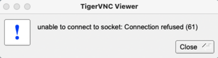

# Virtual Machines - Real Actions

## Introduction

This lab shows how to access a Virtual Machine (VM) and configure Virtual Network Computing (VNC).

## Request account access

<table>
    <thead>
        <tr>
            <th>for Uno VM</th>
            <th>for OCI VM</th>
        </tr>
    </thead>
    <tbody>
        <tr>
            <td rowspan=4>LDAP DSEE and PDIT NIS unix/linux</td>
            <td row=2>LDAP DSEE and PDIT NIS unix/linux <br>- <b>Login shell:</b> <i>Bash</i> or <i>csh</i> <br>- <b>Env or LOB:</b> <i>system LOB (gid=10)</i></td>
        </tr>
        <tr>
            <td>Kerberos [ADE_Admin] <br>- <b>LOB:</b> DEV</td>
        </tr>
    </tbody>
</table>

<!--
| for Uno VM | for OCI VM |
|------------|------------|
| LDAP DSEE and PDIT NIS unix/linux | LDAP DSEE and PDIT NIS unix/linux <br>Login shell: Bash or csh <br> Env or LOB: system LOB (gid=10) |
|                                     | Kerberos [ADE_Admin] |
-->

 - <ins>Request type</ins>: Select *Application* instance. Entitlements not required.

	

	> To know about provisioning a VM for Oracle Database, [see this](https://confluence.oraclecorp.com/confluence/x/NJMbrQ).

	## Internal test environments

	- Host user name: *sso* or global UID *mgarodia*
	<if type="hidden">
	- TigerVNC pwd: *welcome1*
	- LDAP/Kerberos pwd: *Livelabs\*1*
	</if>

	| VM host name                                            | Description                          |
	|---------------------------------------------------------|------------------------------------- |
	| phoenix211284.dev3sub1phx.databasede3phx.oraclevcn.com  | OCI system <br>IP:    			     |
	| phoenix123546.dev3sub1phx.databasede3phx.oraclevcn.com  | OCI system <br>IP:    				 |
	| phoenix62464.dev1sub1phx.databasede1phx.oraclevcn.com   | OCI system <br>IP: `100.104.88.84`   |
	| slc10wsw.us.oracle.com:2                                | Uno system <br>User ID: `1477205`    |
	|<if type="hidden">phoenix62465.dev1sub1phx.databasede1phx.oraclevcn.com:1 | Suresh Mohan's VM <br>pwd: *welcome1* </if>|
	| den03ckl.us.oracle.com:1                                | Temp system from Subbu <br> cuser:welcome <br>root:Welcome123 |

## Configure VNC for VM

1. Log in to VM using PuTTY
1. Start VNC server
1. Access VM using a VNC viewer

	> **Caution:** Start VNC server only if the server has stopped or after a system restart. If VNC server is already running, then starting VNC again <ins>assigns a new incremental port number</ins> to the instance.

	----
	## 1. Log in to VM using PuTTY

	1. In the **PuTTY Configuration** window, enter the domain host name (or IP address) `oracle_uid@slc10wsw.us.oracle.com`.

		```
		<copy>phoenix211284.dev3sub1phx.databasede3phx.oraclevcn.com</copy>
		```

		Click **Open**.   
		For future logins, you can **Save** the current session and **Load** them again.

		> **Note:** Install *PuTTY*, if not already installed.    
		Earlier practice was to install from [MyDesktop applications](https://mydesktop.oraclecorp.com/myd_sso/apps.main). Now, use *Workspace ONE Intelligent Hub* to get the required apps or tools.

	1. In the terminal window, enter the following.

		- login as: <i>GUID</i> [*mgarodia*]
		- mgarodia@phoenix211284.dev3sub1phx.databasede3phx.oraclevcn.com's password: <br><i>Enter the password</i> <if type="hidden">[*Livelabs\*1*]</if>

		```
		Last login: Wed Jan 18 12:49:02 2023
		-bash-4.4$
		```

	1. Set VNC password.

		```
		$ <copy>vncpasswd</copy>
		```

		```
		Password: <Enter password<if type="hidden">- welcome1</if>>
		Verify: <Enter password again<if type="hidden">- welcome1</if>>
		```

	1. Enter **n** here.   
		Do not use a view-only password.

		```
		Would you like to enter a view-only password (y/n)? n
		A view-only password is not used

		New 'phoenix211284:1 (mgarodia)' desktop is phoenix211284:1 <-- your port number
		Creating default startup script /home/mgarodia/.vnc/xstartup
		Creating default config /home/mgarodia/.vnc/config
		Starting applications specified in /home/mgarodia/.vnc/xstartup
		Log file is /home/mgarodia/.vnc/phoenix211284:1.log
		```

		Note the (instance) port number assigned. The default is ***1***. The port number increments if you start VNC again while it is still running.

	----
	## 2. Start vnc server

	You can start the VNC server in your VM as follows.

	- Old practice - run as normal user (your GUID)

		```
		$ <copy>vncserver</copy>
		```
		```
		WARNING: vncserver has been replaced by a systemd unit and is now considered deprecated and removed in upstream.
		Please read /usr/share/doc/tigervnc/HOWTO.md for more information.

		New 'phoenix211284:1 (mgarodia)' desktop is phoenix211284:1

		Starting applications specified in /home/mgarodia/.vnc/xstartup
		Log file is /home/mgarodia/.vnc/phoenix211284:1.log
		```

	- New practice - run as root

		```
		$ systemctl start vncserver@:x
		```
		or
		```
		$ sudo systemctl start vncserver@:x
		```

		Replace *`:x`* with the actual port number you configured in the user mapping file.

		For example

		```
		$ <copy>systemctl start vncserver@:1</copy>
		```

		## Cite

		 - Detailed explanation on how to start VNC using the new practice is explained in [this document](./files/HOWTO.md).

		 - Alternate ways to enable VNC viewer on latest operating system (OL8+) -
			 - [Install VNC on RHEL 8 - techmint](https://www.tecmint.com/install-vnc-server-on-rhel-8/)
			 - [Create VNC on OCI VMs - confluence](https://confluence.oraclecorp.com/confluence/display/EMQ/Create+VNC+on+OCI+VM+Instances)

		 - Want to read more on VNC, [click here - wiki](https://en.wikipedia.org/wiki/Virtual_Network_Computing)

	----
	## 3. Access VM using a VNC viewer

	You can access your VM using a VNC client of your choice.

	A few examples are -

	- TigerVNC
	- RealVNC
	- TightVNC
	- UltraVNC
	- PocketVNC

	> **Note**: This lab uses TigerVNC to connect to VM. However, you can use the client already installed in your system.

	1. Open TigerVNC.

	1. Enter the host name and port number `[host-name]:[port-number]` to connect to the VM.

		**Example 1**

		```
		<copy>phoenix211284.dev3sub1phx.databasede3phx.oraclevcn.com:1</copy>
		```

		<if type="hidden">

		**Example 2**

		```
		<copy>slc10wsw.us.oracle.com:2</copy>
		```

		</if>

		Go to **Options**, under the **Misc** tab select *Shared (don't disconnect other viewers)* to enable simultaneous connections to the VM.

		> **Note:** If the `Shared` option is not selected, when one user connects to the VM, then it immediately disconnects any other user who is already connected to the VM.

## Restart VM

You might want to restart your VM for various reasons. After restarting, the processes and apps do not start up automatically.

The following steps help you get the VM back in its original running state.

1. Restart VM
1. Start VNC server
1. Startup databases
1. Start OMS and Agent for EM

	----
	## 1. Restart VM

	1. For your assigned host devices, open the [Uno site](https://uno.oraclecorp.com/uno/hostdevices).

	1. Under Hosts & Devices, select the host that you want to restart. For example, *phoenix211284*.

	1. Go to **Actions** &gt; click **Reboot** to restart the VM.

		> It takes a few while for the VM to come up. This is a hard restart where all running process and tasks are terminated forcefully.

	----
	## 2. Start VNC Server

	Quick steps -

	1. Open putty and log in to VM.

		```
		$ <copy>phoenix211284.dev3sub1phx.databasede3phx.oraclevcn.com</copy>
		```

	1. Start VNC using either command.

		Option 1

		```
		$ <copy>vncserver</copy>
		```

		Option 2

		```
		$ <copy>systemctl start vncserver@:1</copy>
		```

		Failure with Option 2 command

		```
		==== AUTHENTICATING FOR org.freedesktop.systemd1.manage-units ====
		Authentication is required to start 'vncserver@:1.service'.
		Authenticating as: root
		Password:
		polkit-agent-helper-1: pam_authenticate failed: Authentication failure
		==== AUTHENTICATION FAILED ====
		Failed to start vncserver@:1.service: Access denied
		See system logs and 'systemctl status vncserver@:1.service' for details.
		```

	For details, check <i>Start VNC Server</i> under [Task 2: Configure VNC for VM](?lab=vm-real-axons#Task2:ConfigureVNCforVM).

	----
	## 3. Startup databases

	You can do either of the following -
	- startup DBs manually
	- startup DBs using scripts

		> **Note:** You can start OMS and access the EM console in a web browser only if the repo database (*19c*) is up and running. If the repo is closed, OMS server will not start.

		----
		## startup DBs manually

		1. Go to Oracle home for each DB.

			```
			$ <copy> cd /scratch/u01/app/oracle/product/[DB-version]/dbhome_x/</copy>
			```

		1. Set the env variables for `$ORACLE_SID` and `$ORACLE_HOME` for all DBs.

			```
			$ <copy>setenv ORACLE_SID orcl</copy>
			```

			```
			$ <copy>setenv ORACLE_HOME /scratch/u01/app/oracle/product/23.0.0/dbhome_1</copy>
			```

		1. Start the individual listeners for all DBs from each `$ORACLE_HOME/bin`.

			```
			$ [DB23c ORACLE_HOME/bin] <copy>./lsnrctl start</copy>
			```

			```
			$ [DB21c ORACLE_HOME/bin] <copy>./lsnrctl start listener21c</copy>
			```

			```
			$ [DB19c ORACLE_HOME/bin] <copy>./lsnrctl start listener19c</copy>
			```

		1. Log in to the SQL prompt and start up the database.

			```
			$ <copy>./sql / as sysdba</copy>

			Connected to an idle instance
			```

			```
			SQL> <copy>startup</copy>

			Database mounted.
			Database opened.
			```

		----
		## startup DBs using scripts

		Run the scripts in the home location.

		-

			```
			$ <copy>source ~/23cstart.sh</copy>
			```

		-

			```
			$ <copy>source ~/21cstart.sh</copy>
			```

		-

			```
			$ <copy>source ~/19cstart.sh</copy>
			```

	----
	## 4. Start OMS and Agent for EM

	When you check the OMS and Agent status from their respective *`bin`* directories, you will find that OMS is down and the Agent is also not running.

	**Start OMS** -

	1. In a terminal, go to middleware home.

		```
		$ <copy>cd /scratch/u01/software/em/middleware/bin</copy>
		```

	1. Start OMS.

		```
		$ <copy>./emctl start oms</copy>
		```

	> **Note:** Before starting OMS server, ensure that the repo database (*19c*) is up and running. If the repo is closed, OMS will not start.

	**Start Agent** -

	1. In a terminal, go to the agent location.

		```
		$ <copy>cd /scratch/u01/software/em/agent/agent_13.5.0.0.0/bin</copy>
		```

	1. Start Agent.

		```
		$ <copy>./emctl start agent</copy>
		```

## Troubleshooting

- Scenarios, solutions, troubleshooting options

	## Unable to connect to VM (using TigerVNC)

	Having trouble connecting to your VM could be due to various reasons. The workaround might vary depending on the scenario and the primary cause. Some of the scenarios are discussed here.

	> **Tip**: *Stop* and *restart* the vnc server instead of running it again. Every time you run VNC server, it creates a new (instance) port number and another log file *`host-name:x.log`*.

	## Stop VNC Server

	Terminate the process id of the vnc server.

	```
	$ <copy>vncserver -kill :x</copy>
	```
	where, *`x`* is the server session (port) number. Cite: [vncserver options](https://linux.die.net/man/1/vncserver) page.

	## Xvnc seems to be deadlocked

	**Problem statement**  
	Terminating the process for VNC server returns an error.

	

	**How to resolve**

	1. Find the process id of the vnc server.

		- Option 1

			```
			$ <copy>pidof</copy> <program_name>
			```

		- Option 2

			```
			$ <copy>ps aux | grep -i</copy> <program_name>
			```

		- **Option 3** (recommended)

			```
			$ <copy>ps -ef | grep vnc</copy>
			```

			Output:

			```
			mgarodia   465 31047  0 03:57 pts/5    00:00:00 grep --color=auto vnc
			mgarodia  2415     1  0  2021 ?        00:15:13 /usr/bin/Xvnc :1 -auth /home/mgarodia/.Xauthority -desktop phoenix211284:1 (mgarodia) -fp catalogue:/etc/X11/fontpath.d -geometry 1024x768 -pn -rfbauth /home/mgarodia/.vnc/passwd -rfbport 5901 -rfbwait 30000
			mgarodia  2431     1  0  2021 ?        00:00:00 /bin/sh /home/mgarodia/.vnc/xstartup
			```

	1. Ignore the line with *`-color=auto`*. Terminate the process (in this example, *2415*) with the name *Xvnc*.

		```
		$ <copy>kill 2415</copy>
		```

		> **Note:** `Kill` terminates the process gracefully. This is the default and safest way to terminate a process.

	     - The command `kill -9` sends a signal to terminate the process attached with the PID or the process name. It is a hard way to terminate a single or a set of processes *forcefully* and *immediately* and can create zombie processes.

		## Other terminate options

		- You can also terminate multiple processes together.

			**Syntax**

			```
			$ <copy>sudo kill -9</copy> process_id_1  process_id_2 process_id_3
			```

		- To terminate all process of a program, combine the commands.

			```
			$ <copy>sudo kill -9</copy> `pidof programe_name`
			```

		- Or use this quick command.

			```
			$ <copy>killall program_name</copy>
			```
	1. Verify the vnc server process.

		```
		$ <copy>ps -ef | grep vnc</copy>
		```

		Output:

		```
		mgarodia   603 31047  0 03:58 pts/5    00:00:00 grep --color=auto vnc
		mgarodia  2431     1  0  2021 ?        00:00:00 /bin/sh /home/mgarodia/.vnc/xstartup
		```

	1. Terminate the process of the vnc server again.

		```
		$ <copy>vncserver -kill :x</copy>
		```

		Output:

		```
		Killing Xvnc process ID 2415
		Xvnc process ID 2415 already killed
		Xvnc did not appear to shut down cleanly. Removing /tmp/.X11-unix/X1
		```

	1. Start the vncserver. It will use the existing port number, for example `:1`.

		```
		$ <copy>vncserver</copy>
		```

		Output:

		```
		New 'phoenix211284:1 (mgarodia)' desktop is phoenix211284:1

		Starting applications specified in /home/mgarodia/.vnc/xstartup
		Log file is /home/mgarodia/.vnc/phoenix211284:1.log
		```

		The VNC server is back. You can connect with the VNC viewer, for example TigerVNC, again.


	## Connection timed out or refused

	**Problem statement**  
	TigerVNC returns an error - unable to connect to socket: connection timeout or refused error.

	

	

	**What happened**  
	VNC server is not running.

	**How to resolve**

	1. Verify if the vnc server is running.

		```
		$ <copy>ps -ef | grep vnc</copy>
		```

		Output:

		```
		mgarodia   603 31047  0 03:58 pts/5    00:00:00 grep --color=auto vnc
		```

		If the result displays a line with *`-color=auto`*, then VNC server is not running.


	1. Start the vncserver. It will use the existing port number, for example `:1`.

		```
		$ <copy>vncserver</copy>
		```

	## No connection made, target machine actively refused

	**Problem statement**  
	TigerVNC returns an error that the target machine actively refused the connection.

	

	You then connect to the VM using Putty and try to run the VNC Server. But you get the following error.

	```
	$ <copy>vncserver</copy>

	WARNING: vncserver has been replaced by a systemd unit and is now considered deprecated and removed in upstream.
	Please read /usr/share/doc/tigervnc/HOWTO.md for more information.
	vncserver: Could not create /home/[your-account]/.vnc.
	```

	**What happened**  
	Your home directory does not exist on the VM.

	**What to do**   
	Nothing. Sit back and relax.

	If you are a new joinee or have applied for LDAP permissions recently, then the home directory is not created immediately.

	> **Note**: LDAP takes around 1 day to set up your account and create your home directory.

## Acknowledgments

 - **Author** - ♏🅰️♑❗💲♓ Team Database UAD
 - **Last Updated on** - December 3, (Sun) 2023
 - **Questions/Feedback?** - Blame [manish.garodia@oracle.com](./../../../intro/files/email.md)
