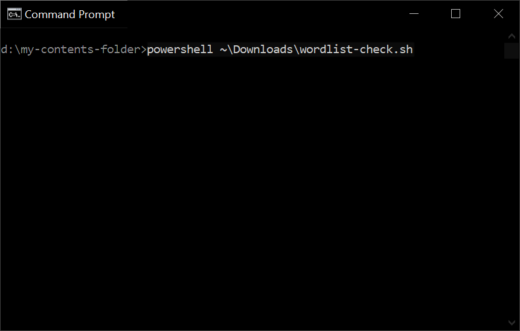
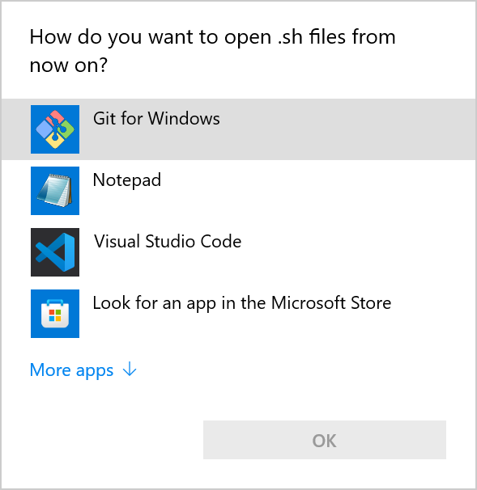
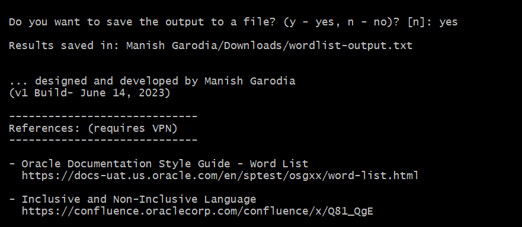
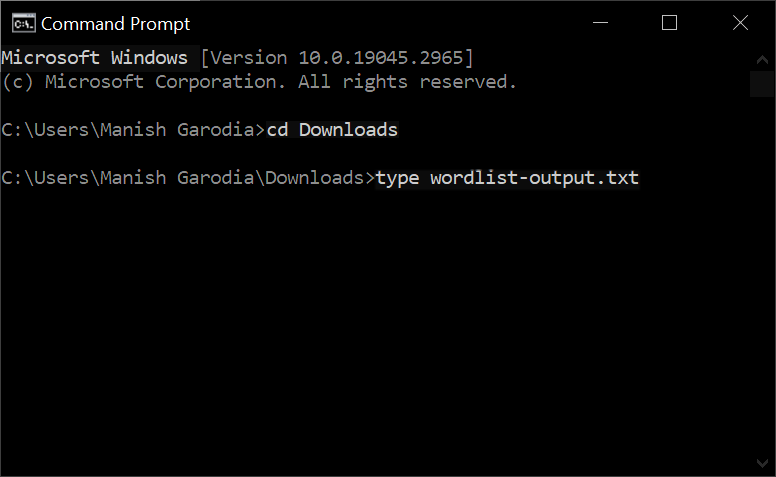

# Wordlist Check

## About this tool 

**Wordlist Check** is a learning tool that checks for disallowed words and incorrect usage in documents according to Oracle's standards and guidelines. This lab helps you get familiar with the tool and learn how to use it. 

### Objective 

To bring in consistency and improve the quality of documentation with some automation.

## Know the tool

Wordlist Check contains a lightweight, Linux-based commands that runs in a command-line interface (CLI). It works with files that exist locally on your system, and not from a URL or online location.

You can run this tool on your documents and contents to check for disallowed words and incorrect usage. 

**Background**   
Oracle Documentation Style Guide (OSB) recommends a **[Word List](https://docs-uat.us.oracle.com/en/sptest/osgxx/word-list.html)** preferred by the National Standards Organization (NISO). For more information about the NISO sort order, see [Sorting Glossary Entries](https://docs-uat.us.oracle.com/en/sptest/osgxx/sorting-glossary-entries.html#GUID-3219677E-95D8-45FC-92EA-CA554D1E1162).

Another set of guidelines are explained in [Oracle's Inclusive Language standard](https://confluence.oraclecorp.com/confluence/x/Q81_QgE).

| What the tool does                       | What the tool does not do                 |
|------------------------------------------|-------------------------------------------|
| Looks for disallowed words and incorrect usage in files that are in text, markdown, or XML formats | Does not check contents of binary files, config files, or images, for example, `*.css`, `*.docx`, `*.sql`, `*.yml`, `*.png`, `*.jpg`, `index.html`, `manifest.json`, etc.  |
| Checks for most, if not all, words mentioned in Oracle Doc style guide               | Does not perform English grammar check |
| Checks the contents across multiple files in each subfolder that are stored locally on your system      | Does not check files from a URL or online location                  |
| Creates a `Downloads` folder under your profile, if it does not exist                | Does not affect the existing files and folders on your system  |
| Provides option to save the output to a text file                                    | Does not fix the issues automatically                              |
{: title="Functions of Wordlist Check"}

## Download the tool

Follow this link to download the tool:

 - [wordlist-check.zip](https://bit.ly/wordlist-check-mg)

Extract the file, *`wordlist-check.sh`*, and store it on your system, for example in the `Downloads` folder.

### Prerequisites

The tool can function in both Windows and Linux (Mac) platforms. Though, internally it requires a Linux environment. 

On a Windows system, ensure that you have *Git Bash* to run this tool. However, it does not require you to know about Git Bash or learn its commands. All you have to do is, install Git for Windows so that you can run this tool in Windows.

> **Tip**: If you do not have Git Bash, then get it from their site - [Git Downloads](https://git-scm.com/downloads).

On a Linux (Mac) system, you can run this tool in a terminal window. You can also use a VNC viewer or PuTTY to connect to your VM and run this tool. You do not require installing Git in a Linux system.

## Run the tool - *Wordlist Check*

You can run the tool in Windows using any of these interfaces:
 - Git Bash
 - Windows PowerShell (and PowerShell ISE)
 - Windows Command Prompt

	> Windows Command Prompt does not recognize Linux shell commands. It internally calls PowerShell to run the tool.

Open a CLI window, for example Git Bash, Windows PowerShell, or Command Prompt, and do the following.

> **Note**: This tool requires Git Bash to run on a Windows system. If you do not have Git Bash, then you can get it from their site - [Git Downloads](https://git-scm.com/downloads).

1. Go to the folder from where you want to check the contents for disallowed words.

	```
	$ <copy>cd [your-contents-folder]</copy>
	```

1. Specify the full path of the tool *`wordlist-check.sh`* and press **Enter** to run it.   
	In this example, the tool is located in the `Downloads` folder.

	**Git Bash**

	```
	$ <copy>~/Downloads/wordlist-check.sh</copy>
	```

	**PowerShell** or **Powershell ISE**

	```
	PS [your-contents-folder] <copy>~\Downloads\wordlist-check.sh</copy>
	```

	**Command Prompt**

	```
	[drive]:[your-contents-folder] <copy>powershell ~\Downloads\wordlist-check.sh</copy>
	```

	

	- Occasionally, you may find some hiccups with PowerShell or Command Prompt.

		## Issues with PowerShell

		- If you get a message that `the command is not recognized`, then either the path to the tool is incorrect or the tool does not exist at the given location.

		- If the default application is not set for the file type, then it may display an error.

			```
			Program jada-jada failed to run: Application not found at line:1 char:1
			```

			To fix this, right-click the file `wordlist-list.sh` and select **Properties**. Change the **Opens with** option to *Git for Windows*.

		- For the first run, your system may ask for the app to open the tool. Select *Git for Windows*.

			

	The tool searches for disallowed words in your contents under each subfolder. Both PowerShell and Command Prompt brings up Git Bash temporarily to display the search result.

	

	If the tool finds any mismatch with Oracle Doc style guide, then it displays result with the following details -
	- <font style="color:rgb(177,72,198);">**file name with the full path**</font>
	- <font style="color:rgb(28,168,0);">**line number**</font>
	- <font style="color:rgb(255,118,118);">**disallowed word and incorrect usage**</font>

	> **Tip**: You may ignore some parts in case of exceptions. For example, if the disallowed words are part of statements, commands, code blocks, file names, or UI elements.

1. The tool prompts you to save the results to a file, *`wordlist-output.txt`*.

	

	Press **y** or **yes** to save the output file in the `Downloads` folder or press **n** or **Enter** to ignore. The tool creates a `Downloads` folder, if it does not exist.

	```
	[your-account]/Downloads/wordlist-output.txt
	```

	### **View Output**

	After saving the results in the *`wordlist-output.txt`* file, you can view it using a command-line utility, for example Command Prompt. 
	
	**Command Prompt**

	1. Open Command Prompt and go to the `Downloads` folder in your profile.

		```
		C:\Users\[your-account] <copy>cd Downloads</copy>
		```

	1. Run this to view the contents of the output file.

		```
		<copy>type wordlist-output.txt</copy>
		```

		

		> **Note**: As the output file is created in Bash (Linux-based) environment, if you view it in a Windows text editor (Notepad, Wordpad, et al.), then it may display some junk characters because of conversion between operating systems.

	Viewing the output file from the command line does not display junk characters. Alternatively, you can use Git Bash to view the output file. 

	**Git Bash**

	Open Git Bash and run the following.

	```
	$ <copy>cat ~/Downloads/wordlist-output.txt</copy>
	```

----
## Run as a command without full path

You can run this tool as a command from any location without specifying its full path. To achieve this, set the environment variable *`$PATH`* depending on the operating system.  

> ***Warning***: Exercise *<ins>utmost caution</ins>* while doing these.

----
**For Windows**

1. Right-click **My Computer** or **This PC** &gt; select **Properties**.

	

	Alternatively, open **Settings** &gt; go to **System**, scroll down and click **About** in the left pane.

1. Under Related settings on the right, click **Advanced system settings**.

	

	It opens the the System Properties window.

1. On the **Advanced** tab &gt; click **Environment Variables**.

	

	The window displays user variables for your account and the system variables.

1. Under **System variables**, select *Path* and click **Edit** to modify the variable.

	

1. Click **New** and then **Browse** to add the location where the tool *`wordlist-check.sh`* exists.

	

	> **Caution**: Ensure that you click **New** and browse to the location of the tool.   
	DO NOT edit anything in the Edit environment variable window. Clicking edit will overwrite an existing variable and your system may face serious consequences.

Click **OK** in each window to save your changes and close them.

You have successfully set the environment variable *$PATH* for Windows system. Similarly, you can set the variable for a Linux system.

----
**For Linux**

It is pretty much quick.

1. Edit the *`.bashrc`* file.   
	> Usually, the system files `.bashrc` and `.bash_profile` are located in the home folder under `[your-account]`.

	 - Windows: `C:\Users\[your-account]`
	 - Linux: `/home/[your-account]`

1. Add the following lines and include the full path of the tool to set the *`$PATH`* variable.

	```
	<copy>export PATH=~/Downloads/:$PATH
	export PATH=/d/git/GitHub/:$PATH</copy>
	```

The *$PATH* variable is now set.

Restart the CLI window for the variable to take effect. When you open a new CLI window, type *`wordlist-check.sh`* without the full path to run the tool.

> **Tip**: In Windows, the CLI utilities, Git Bash, PowerShell, and Command Prompt, automatically pick up environment variables defined in your system.

## Important links

 - Download the tool [wordlist-check.zip](https://bit.ly/wordlist-check-mg)
 - Download Git for Windows from [Git](https://git-scm.com/downloads)
 - [Oracle Documentation Style Guide (OSG)](https://docs-uat.us.oracle.com/en/sptest/osgxx/) 
 - [OSG - Word List](https://docs-uat.us.oracle.com/en/sptest/osgxx/word-list.html)
 - [Oracle's Inclusive Language standard](https://confluence.oraclecorp.com/confluence/x/Q81_QgE)
 - Notes on [using github, git desktop, git bash, code editors](https://bit.ly/git-labs)

## Acknowledgments

 - **Author** - Manish Garodia, Team Database UAD
 - **Last updated on** - Jun 14, (Wed) 2023
 - **Questions/Feedback?** - Email [manish.garodia@oracle.com](./intro/files/email.md) or Slack [@mgarodia](https://proddev-database.slack.com/archives/D01NY1FF049)

