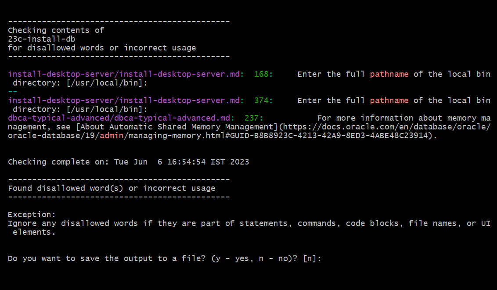
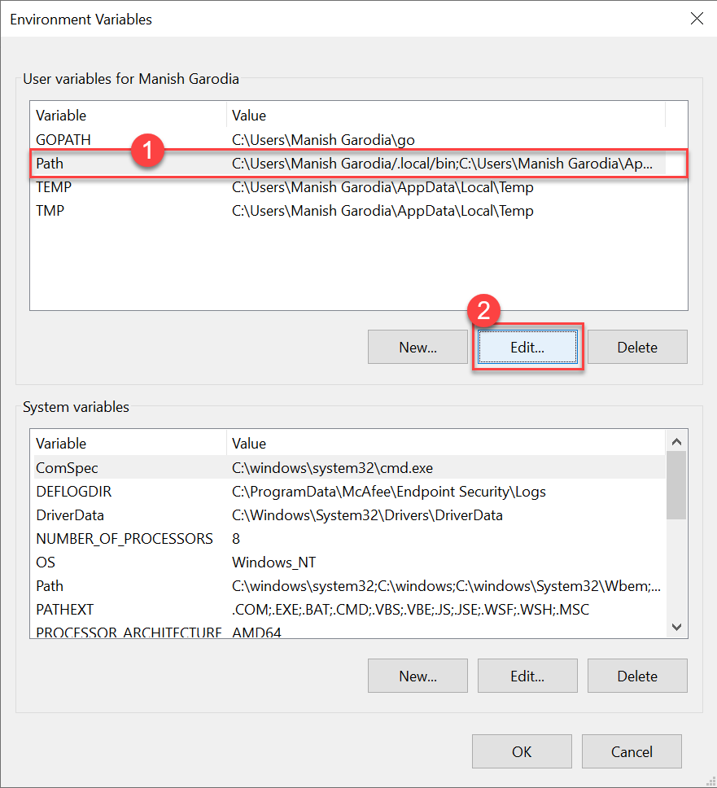
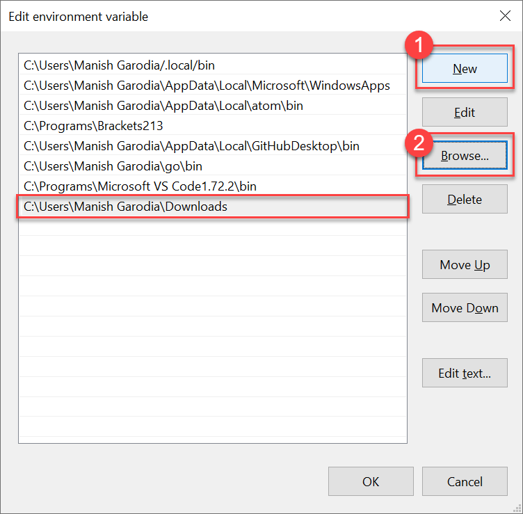
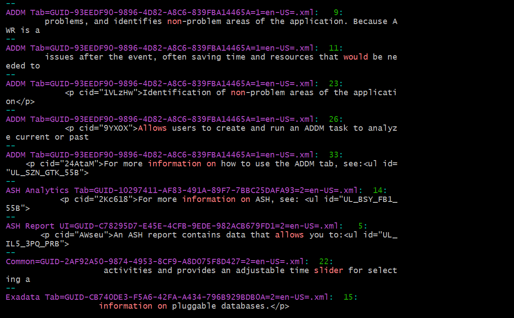
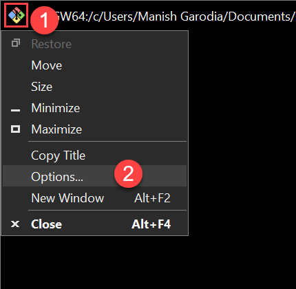
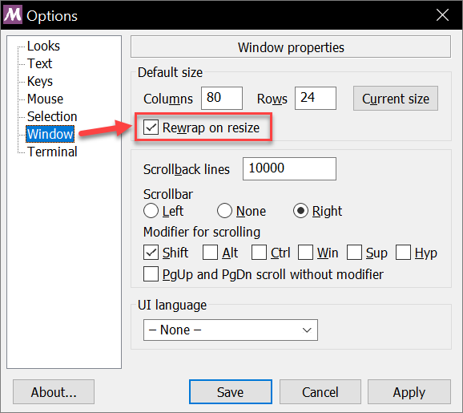

# Wordlist Check

## Introduction

***Wordlist Check*** is a learning tool that checks for disallowed words and incorrect usage in contents according to Oracle's standards and guidelines. Follow this document to get familiar with the tool and learn how to use it.

**Objective**   
To bring in consistency and improve the quality of documentation with some automation.

## About the tool

Wordlist Check contains lightweight, Linux-based commands that run in a command-line interface (CLI).

**Key features**   
When you run this tool on your documents, it:

 - checks for disallowed words and incorrect usage as per Oracle Documentation Style Guide (OSG) and Inclusive and Non-Inclusive Language
 - displays the result instantly
 - provides option to save the result to a text file

**Functions**   

| What the tool does                       | What the tool does not do                 |
|------------------------------------------|-------------------------------------------|
| Looks into files that are in text, markdown, or XML format | Does not check contents of binary files, configuration files, or images, for example, `*.css`, `*.docx`, `*.sql`, `*.yml`, `*.png`, `*.jpg`, `index.html`, `manifest.json`, etc.  |
| Checks for most, if not all, words mentioned in Oracle Doc style guide               | Does not perform English grammar check |
| Checks the contents across multiple files in each subdirectory that are stored locally on your system      | Does not check files from a URL or an online location                  |
| Creates a `Downloads` directory under your profile, if it does not exist             | Does not affect the existing files and directories on your system  |
| Provides option to save the output                                                   | Does not fix the issues automatically                              |
{: title="Functions of Wordlist Check"}

> **Tip**: For unsupported file types, such as docx, manifest, etc., you can copy the content into a temporary text file and run the tool on this file. Thus, you can use this tool to check the contents of unsupported file types.

**Background**   
Oracle Documentation Style Guide (OSG) recommends a **[Word List](https://docs-uat.us.oracle.com/en/sptest/osgxx/word-list.html)** preferred by the National Standards Organization (NISO). For more information about the NISO sort order, see [Sorting Glossary Entries](https://docs-uat.us.oracle.com/en/sptest/osgxx/sorting-glossary-entries.html#GUID-3219677E-95D8-45FC-92EA-CA554D1E1162).

Another set of guidelines is explained in [Oracle's Inclusive Language standard](https://confluence.oraclecorp.com/confluence/x/Q81_QgE).

> **Note**: The tool is in compliance with both these standards.

### Download and set up the tool

1. Follow this link to download the tool.

	<a href="https://bit.ly/wordlist-check-mg" class="tryit-button">wordlist-check.zip</a>

1. Extract the file, *`wordlist-check.sh`*, and store it on your system, for example, in the `Downloads` directory.

### **Prerequisites**

The tool can function in both Windows and Linux (Mac) operating systems. Though, internally it requires a Linux environment.

For a **Windows system**
 - Ensure that you have ***Git Bash*** installed.  

	> **Note**: It does not require you to know about Git Bash or learn its commands. You also do not require a Git Bash session running to use this tool.

 - To get Git Bash, install *`Git for Windows`* from their site - [Git Downloads](https://git-scm.com/download/win).

For a **Linux system (or Mac)**
 - Run this tool in a terminal window.
 - Do not require installing Git.

## How to use

This tool helps you:
 - check contents in Windows
 - check contents in VM (Linux)
 - check OHC books and publications

### Check contents in Windows

To run the tool in Windows, use any of these interfaces:
 - Git Bash
 - Windows PowerShell (or PowerShell ISE)
 - Command Prompt

	> Command Prompt does not recognize Linux shell commands. It internally calls PowerShell to run the commands.

Open a CLI window, for example Git Bash, Windows PowerShell, or Command Prompt, and do the following.

<!--
> **Tip**: This tool requires Git Bash installed in a Windows system. However, you do not require a Git Bash session running to use the tool. To get Git Bash, download and install *`Git for Windows`* from their site - [Git Downloads](https://git-scm.com/download/win).
-->

1. Go to the directory from where you want to check the contents for disallowed words.

	```
	$ <copy>cd [your-contents-directory]</copy>
	```

	> **Note**: The Wordlist Check tool will scan recursively, that is, all files in that directory and the subdirectories. Ensure to have only those files that you want to scan in that directory.

1. Specify the full path of the tool *`wordlist-check.sh`* and press **Enter** to run it.   
	In this example, the tool is located in the `Downloads` directory.

	**Git Bash**

	```
	$ <copy>~/Downloads/wordlist-check.sh</copy>
	```

	**PowerShell** or **Powershell ISE**

	```
	PS [your-contents-directory] <copy>~\Downloads\wordlist-check.sh</copy>
	```

	**Command Prompt**

	```
	[drive]:[your-contents-directory] <copy>powershell ~\Downloads\wordlist-check.sh</copy>
	```

	

	For the first run, your system may ask for the app to open the tool. Select *Git for Windows*.

	

	The tool searches for disallowed words and incorrect usage in all files under each subdirectory. Both PowerShell and Command Prompt brings up Git Bash temporarily to display the search result.

	

	If the tool finds any mismatch with the Oracle standards, then it highlights the following -
	- <font style="color:rgb(177,72,198);">**file name with full path**</font>
	- <font style="color:rgb(28,168,0);">**line number**</font>
	- <font style="color:rgb(255,118,118);">**disallowed word and incorrect usage**</font>

	> **Tip**: You may find certain exceptions that you can consider or ignore depending on your requirements. For example, the disallowed word is a part of a statement, command, code block, file name, or UI element.

1. The tool prompts you to save the results to a file.

	

	- Save output

		Enter **y** or **yes** to save the result to a file, *`wordlist-output.txt`*, in the `Downloads` directory.

		```
		[your-account]/Downloads/wordlist-output.txt
		```

		Usually, a `Downloads` directory exists in all user profiles. However, if the directory does not exist, then the tool creates it in your profile.

	- Discard output

		Enter **n** or **No**, or press **Enter** to discard the result.

	### **View output file**

	After saving the results, you can view the output file using a command-line utility, for example Command Prompt.

	**Command Prompt**

	1. Open Command Prompt and go to the `Downloads` directory in your profile.

		```
		C:\Users\[your-account] <copy>cd Downloads</copy>
		```

	1. Run this to view the contents of the output file.

		```
		<copy>type wordlist-output.txt</copy>
		```

		

		> **Note**: As the output file is created in Bash (Linux-based) environment, if you view it in a Windows text editor (Notepad, Wordpad, etc.), then it may display some junk characters due to conversion between operating systems.

	Viewing the output file from the command line does not display junk characters. Alternatively, you can use Git Bash to view the output file.

	**Git Bash**

	Open Git Bash and run the following.

	```
	$ <copy>cat ~/Downloads/wordlist-output.txt</copy>
	```

### Check contents in VM (Linux)

If the tool, *`wordlist-check.sh`*, does not exist on your VM, then copy or download it to a directory, for example, `/home/[your-account]/Downloads`.

> **Note**: To copy the tool from a Windows system to the VM, you can use an SFTP client, such as WinSCP.

1. Connect to your VM using any of these:

	- A VNC viewer - for example, *TigerVNC*
	- An SSH/telnet client - for example, *PuTTY*

	In the VNC viewer, open a terminal window to run the tool. In a PuTTY session, you can run the tool in the same window.

1. Go to the directory from where you want to check the contents for disallowed words.

1. Enter the following command and specify the full path of the tool.

	```
	$ <copy>sh ~/Downloads/wordlist-check.sh</copy>
	```

The tool checks the content and displays result.

### Check OHC books and publications

This tool does not work directly on online locations or web pages. However, you can still run it on OHC books and publications.

- **Check topics that you updated**

	When you create a new topic or modify an existing topic in SDL CCMS, it creates a copy of that topic automatically on your system.

	1. Open a CLI window and go to this directory.

		```
		C:\Users\[your-profile]\Documents\SDL\InfoShare\[some-number]\[your-account]
		```

		It contains topics that you created or modified.

	1. Run the tool on the XML files and check the contents of these topics.

- **Check entire publication**

	Get a copy of the book or publication on your system to check the contents using this tool.

	1. Go to the [DocBuilder](https://docbuilder.doceng-oci.oraclecorp.com/) site and download the latest build of the publication that you want to check.

	1. Extract the contents of the compressed build file. It contains these directories - `infodev.pdf`, `infodev.xhtml`, and `infodev.xml`.

	1. Open a CLI window and go to the *`infodev.xml`* directory. It contains all topics in XML format from the entire publication .

	1. Run the tool on the XML files and check the contents of the entire publication.

**Fix issues in your publication**

After identifying the issues in your publication:
1. Go to SDL CCMS and determine the source files that you want to modify.
1. Refer the output from the tool and update the corresponding topics using Oxygen XML Author.

In Oxygen XML Author, use the *`Text`* mode to view line numbers in your topics.

> **Known limitation**: The line number in your topic may not match with the output from the tool. This is because Oxygen XML Author removes some elements from the topics when you download the build from DocBuilder. Besides, the file name and topic title may not be exactly the same.

### Run as a command without full path

You can run this tool as a command from any location.

This means you store the tool, *`wordlist-check.sh`*, in a directory on your system and then run the tool without specifying its full path.

To achieve this, set the environment variable *`$PATH`* depending on the operating system.  

> ***Warning***: Exercise *<ins>utmost caution</ins>* while doing these.

----
**For Windows**

1. Right-click **My Computer** or **This PC** &gt; select **Properties**.

	

	Alternatively, open **Settings** &gt; go to **System**. Scroll down the left pane and click **About**.

1. Under Related settings on the right, click **Advanced system settings**.

	

	It opens the System Properties window.

1. On the **Advanced** tab &gt; click **Environment Variables**.

	

	The window displays user variables in your account and system variables.

1. Under **User variables** for your profile, select *Path* and click **Edit** to modify the variable.

	

1. Click **New** and then **Browse** to add the location where the tool *`wordlist-check.sh`* resides.

	

	> **Caution**: Ensure that you click **New** and browse to the location of the tool.   
	DO NOT edit anything in the Edit environment variable window. Clicking edit will overwrite an existing variable and your system may have consequences.

1. Click **OK** in each window to save your changes and close them.

You have successfully set the environment variable *$PATH* for Windows system.

Restart the CLI window for the variable to take effect. The next time you open a new CLI window, type *`wordlist-check.sh`* without the full path to run the tool.

> **Tip**: In Windows, the CLI utilities - Git Bash, PowerShell, and Command Prompt - automatically pick up environment variables defined in your system.

Similarly, you can set the variable for a Linux system.

----
**For Linux (or Mac)**

It is pretty much quick.

1. Edit the *`.bashrc`* file.   
	> Usually, the system files `.bashrc` and `.bash_profile` are located in the home directory under `[your-account]`.
	 - Windows: `C:\Users\[your-account]`
	 - Linux: `/home/[your-account]`

1. Add the following line and include the full path of the tool to set the *`$PATH`* variable. In this example, the tool is located in the `Downloads` directory.

	```
	<copy>export PATH=~/Downloads/:$PATH</copy>
	```

The *$PATH* variable is now set.

Load the `.bashrc` file for the variable to take effect.

```
$ <copy>source ~/.bashrc</copy>
```

The next time you open a new terminal window, type *`wordlist-check.sh`* without the full path to run the tool.

## Troubleshooting

- This section discusses issues while running the tool and possible workarounds. 

	## Issues with PowerShell

	- If you get a message that `the command is not recognized`, then either the path to the tool is incorrect or the tool does not exist at the given location.

	- If the default application is not set for the file type, then it may display an error.

		```
		Program jada-jada failed to run: Application not found at line:1 char:1
		```

		To fix this, right-click the file `wordlist-list.sh` and select **Properties**. Change the **Opens with** option to *Git for Windows*.

	## Word wrap not working on maximize window

	**Problem statement**   
	Generally, Git Bash starts in restore view. When you run the tool on your contents and maximize the Git Bash window for a full view of the output, the text in the right margin is truncated.

	

	**What to do**  
	Modify the Window properties and enable word wrap for Git Bash.

	1. Click the icon on the top left of the Git Bash window and select **Options**.

		

	1. Go to Window and select **Rewrap on resize**.

		

	1.	Click **Save** to enable word wrap for Git Bash.

	Restart the Git Bash window for the changes to take effect.

	> **Tip**: Update Git Bash if window properties do not have the rewrap option.

## Important links

 - Download the tool - [wordlist-check.zip](https://bit.ly/wordlist-check-mg)
 - Download `Git for Windows` from [Git](https://git-scm.com/download/win)
 - [OSG - Word List](https://docs-uat.us.oracle.com/en/sptest/osgxx/word-list.html)
 - [Oracle's Inclusive Language standard](https://confluence.oraclecorp.com/confluence/x/Q81_QgE)
 - Notes on [using github, git desktop, git bash, code editors](https://bit.ly/git-labs)
 - [Help text on the tool](https://confluence.oraclecorp.com/confluence/x/XQkasQE) on the S&P site

## Acknowledgments

 - **Author** - Manish Garodia, Team Database UAD
 - **Last updated on** - Aug 11, (Fri) 2023
 - **Questions/Feedback?** - Email @manish.garodia

<!--
[wordlist-check.zip](https://bit.ly/wordlist-check-mg)

export PATH=/d/git/GitHub/:$PATH</copy>
-->
