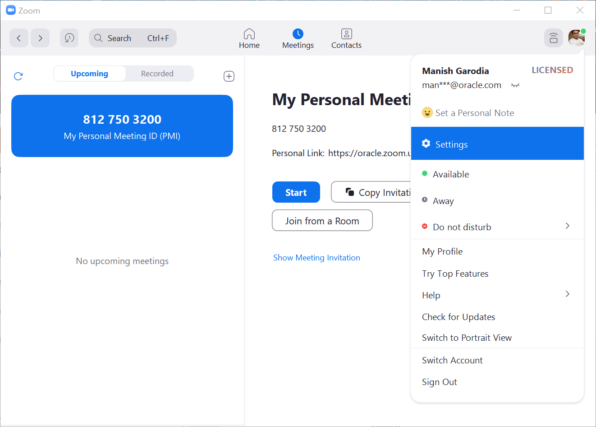
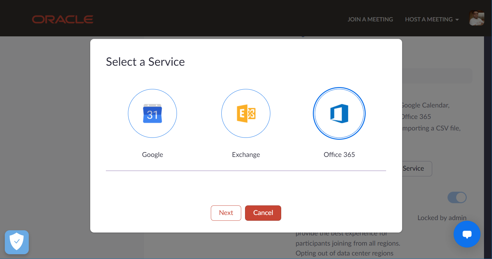
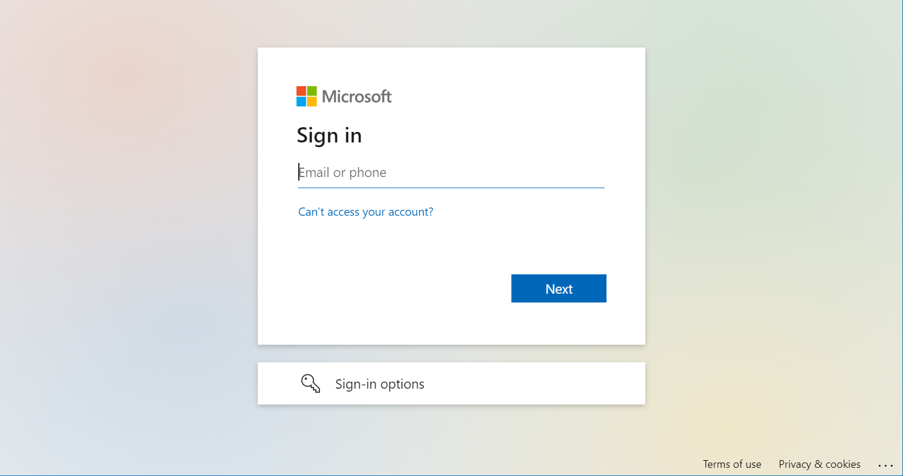
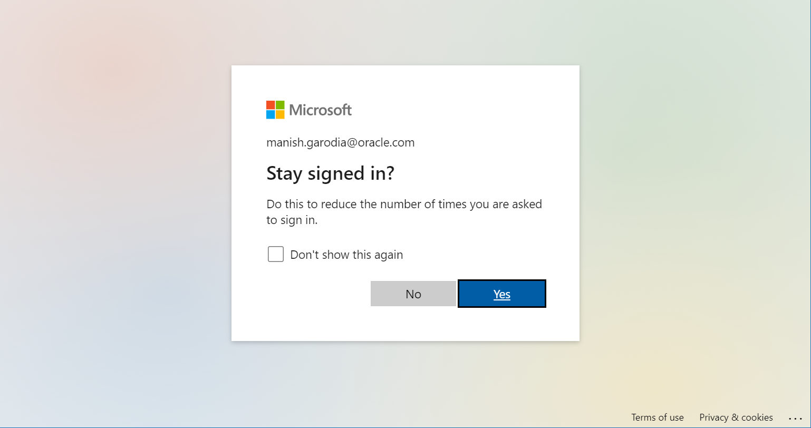
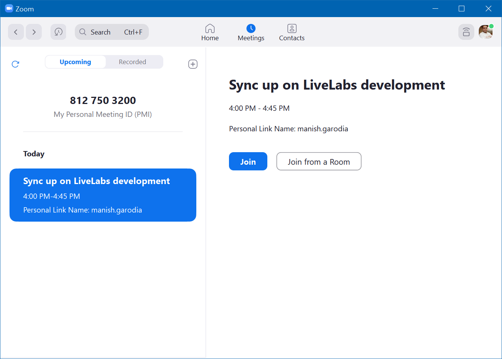
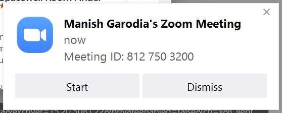
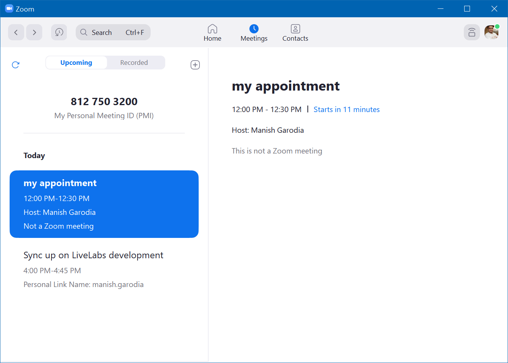
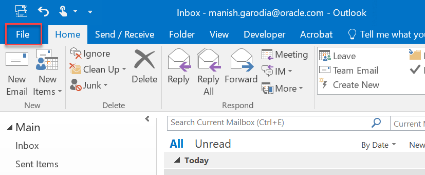
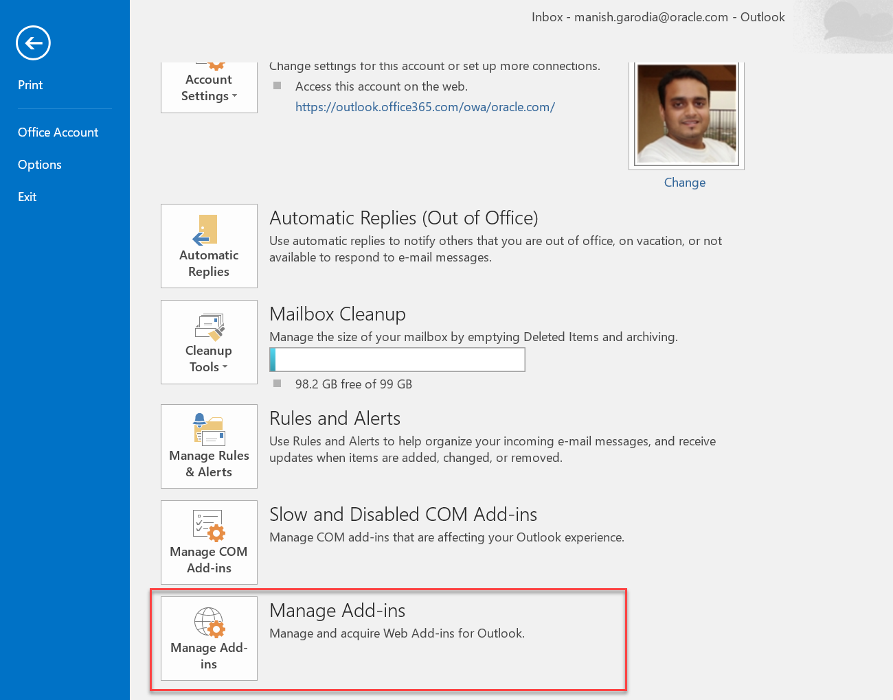

# Zoom Barabar Zoom (swing well)

## Zoom weds Outlook

This lab covers some useful tips for setting up Zoom and integrating it with Microsoft Outlook.

## Integrate Zoom with Outlook Calendar

You can sync up the Zoom application with the Outlook calendar and view the meetings in Zoom.

> **Note:** Close the Outlook application before you start.

1. Log in to Zoom.

	

1. Click the *profile status icon* on the top-right and go to **Settings**.

	

1. On the **General** tab, scroll down and click **View More Settings**.   
	The advanced settings for Zoom opens in your default browser. You may have to login using your SSO credentials or use VPN.

	

	> **Note:** Close the Zoom Settings window if it is on top of all other windows. Do not close the Advanced Settings in the web browser.

1. From the left navigation pane, go to **Profile**.

	

1. Scroll down to the section **Others** and click **Configure Calendar and Contacts Service**.

	

1. When prompted to select a service, select *Office 365* and click **Next**.

	

	The window displays the option to **Add a Calendar Service**.

1. Leave the default *Read* and *Write* permissions for both Calendar and Contacts and click **Authorize**.   
	You may deselect a permission to restrict Zoom from accessing it.

	

	The window opens the Microsoft Sign in page.

1. Enter your *official (Oracle) e-mail address* and click **Next**. The window takes you Oracle's sign in page.

	

1. When prompted to *Stay signed in?* click **Yes**.   
	Optionally, you may select `Don't show this again`.

	

	Your Zoom profiles shows that you have successfully integrated your Outlook Calendar and Contact with Zoom.

	

- You can now join the Outlook meeting from Zoom directly.

	

	## Other options

	You will also get a notification to join a few minutes before the Zoom meeting starts.

	

	If you are the meeting Organizer, you will get a notification to start the Zoom meeting.

	

	If the appointment or a meeting does not have a zoom link, it will show up in Zoom but cannot join directly.

	

	> **Note:** Open the meeting in Outlook, add the zoom link in Location or in the body text, and save it. You do not send update to the attendees.   
	Adding zoom link to **Subject** will not enable the join option. Also, bitly or other short links are not considered as Zoom meetings.

	As it is attached directly to your profile and not a local installation, I believe it will work device-independent, that is, on mobile phones, tabs, browsers, etc. However, I am yet to try them out.

## Add the plug-in Zoom for Outlook

After adding this plug-in *Zoom for Outlook*, you can create Zoom meetings directly from Outlook.

1. Open Outlook and go to **File**.

	

	It opens the **Account Information** window.

	

1. In the **Info** tab, scroll down and click **Manage Add-ins**.   

	

	The window opens the Microsoft Sign in page in the default web browser.

1. Enter your *official (Oracle) e-mail address* and click **Next**. The window takes you Oracle's sign in page.

	

1. When prompted to *Stay signed in?* click **Yes**.   
	Optionally, you may select `Don't show this again`.

	

	It opens the *Office365* page.

1. In the **Search add-ins** box on the top right, type *Zoom for Outlook*.

	

1. In the plug-in window, click **Add** to add the Zoom plug-in to Outlook.

	

The next time you create a new meeting or an appointment in Outlook, you get an option to *Add a Zoom Meeting*.

## Acknowledgments

 - **Author** - Manish Garodia, Team Database UAD
 - **Last Updated on** - April 2, (Sun) 2023
 - **Questions/Feedback?** - Blame [manish.garodia@oracle.com](./../../../intro/files/email.md)

