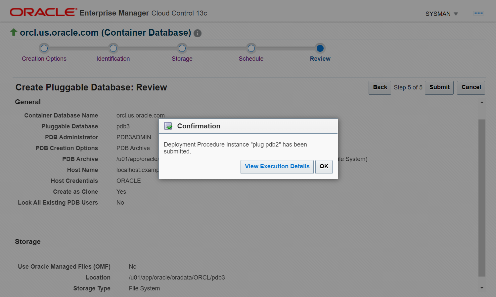

# Plug unplugged PDBs into CDB

## Introduction

This lab shows how to create a new Pluggable Database (PDB) in the Container Database (CDB) by plugging in an unplugged PDB from Oracle Enterprise Manager Cloud Control (Oracle EMCC). 

Estimated time: 15 minutes

### Objectives

Perform these tasks from Oracle EMCC:
 -   Plug an unplugged PDB into the root container
 -   View the newly created PDB 

### Prerequisites

This lab assumes you have -

 -   A Free Tier, Paid or LiveLabs Oracle Cloud account
 -   Completed -
     -   Lab: Prepare setup (*Free-tier* and *Paid Tenants* only)
     -   Lab: Setup compute instance
     -   Lab: Initialize environment
     -   Lab: Provision a Pluggable Database (PDB)
     -   Lab: Remove PDBs from the CDB
 -   Logged in to Oracle EMCC in a web browser as *sysman* 

## Task 1: Plug an unplugged PDB into the root container

Oracle EMCC provides options to provision PDBs from the database instance home page. These options are not available on the CDB or the PDB home page. Before plug in, ensure that you have a PDB that is unplugged. You can plug the unplugged PDB into the same or another container. 

In this task, you will plug the unplugged PDB, namely *PDB2*, into the same root container and create a new PDB, namely *PDB3*, in your Oracle Database.

1.  On the Database pages, click on the Database Instance name, for example *orcl.us.oracle.com*.  
    The values may differ depending on the system you are using.  

	 

    The green upward arrow in the **Status** field indicates that the database instance is up and running.  

     > **Note:** To open the Databases page, go to **Targets** &gt; **Databases**. The Databases page allows you to add or remove PDBs in Oracle EMCC as managed targets. This page does not create new PDBs or delete PDBs from the database instance. 

1.  From the **Oracle Database** menu on the instance home page, select **Provisioning** &gt; **Provision Pluggable Databases**.  
    The values may differ depending on the system you are using.  

	 

1.  The Provision Pluggable Databases Console opens and displays the options for various PDB operations.  
    For this lab, scroll down the page and select **Create New Pluggable Databases**.  
    The values may differ depending on the system you are using.  

	 

    Click **Launch** to start the PDB plug operation. 

	Oracle EMCC redirects to the Database Login page, if not already logged in. Select the *Named* Credential option, if not already selected, and click **Login** to connect to the Oracle Database.  
    The values may differ depending on the system you are using.  

	 

     > **Note:** The *Named* Credentials option allows you to log in to the database with the *sysdba* administrative user privileges.  

1.  On the PDB Creation page, select the option *Plug an Unplugged PDB*.   
    This option creates a new PDB using the unplugged PDB. The values may differ depending on the system you are using.

	 

    The PDB Creation page also has other options for creating a PDB. For this task, leave the other options.   

     > **Note:** The **Cancel** button stops the procedure and takes you to the Provision Pluggable Database page. The **Back** button will take you to the previous page if you want to view any details or modify them.  

1.  Scroll down the page. Under **Container Database Host Credentials**, select the *Named* Credential option, if not already selected.   
    The values may differ depending on the system you are using.  

	 

     > **Note:** The host credentials belong to the user that owns Oracle home where the target CDB resides. If you do not select this option, then Oracle EMCC may return an error indicating invalid host credentials.  

    Click **Next** to proceed.  

1.  On the Identification page, you will see a PDB name automatically assigned.  
    The values may differ depending on the system you are using.  

	 

    For this lab, specify the following:

     - **PDB Name** - Delete the default text and enter a unique name for the PDB you are plugging. For this task, enter *PDB3*.

		> **Note:** If the PDB name already exists, then Oracle EMCC returns a validation error. You cannot create PDBs in the same container with duplicate names.   
		The PDB name must have at least one character with a maximum of 30 characters, start with an alphabet, and include only alphanumeric characters or an underscore (`_`).  

     - **Create as Clone** - Select this check box.   
    This option ensures that Oracle Database generates a unique DBID, GUID, and other identifiers for the new PDB.   

     - **Create Multiple Copies** - Do not select this check box and create only one PDB in the database.   
    You can create up to *252* PDBs in a CDB. 

1.  Select the **Create PDB Administrator** option to create a new administrative user account for the PDB.   
    If you want to use the administrative user account of the source PDB, then do not select this option.  
    The values may differ depending on the system you are using.  

	 

    Enter the login credentials for the new administrative user.
    - **Username** - *PDB3ADMIN*  
    - **Password** - Set a password, for example, *mypassword*  
    Ensure to note this password because when you log in to the PDB as *PDB3ADMIN*, you require this password.  

		> **Note:** The PDB administrative password is a mandatory field. You cannot proceed to the next step without specifying a password for the PDB administrative account. 

	Oracle EMCC provides a check box **Lock All Existing PDB Users** to lock and expire all users in the newly created PDB, except the PDB administrator. For this lab, do not select this check box.  

1.  In the PDB Template Location section, select the location of the source PDB template and the type of template.  

    You can select from the following options:  
     - **Target Host File System** - to select the PDB Template from the CDB host where you are plugging in the unplugged PDB.  
	 - **Create the PDB from PDB Archive** - to plug the PDB using the archive (TAR) file with data files and the metadata XML file.  
     - **Create the PDB using PDB File Set** - to plug the PDB using the DFB file with all data files and the metadata XML file.  
     - **Create PDB using Metadata file** - to plug the PDB using the PDB metadata XML file and the existing data files.  
     - **Software Library** - to specify the component in Oracle Software Library that contains the PDB template.   

    For this lab, the page displays the default options *Target Host File System* and *Create the PDB from PDB Archive* selected. Use these options because you unplugged the PDB in the previous lab with the same options. 

	For creating the PDB, you need to select the **PDB Archive Location**. Click on the magnifier icon next to this field to browse the PDB template file.   

     > **Note:** Though you can type the template file name and location in this field, Oracle recommends that you use the file browser.   

	 

    The file browser window displays the files and templates associated with the PDBs. 

1.  Select the PDB template, *PDB2.tar.gz*, in the file browser window.   
    The values may differ depending on the system you are using.  

	 

     > **Note:** This window allows single-select, which means you can select only one PDB template.   

    Under the **Properties** column, click on **Show** to view the details of the selected PDB template.  
    The values may differ depending on the system you are using.  

	 

    Click **OK** to close the properties window. Click **OK** again on the file browser window. The window goes back to the Identification page.

1.  Verify that the **PDB Archive Location** field displays the PDB template you selected.  
    The values may differ depending on the system you are using.  

	 

    Click **Next** to proceed. 

	Oracle EMCC performs validation for PDB identification and the metadata, such as the disk space, the file validity, the admin user, and so on. On successful validation, Oracle EMCC goes to the PDB storage options. 

1.  Select the storage options for the PDB, such as the storage type, the location to store data files and temporary files, and so on.  
    The values may differ depending on the system you are using.  

	 

    For this lab, leave the default storage options.   

     - **Use Common Location for PDB Datafiles** - The page displays this option selected.  
    With this option, you can enter a custom location for the data files. Note that the target CDB does not support Oracle Managed Files (OMF).  

     - **Storage Type** - *File System*   
	 Do not select Automatic Storage Management because Oracle ASM is not applicable for this workshop.

     - **Location** - Leave the default location to store the data files.  

     - **Temporary Working Directory** - You can specify a location where to store the temporary files generated during the PDB creation process. For this lab, leave the default location.  

     - **Post-Creation Scripts** - Oracle Database gives an option to run a custom SQL script after creating the PDB. For this lab, do not select this option.   

    The values may differ depending on the system you are using.  

	 

    Click **Next** to proceed.  

1.  Oracle EMCC takes a while to validate and prompts to schedule the plug operation.  
    The values may differ depending on the system you are using.  

	 

    For this lab, specify the following:  

     - **Deployment Instance** - Delete the default text and enter a unique name, *plug pdb2*.  
    The instance name you enter helps you identify and track the progress of this procedure on the Procedure Activity page.  
    If the instance name already exists, then Oracle EMCC returns a validation error. You cannot create procedures in Oracle EMCC with duplicate names.   

     - **Start** - Leave the default, *Immediately*, to run the procedure now.  

    Optionally, you can schedule the procedure to start at a later date and time with a grace period.   
    The grace period is the time that defines the maximum permissible delay when attempting to run a scheduled procedure. If the procedure does not start within the grace period, then the procedure skips running.  
    For this lab, do not use this option and do not select the grace period.  

    Click **Next** to proceed.  

1.  The Review page displays a summary of the PDB plug operation. For example, the container database name, the PDB name which you entered, the host details, the storage options, and so on.   
    The values may differ depending on the system you are using.  

	 

    Verify the following on this page:  
     - **PDB Creation Options** - *PDB Archive*   
     - **PDB Archive** - *full path and location of the file system*   
     - **Storage type** - *File System*   

    Review the details and click **Submit** to start plugging the PDB into the root container.  

1.  Oracle EMCC displays a confirmation pop-up.   
    The values may differ depending on the system you are using.  

	 

    Click **View Execution Details** to open the Provisioning page.   

     > **Note:** If you click **OK**, Oracle EMCC goes to the Provision Pluggable Databases page.  

    This page displays the status of the procedure. It also contains the detailed steps of the PDB create operation. After the PDB is created, the **Status** field changes from *Running* to *Succeeded*.  
    The values may differ depending on the system you are using.  

	 

    When you run an administrative task on your database from Oracle EMCC, such as create, drop, or plug PDB, the job system starts a new job to complete that procedure. You can view the details of the job in Oracle EMCC from the Provisioning page.  
    To open the Provisioning page, from the **Enterprise** menu, select **Provisioning and Patching** &gt; **Procedure Activity** and click on the specific activity name.  

You have created *PDB3* by plugging in an unplugged PDB into the local CDB. The PDB is open in the `Read Write` mode. You can view this PDB in Oracle EMCC displayed under the database instance. 

## Task 2: View the newly created PDB

After plugging in the PDB in the above task, you can check that Oracle Database displays the newly created PDB. 

In this task, you will view the new PDB, namely *PDB3*, in your database.

1.  From the **Targets** menu, select **Databases** to open the Databases page.   
    The values may differ depending on the system you are using.  

	 

1.  The Databases page displays the discovered database system targets, that is, the Database Instances on the host and the PDBs in each instance. 

	Click on the expand/collapse triangle next to the instance name, for example *orcl.us.oracle.com*, where you created the PDB.  
    The values may differ depending on the system you are using.  

	 

    The Databases page displays the new PDB, *PDB3*, in the database instance along with the existing PDB, *ORCLPDB*. The green upward arrows in the **Status** field indicate that the database instance and the PDBs are up and running. 

In this lab, you learned how to plug an unplugged PDB into the same local container. Similarly, you can plug PDBs into a remote container. 

You may now **proceed to the next lab**.

## Acknowledgements

 -   **Author**: Manish Garodia, Database User Assistance Development team
 -   **Contributors**: Suresh Rajan, Ashwini R, Jayaprakash Subramanian
 -   **Last Updated By/Date**: Manish Garodia, October 2022
