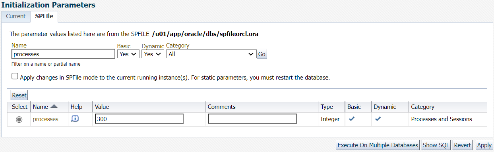

# Shut down and Start up the Database Instance

## Introduction

This lab walks you through the steps to view and modify initialization parameters in Oracle Enterprise Manager Cloud Control (Oracle EMCC) to specify the properties of the Database Instance.  

Estimated Time: 15 minutes

### Objectives

View and modify the initialization parameters of the Database Instance in Oracle EMCC.

### Prerequisites

-   Oracle Database 21c installed and a Container Database (CDB) with at least one Pluggable Database (PDB) created.
-   Oracle EMCC 13.5 installed and with Oracle Database 19c as the repository.
-   You have completed: 
    -  Lab: Log in to Oracle EMCC
-   Ensure that Oracle EMCC has Oracle Database 21c and the listener added as managed targets.

## Task 1: View and modify the initialization parameters

To view and modify the values of the initialization parameters, log in to Oracle EMCC and perform the following steps. 

1.  From the **Targets** menu, select **Databases**.

    

    The **Databases** page displays a list of Oracle Databases added to Oracle EMCC as managed targets. The values may differ depending on the system you are using.  

2.  Click on the container name to access the container home page.  

      

3.  From the **Administration** menu, select **Initialization Parameters**.  

      

    The Database login screen appears.

4.  Select *Named* Credential to log in to the database. This option fills the credential details automatically.  

      

    You can now view the Initialization Parameters of the container database and pluggable database by switching between the containers from Database Instance homepage.  

      

    **Note:** In a pluggable database (PDB), the Initialization Parameters page includes the PDB Modifiable column. Each initialization parameter that can be modified at the PDB level has a check mark in the PDB Modifiable column. Any initialization parameter in a PDB that does not have a check mark in the PDB Modifiable column can be set and modified only in the root, and the value set in the root applies to the individual PDBs in the multitenant container database (CDB). Initialization parameters exist at both the CDB level and the PDB level. By default, initialization parameters at the PDB level inherit the value from the initialization parameters at the CDB level. 

    The Initialization Parameters window has two tabs:  
    - Current — This default tab displays all initialization parameter values that are currently active and in memory for the Database Instance.  
    - SPFile — This tab displays initialization parameter settings in the server parameter file (SPFILE). The window displays the SPFile tab if the Database Instance starts with the SPFile. But if the Database Instance starts with the PFile, the window does not display this tab.  

5.  Click the **SPFile** tab to view parameters in the server parameter file.  

      

    The window displays the Initialization Parameters of the container database.  

    **Note:** The server parameter file is a binary file that can be written to and read by the database and is the recommended format for the initialization parameter file.  

6.  On the **SPFile** tab, view the `processes` initialization parameters by performing the following steps.

    **Name**: Enter the full name of the parameter, for example `processes`. The **Name** field is case-sensitive.  
    **Basic**: Select **Yes** to limit the display to basic initialization parameters.  
    **Dynamic**: Select **Yes** to limit the display to dynamic initialization parameters.  
    You could select any category of initialization parameters from the **Category** dropdown to limit the search to that particular category.  

    Click **Go**.  

      

7.  On the Current tab, modify the `open_cursors` parameter value to 350 by following steps.  

    **Name**: Enter the full name of the parameter, for example `open_cursors`. The **Name** field is case-sensitive.  
    **Basic**: Select **Yes** to limit the display to basic initialization parameters.  
    **Dynamic**: Select **Yes** to limit the display to dynamic initialization parameters.  
    You could select any category of initialization parameters from the **Category** dropdown to limit the search to that particular category.  

    Click **Go**.  

    In the current tab, where `open_cursors` parameter is filtered, specify the following.  

    **Value**: 350    

    **Note:** If the **Value** field is not editable for a parameter, it means that the parameter is not dynamic. You cannot change that parameter for the current instance.   

    **Comments**: Enter text explaining the reason for the changes. This step is optional.  

    Ensure that the **Apply changes in current running instance(s) mode to SPFile** option is not selected. Select this option only to modify the initialization parameter for the currently running instance.  

    Click **Apply**.  

      

8.  A confirmation message appears. The **Current** tab displays the updated value of `open_cursors`.  

    

9.  To modify the value of `processes` to 300 in the server parameter file , perform the following steps.  

    **Name**: Enter the full name of the parameter, for example `processes`. The **Name** field is case-sensitive.  
    **Basic**: Select **Yes** to limit the display to basic initialization parameters.  
    **Dynamic**: Select **Yes** to limit the display to dynamic initialization parameters.  
    You could select any category of initialization parameters from the **Category** dropdown to limit the search to that particular category.  

    Click **Go**.  

    In the SPFile tab, where `processes` parameter is filtered, specify the following.  

    **Value**: 300  
    **Comments:** Enter text explaining the reason for the changes. This step is optional.  

    Click **Apply**.  

      

10.  A confirmation message appears. The **SPFile** tab displays the updated value of `processes`.   

    

You may now **proceed to the next lab.**

## Acknowledgements

- **Author** - Manisha Mati, Senior User Assistance Developer
- **Contributors** - Manish Garodia, Suresh Rajan, Kurt Engeleiter, Suresh Mohan, Jayaprakash Subramanian, Ashwini R
- **Last Updated By/Date** - Manisha Mati, January 2021
