## Access the Database Homepage in EMCC

This lab walks you through the steps on how to access the container database and pluggable databases in EMCC. 

Estimated Lab Time: 15 minutes

### What You Need?

- Oracle Database 21c installed

- Enterprise Manager Cloud Control 13.5 configured

### Assumptions

You have entered the URL for EMCC in a web browser and logged in as the `sysman` user: https://hostname:portnumber/em.

   

**Note**: If you get a security certificate warning, ignore the error. Depending on your web browser, click on *Advanced* or *More Information* and continue to the login page.
	

## **STEP 1**: Access CDB and PDBs from EMCC

1. From the **Targets** menu select **Databases**. 

   

	The *Databases* page displays a list of target databases registered with EMCC. 

   
   
2. On the Databases page select the database name and go to **View** > **Expand All Below**.

   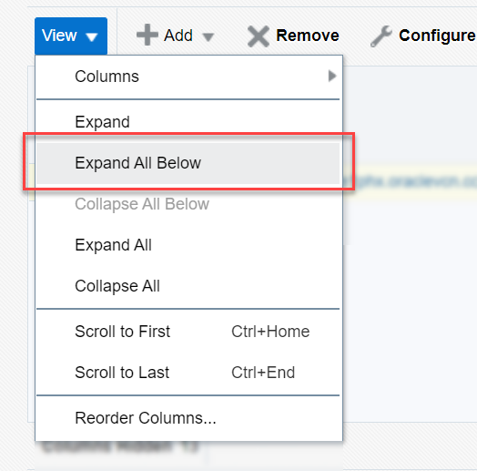
	
	Alternatively, click on the expand/collapse arrow :arrow_forward: next to the database name. The container databases for each instance on the host are listed. 

   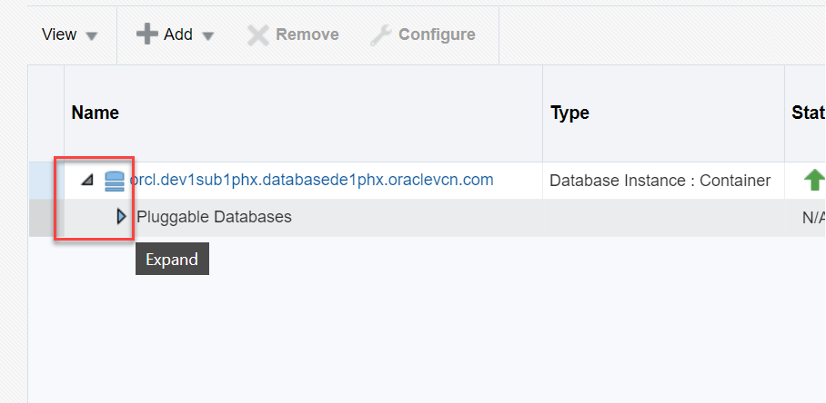

3. Click on the database instance name to access the database homepage.

	A. If you click on the name for type *Database Instance : Container*, it brings up the container homepage for the database instance. 
	
   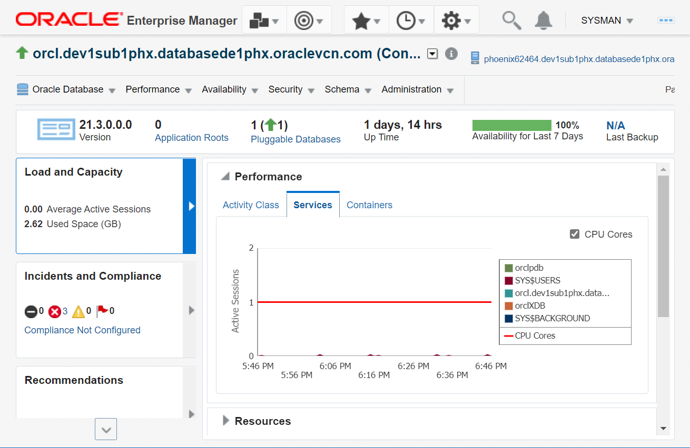

	B. If you click on the name for type *Pluggable Database*, it brings up the PDB homepage.

   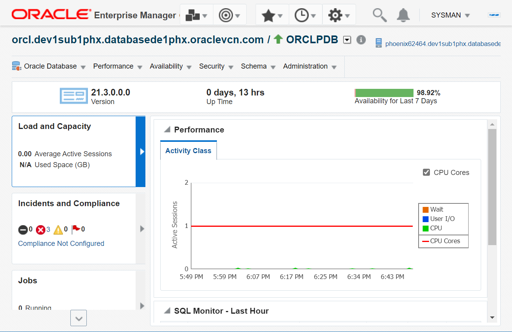

From the database homepage, you can perform database administration. To bookmark the database homepage click on the favorites menu (star icon) and select **Add Page to Favorites**.

   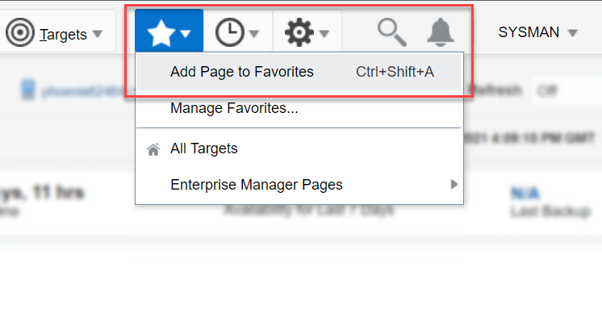

## **STEP 2**: Switch Between Container Databases

You can alter your session and set the container in EMCC with a single login.

In other words, if you open the CDB homepage and want to switch to the PDB, you can do it without logging out of EMCC. Similarly, you can switch from a PDB homepage to the CDB or to another PDB homepage.

1. Open the container homepage as per the steps in the previous lab. 

2. Click the down arrow :arrow_down_small: next to the container and select **All Containers...**. 

   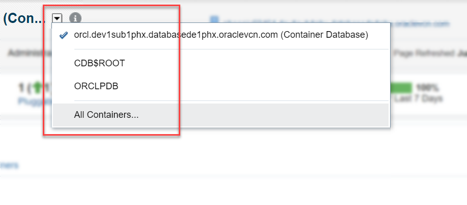
   
3. Select the CDB name from the containers list and click on **OK**.

   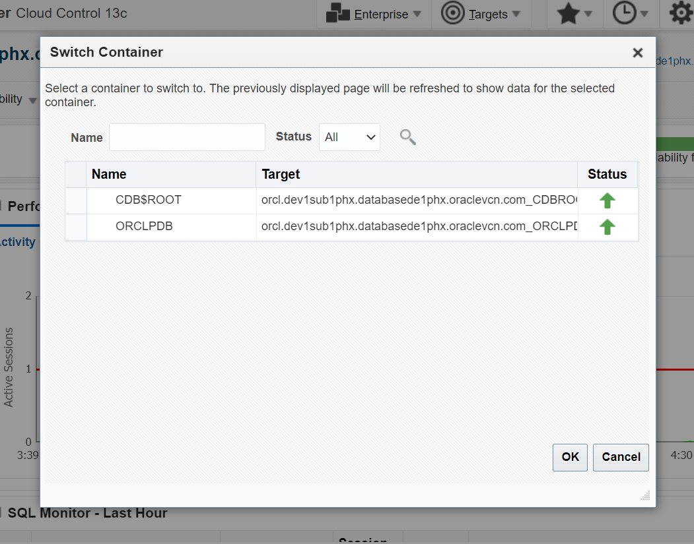

	It brings up the CDB homepage.

   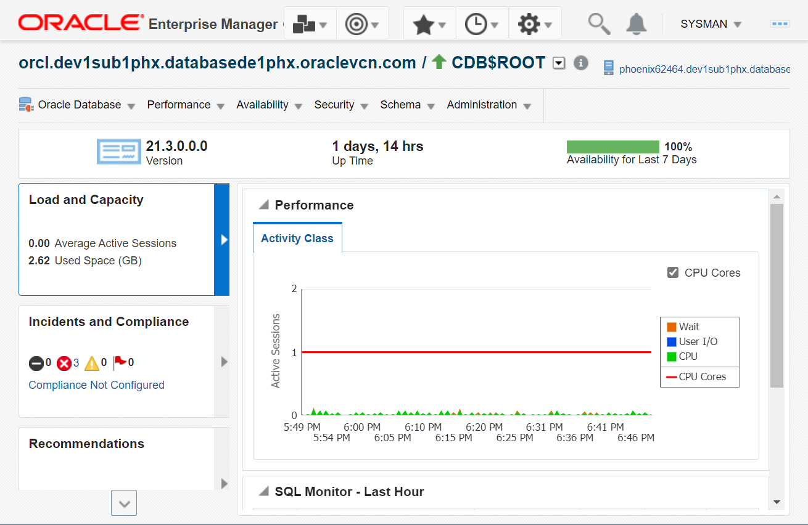

Similarly, select the PDB name and open the PDB homepage. 

   

**Note**: To quickly switch from one container to another, click the down arrow and then click the container name. It switches to the selected container homepage. 

   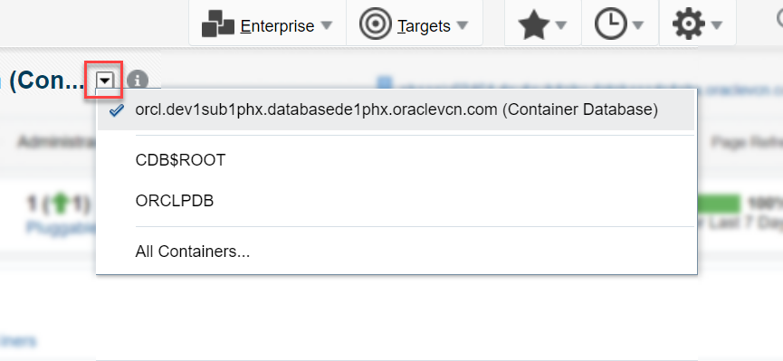

## **STEP 3**: View Container Details

You can view the details of a container from the CDB or PDB homepage. 

1. Open the container homepage as per the steps in the previous lab. 

2. From the **Oracle Database** menu select **Target Information** to view the container details.

   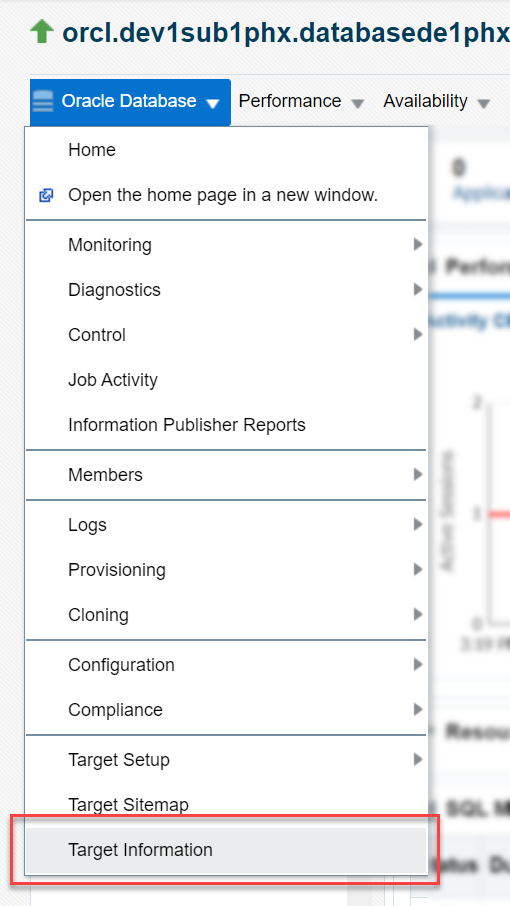

	Alternatively, click on the icon :information_source: (i) next to the database name. 

   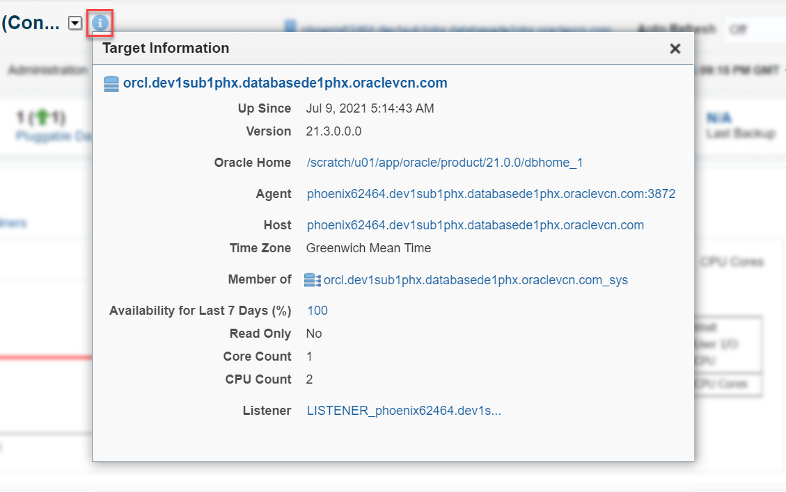

3. Click the down arrow :arrow_down_small: next to the container and select the CDB name to open the CDB homepage. 

   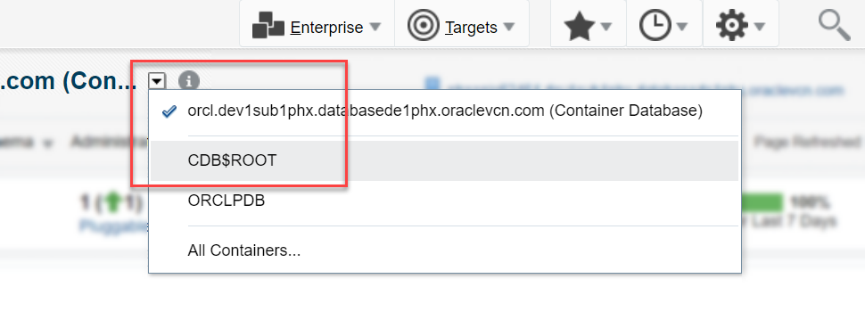

4. From the **Oracle Database** menu select **Target Information** to view the CDB details.
	Alternatively, click the icon :information_source: (i) next to the container name. 

   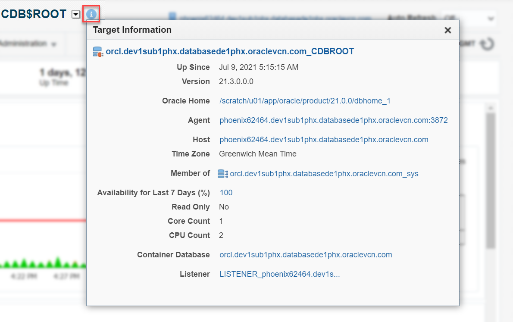

Similarly, open the PDB homepage and view the container details.

   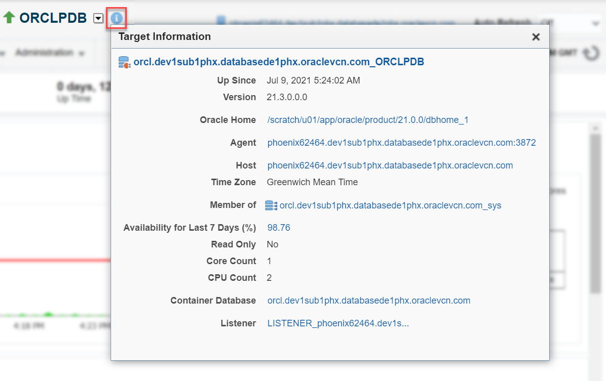

<!--At the conclusion of the lab add this statement:-->
You may proceed to the next lab.

## Acknowledgements

- **Created by/Date**: Manish Garodia, Principal User Assistance Developer, July 2021

- **Contributors**: Suresh Rajan, Manish Garodia
<!--
- **Last Updated By/Date**: Manish Garodia, Principal User Assistance Developer, July 2021 -->

## See an issue?

Submit feedback using this [form](https://apexapps.oracle.com/pls/apex/f?p=133:1:::::P1_FEEDBACK:1). Select the *workshop name*, *lab details*, and *step* in your request.  If you don't see the workshop name in the list, enter it manually. If you would like us to follow-up with you, enter your email in the *Feedback Comments* section.
