## Manage your targets in EMCC

This lab walks you through the steps to manage your targets in EMCC. You can view all the targets registered with EMCC. Besides, you can add and remove database(s) and listener(s) as managed targets. 

Estimated Lab Time: 15 minutes

### What You Need?

- Oracle Database 21c installed

- Enterprise Manager Cloud Control 13.5 configured

### Assumptions

You have entered the URL for EMCC in a web browser and logged in as the `sysman` user: https://hostname:portnumber/em.

   

**Note**: If you get a security certificate warning, ignore the error. Depending on your web browser, click on *Advanced* or *More Information* and continue to the login page.

## **STEP 1**: View targets in EMCC

View your targets in EMCC from the *All Targets* page. 

1. From the **Targets** menu, select **All Targets**. 

   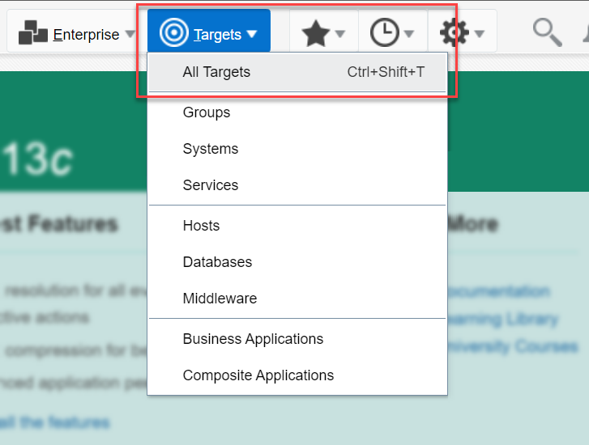

	The *All Targets* page displays a complete list of targets discovered by EMCC, such as Host, Oracle Home, Listener, PDBs, and so on. 

   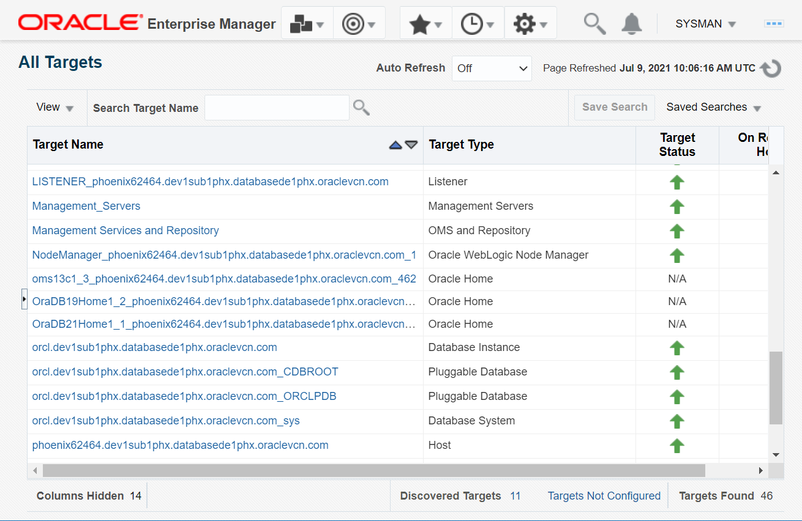
   
2. You can use the filters in the *Refine Search* pane on the left to view specific targets.

   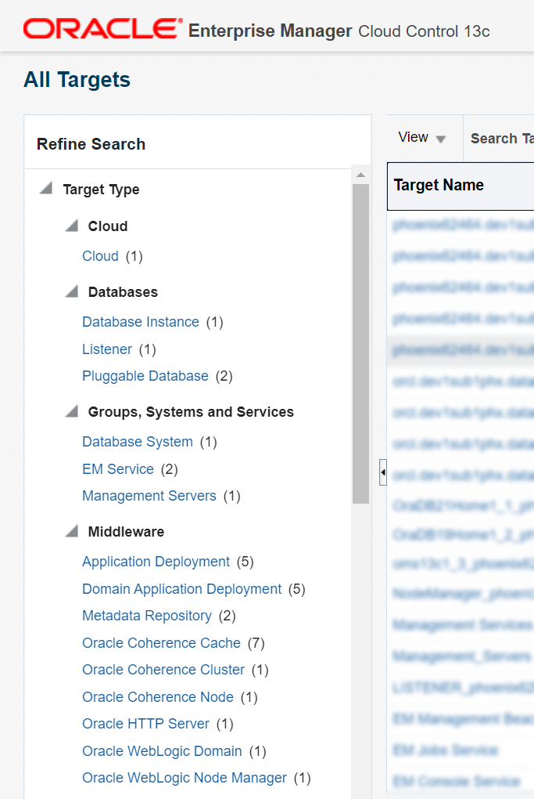

## **STEP 2**: Add databases and listeners to EMCC

Add your existing database(s) and listener(s) simultaneously as managed targets using EMCC discovery and perform database administration from the cloud interface.

1. From the **Setup** menu, select **Add Target** > **Add Targets Manually**. 

   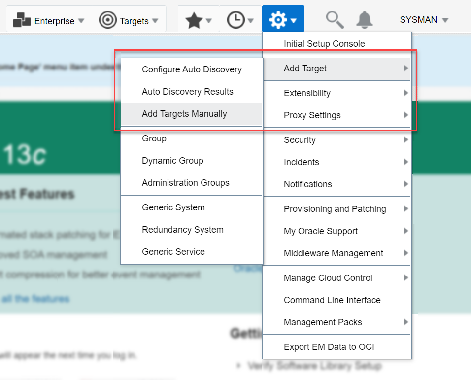

	Alternatively, from the **Targets** menu you can select **Databases**. 
	
   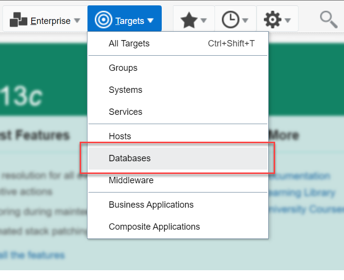

	On the Databases page click **+ Add** > **Oracle Database**.

   

2. You can add targets by installing an agent or by manually specifying the monitoring properties. For this lab, use the guided discovery process. 
	Under *Add Non-Host Targets Using Guided Process* click on **Add Using Guided Process** to initiate the discovery.

   

3. From the list, select Guided Discovery as *Oracle Database, Listener and Automatic Storage Management*  and click on **Add**.

	The Discovered Target Types for Oracle Database is Autonomous Transaction processing, Database instance, Listener, Pluggable database, Cluster ASM, Automatic Storage Management, Cluster Database.

   

4. Specify the host or cluster where your target database resides. Click the magnifier icon to search for the target database and then click the target entry under the **Target Name** column.  
	If multiple hosts or clusters are listed, use the filters to search for the required target. The upward green arrow in the status indicates that the database is up and running.

   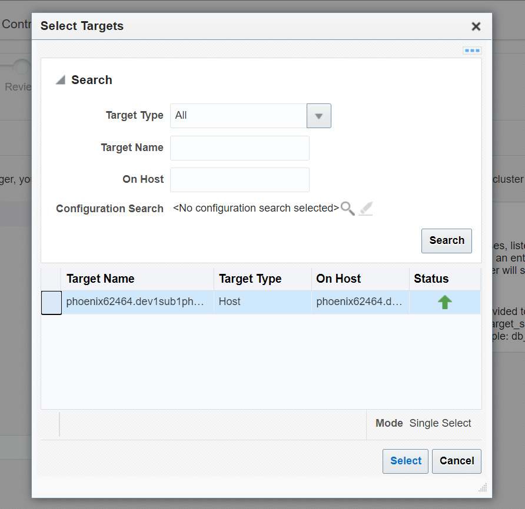
   
   Verify the **Specify Host or Cluster** field displays your target name and go to the **Next** page. You may add discovery hints to change the default discovery behavior. 
   
   
   
5. The results page displays the database(s) and listener(s) discovered on your host machine. 

	A. **Databases** - Select the target database you want to monitor and specify the monitoring credentials. Select the *Role* as `SYSDBA` and enter the *Monitoring Password*.  
	The monitoring username changes to `sys` automatically. Click on **Test Connection** and verify that the connection is successful. 

	You may click **Configure** and view the general configuration and pluggable databases of the selected target. For this lab, do not modify the default values. 

	B. **Listeners** - Select the listener for the target database. 

	You may click **Configure** and view the configuration of the listener. For this lab, do not modify the default values.

   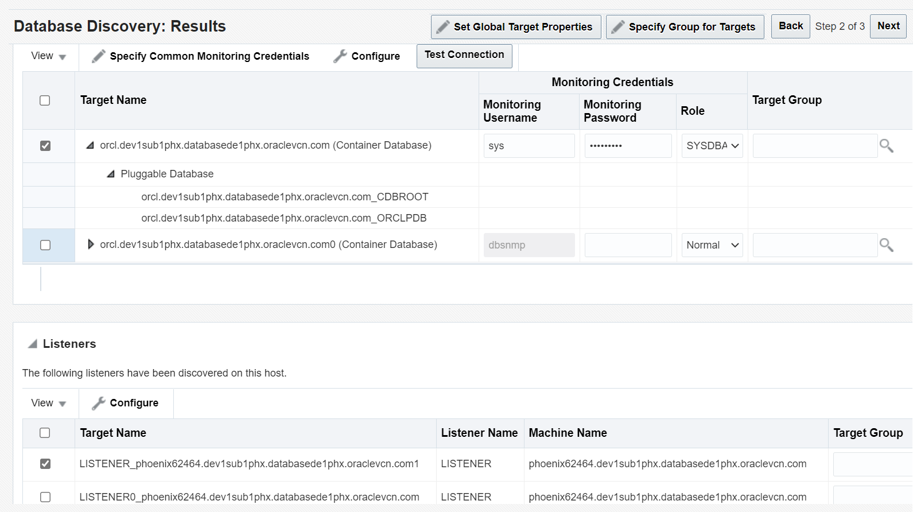

	You can specify common monitoring credentials or set global target properties for the selected targets or add them to a target group. For this lab, ignore these options and select one database and one listener only and go to the **Next** page. 
	
6. 	Review the database systems and the related listener and click on **Save** to add the database and the listener as managed targets. 

   

	The page displays a confirmation that your target is saved successfully. 

   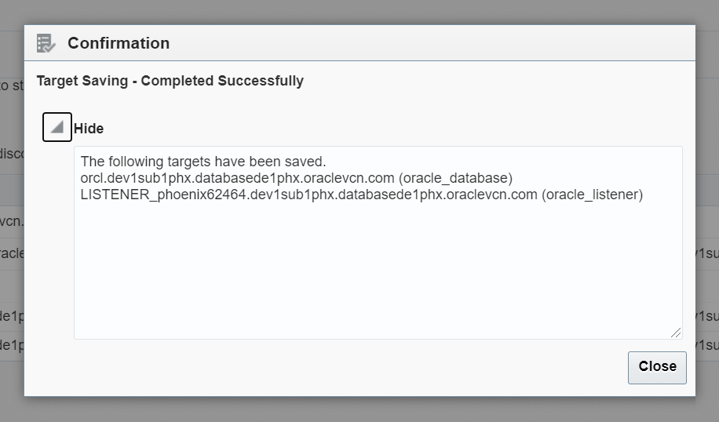

	Your database and the listener are added to EMCC as managed targets. 

   

You can now start monitoring your database from the *Databases* page.

## **STEP 3**: Remove target databases from EMCC

Removing a target database deletes the database system and its associated pluggable database(s) from EMCC. It does not delete the related listener automatically.

1.	From the **Targets** menu select **Databases**. 
	
   

2.	On the Databases page select the database instance to remove and click **Remove**.

   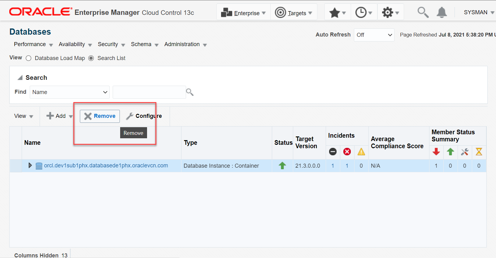

3. In the warning message click on **Yes** to confirm the removal.

   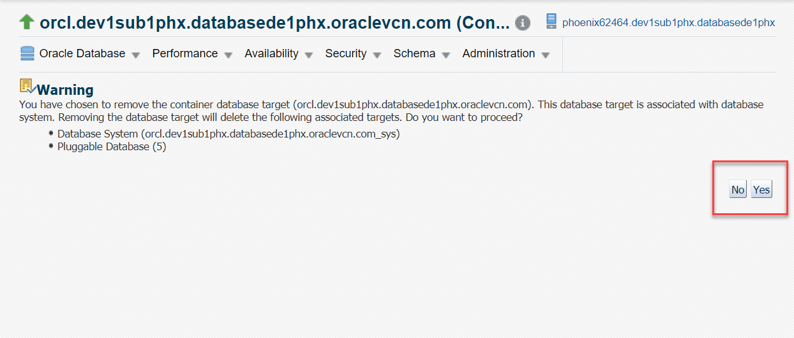
	
	Clicking **No** will cancel the delete operation and take you back to the databases page.  
	
	After deletion, your database is no longer available in the target list. It may display a message `No Databases found` if no other databases are registered as targets. 

   
	
Your target database is removed successfully from EMCC. 

**Note**: EMCC allows you to remove databases one at a time. You cannot remove multiple databases together in a single step.

## **STEP 4**: Remove target listeners from EMCC

1. From the **Targets** menu select **All Targets**. 

   
   
2. On the *All Targets* page right-click the listener to remove and select **Target Setup** > **Remove Target...**. 

   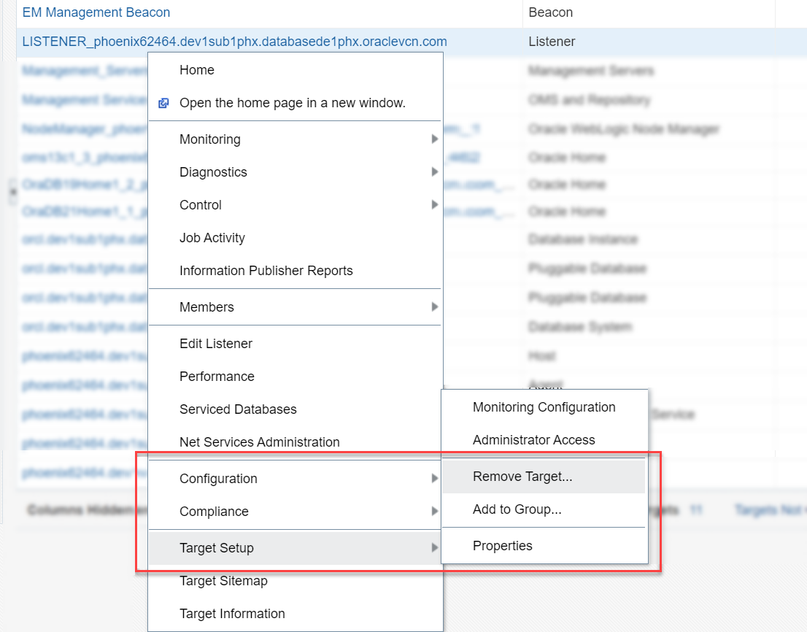

3. In the message box click on **Yes** to confirm the removal.

   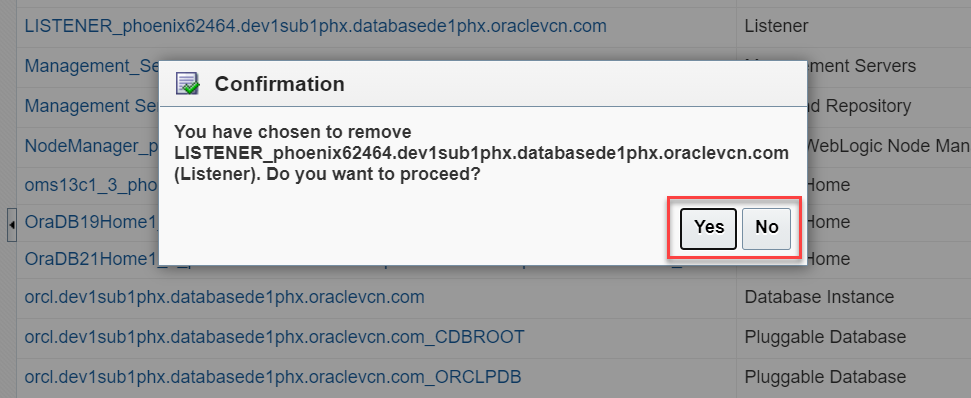
	
	Clicking **No** will cancel the delete operation and take you back to the all targets page.  

   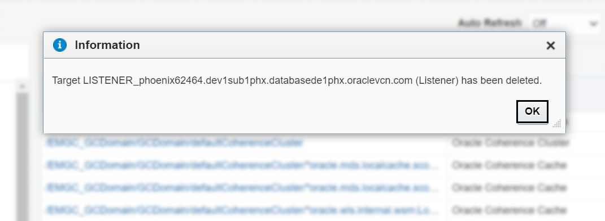
   
The all targets page displays a confirmation message that the target listener is deleted successfully. Removing a listener does not delete the target database automatically.

**Note**: EMCC allows you to remove listeners one at a time. You cannot remove multiple listeners together in a single step.

<!--At the conclusion of the lab add this statement:-->
You may proceed to the next lab.

## Acknowledgements

- **Created by/Date**: Manish Garodia, Principal User Assistance Developer, July 2021

- **Contributors**: Suresh Rajan, Manish Garodia

- **Last Updated By/Date**: Manish Garodia, Principal User Assistance Developer, July 2021

<!--
- **Last Updated By/Date**: Manish Garodia, Principal User Assistance Developer, July 2021 -->

## See an issue?

Submit feedback using this [form](https://apexapps.oracle.com/pls/apex/f?p=133:1:::::P1_FEEDBACK:1). Select the *workshop name*, *lab details*, and *step* in your request.  If you don't see the workshop name in the list, enter it manually. If you would like us to follow-up with you, enter your email in the *Feedback Comments* section.
